알고리즘의 시작

> 1일차 : Algorithm Problem Solving

`APS 기본`

### 배열 1 (Array 1)

* 유한한 단계를 통해 문제를 해결하기 위한 절차나 방법. 주로 컴퓨터 용어로 쓰이며, 컴퓨터가 어떤 일을 수행하기 위한 단계적 방법.


이게 100이라 망정이지 억이면 알고리즘 2는 항상 연산 3번이라 엄청 차이남.


실제 걸리는 시간은 컴마다 성능 달라서 조금 차이가 있을 수 밖에 없음.

그래서 실행되는 명령문의 `개수`를 계산하게 됨.

빅 오 = 최악의 경우에 이정도 걸릴 거라는 것.


상수 4 같은 경우는 상수 1로 표현해서 O (1) 나옴.

아까 가우스 덧셈 같은게 O (1).

입력과 출력을 계산에 넣느냐는 좀 의견이 분분하긴 한데, n개 데이터 1씩 증가시킨다 이러면 O(n) 인데 입출력 전부 고려한다해도 O(3n) 이라서 계수무시하면 같음.

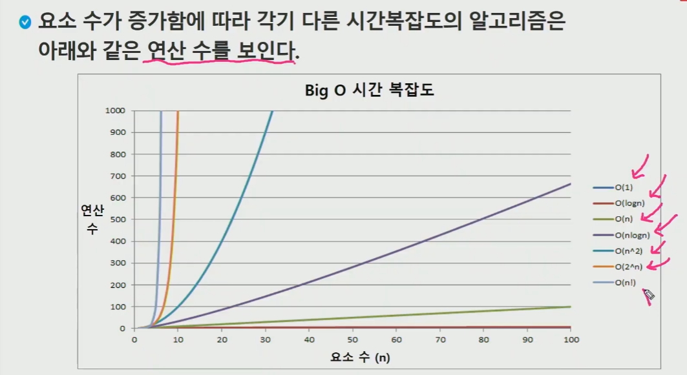


버블정렬은 n² 인데 얜 개오래 걸림. 

https://noahlogs.tistory.com/27

* **배열이란 무엇인가?**


물론 파이썬은 이것저것 리스트에 잡다한거 집어넣을 수 있지만 일반적으로 다른 언어들은 해당 변수는 어떤 자료형이다 라는걸 표현하고 이걸 일정하게 모아놔야 array가 돼서 그럼.e

일일히 변수 지정하는거보다 array 집어넣는게 좋다는 그림 의미.


idx 넘어가면 index error.

---

* Q. Gravity


`A는 무조건 B보다 더 떨어져야함! `

제일 위에 있으니까 A가 더 떨어져야함. 각 콜롬들의 맨 윗값만 생각!


일단 콜롬들 포문으로 뽑고

애랑 오른쪽을 쳐다보면서 같거나 큰 애들의 갯수를 센뒤, 

남은 가로길이에서 빼주면 됨. or 그냥 나보다 작은거 갯수 셈

그 모든 process 의 최댓값을 구해주면 되는것.

아래 맨위 포문에서 len(box) -1 해줘도 마지막박스야 어차피 깔려 있을거니까 괜찮음. 아래 if에서 걸려서 괜찮을거임(?)

ans = 전체중 최고의 값 초기화.


---

### 정렬 🥇

> 2개 이상의 자료를 특정 기준에 의해 작은 값부터 큰값 혹은 그 반대의 순서대로 재배열 하는것.


#### 버블정렬 🧼


아무 언급이 없으면 오름차순으로 한다. 

2회만 했는데도 이렇게 됐는데? 정렬 다 된거 아닌가?


컴퓨터는 이어서 정렬을 함. 사실 1회는 맨 마지막 숫자가 정렬됐음을 보장할 뿐. 3번째 사이클 돌때 42까지 정렬이 된것. 4번째 사이클때 7 12 비교하게됨!. 

마지막 7이라는 값이 남았는데 얘는 정렬이 '`불필요`'함.

5개 정렬시 4개 사이클만 돌아보면 된다가 결론.


이런식으로 순차교환이 스왑인데 파이선은 튜플 식으로 해도 스왑 되어서 편함.

---

#### 카운팅 정렬


count 배열 만들건데, 가장 큰 정수값을 알아야함. (이미 알고있음을 전제)
4가 제일 큰데? 빅오는 리스트길이 + 최대정수 

count = [0]*(4+1)


근데 누적합 전에 1 3 1 1 2 가 이미 이 숫자대로 박아넣으면 정렬 된거아냐? 라고 생각할 수 있음.

이런 경우 앞에서부터 찍어버리면 어느게 1A 인지 알 수 없음.

counting 정렬은 애초에 안정정렬을 목표로 하는 애라서.


 

누적합 한다음 뒤에서부터읽어옴

temp는 내가 정렬하고싶은똑같은 크기의 배열


뒤부터 정렬하면 장점이 있음 :  안정정렬.


동일한 값이 있을때 그 순서를 유지하기 위해서 뒤에서부터 정렬하는것.

이게 그냥 셋다 1이니까 안와닿을수 있는데 튜플형태라고 하면? 다른 데이터들을 같이 가지고있는 애들 정렬할때 문제가 될 수 있음.  

그냥 0칸 안쓸거고 1개더 슬롯 파서 할수도있음.


> 근데 카운팅정렬은 [1,2,1억] 이러면 엄청 비효율적임. 최댓값이 적당히 적을때 써야 개빠름.


이거 오타있어서 복붙하면 안될거임!! 애초에 0 * k +1 이어야하고.

첫번째 포문은 카운팅 포문 (len(a)) 여도 상관없음

그다음 포문은 누적함 구하는 반복문. 첫번째 원소는 건드리지않으니까 1번부터 시작하는것. (1, ) 이부분

세번째 포문은 완벽한 정렬. 두번째가 -1 은 0번 인덱스까지 가라는것.

n은 입력배열, k는 카운팅 배열 ! (빅오에서)

---

#### 완전검색


* 정렬한 후 비교 ? 123123 은 보자마자 run 2개인데 112233 이라고 정렬하면 짜증나짐. -> greedy 에서의 실수중 하나.


이런식으로 모든경우 나열하고 팩토리얼로 치면 720개긴 한데.. 이런식으로 전부 테스트하는것.

아래는 이런식으로 뽑아보면 1개의 예제에서 baby-gin이 아니라는 뜻.


이경우 중복순열 안할거니까 -> 3개 다 다른값이 됐을때만 튜플안에 담길 수 있는 조건.

근데이거 숫자 커지면 노답임. 재귀로 하는등의 방법이 있음.


지금은 인덱스로!


파이썬에선 tri 검사때 == 로 3개 둬도 됨.

false 값으로 초기화 했으니까! 이렇게 가능.

---

#### Greedy 알고리즘


이런식.  6개 주면 값을 구할 수 있더라! 최선이다! 라고 말할 수 있나? 큰돈부터 하나씩 쥐어주고 너무 많이주면 회수해서 작은거 주고.. 이런식으로. 이 문제의 경우에는 yes! 가 답인데? 최적경우.

그런데, 거슬러줄 수 있는 동전의 종류가 하나 더있다고 치면? 400원짜리라고 하면 ?  아까 방식으로 하면 답은 뭐 변하지 않는데.. 사실은 400 3개 50 1개 10 1개 주는게 더 최적인데?!

제일 큰 동전부터 주다보니 6개가 최적이라 착각.

애초에 가능했던게 배수 관계였기 때문! 100과 500은 배수관계라 무조건 주는게 나아서. 근데 500 400 은 서로가 배수관계가 아니기 때문에 문제가 생김. 

> 이럴땐 `완전탐색` 을 이용해야함!!!

---

Q. 한번 해보기. 6중 포문이 될거같은데?


---

Q. 탐욕 알고리즘의 예 -> 아까 베이비진 문제 풀이.


카운트값이 3이상이 아닌가? 하는 트리플릿 검사가 더 간편할 수 있음.  모든 경우를 확인하지 않고도 베이비 진을 구현해 낼 수 있다는 장점이 있음.


여기서 c = [0] * 12가 왜 12인지 생각해보고 10으로 해도 됨조건이 좀 더 들어가야 겠지만!

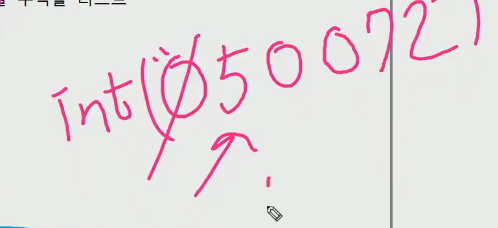

문제는 이런애들 문자열 받고 int 화 하면 앞에 0 이 사라져 버리잖아?! 주의해야함. 


---

`입력`


int 해주기 전엔 저렇다가


map int 이렇게 뿌려주면 들어감. 근데 요게 정석이긴 함.


공백단위로찢겠다고 하면 아래와 같이 안됨. 하나의 요소가 되어버림.


이렇게 해야함!!


* 붙어져 들어오는걸 찢을때는?


다만 주의할건 이경우 찢는다 해도 문자열임


그러니까..  스트링도 iterable 하긴 하니까?


<연습>


이제 이런거 받아볼거. 3은 전체 테스트 케이스 수.

그리고 9는 원소 갯수!

문제번호까지 할거면 이런식으로.


tc+1 로 조정하든가, 위에 포문에서 T에서 T+1 하든가.
range(1, T+1)

이걸 인풋을 한방에 넣어도 됨. 그냥 input에 반응하는 느낌이라 하나씩 코드 돌아갈때마다 가져 씀.


일단 인풋.. 이렇게 일일히 하기 힘들면 이렇게 해도됨.


---

#### 2차원 배열


첫번째는 행의 index, 두번째는 열의 index. 없는 행 조회하면 에러뜸.

2차원 리스트는 그럼 어떻게 입력을 받나 ? 문제에서 행 x 열 주어지고,다음줄부터 값들 주어지는게 (붙어져있거나 띄워져 있거나) 일반적. 이게 약간 원소들인 리스트의 길이가 같기도 하지만, 꼭 같지 않아도 별로 상관은 없음.


빈리스트 하나 선언하고 리스트 하나씩 append.


걍 0 채우고 원소로 넣어라!도 가능. 혹은 리스트 내포로도 가능.


왜 underbar 인가? 반복문 돌리기만 할거면 걍 언더바! 

* 2차원 배열의 순회 = 행 우선순회 + 열 우선순회
* 거꾸로, 지그재그, 시계방향 빙글빙글 이런것도 가능
  * 행 우선순회 = 행 고정시키고 열 읽어야하니까 행포문이 바깥.
  * 열 우선순회


3 X 4 주면 이게 i = 0 1 2 / j = 0 1 2 3 이런식임. 굳이 알면 len(array) 안써도 되고.


열 우선순회에서는 i가 앞에옴.  2차원 리스트의 각 원소들의 길이가 달라서 열 길이가 다른경우 이건 조건을 좀 걸어줘야 함.


range 4 는 4방향 탐색을 하겠다는 뜻.

위에 두 포문은 일단 행 우선탐색 같은거 하면서 요소들 전부 하나씩 확인하는 와중에 그 개별체에 대한 4방향 연산을 해보겠다는 것.
다만 범위 넘어가면 파이썬은 마이너스 인덱스 연산 하니까 그거 조심해주고. -> 그래서 포문을 3개 쓰게 됨.


delta 의 의미?! 상하좌우는 뭐 시계방향으로 해도 되고 사람마다 다름.

보통 dx dy 하면 행렬 이라고 생각하는데, 좌표평면으로 치면 y축이 행이라고 생각하는사람도 있음. dr, dc = row column 식으로 작성해도 괜찮음.


new row = r + delta r [i] 이런 느낌. 출력시 2 4 8 6 나오는데 상하좌우임.

근데  0 1 자리에서 상 하면 마이너스 인덱스때문에 8 나오니까?


아래 조건 걸어서 맵 벗어날땐 아무것도 하지말라고 continue 넣어줌.

이건 이 범위 안에 들어왔을때만 하는거고! 저 위는 벗어나면 안하는 느낌.


대각선 이런느낌. = 나이트의 이동 델타 고민해보기.


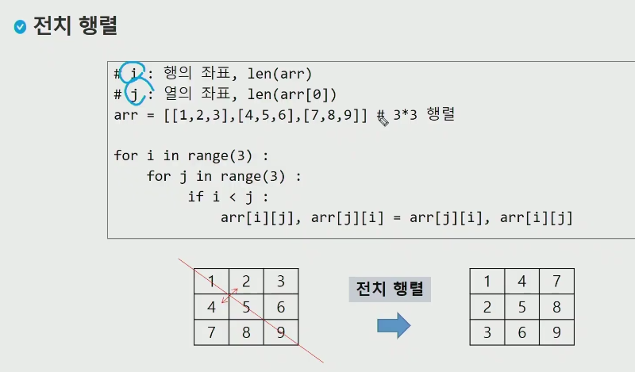

Q1. 실습문제


* 부분집합 합 문제


asterisk = 언팩킹 연산자.


이거 뭔가 2진수같음. 0 ~ 15까지


비트단위로 연산 & 아니면 | 이런거.

실제로 6과 11을 n퍼센트연산자 (&) 로 하면 2가됨 print( 6 & 11),
print( 6 | 11) = 15 라고 나옴. ( n퍼센트 연산자 많이 씀 파이프보단.)

<< (shift 연산자) 이걸 많이 쓸거임 왼쪽 가는거.

0 1 1 0   이거 << 하면 1 1 0 왼쪽으로 가고 맨오른쪽 남는건 0으로 채워줌.
0 0 1 0 << 연산 두번 하면? 1 0 0 0  값은 2 -> 4 -> 8 이 됨.
left shift 연산 한번 할때마다 값이 `2배` 증가함. right shift는 두배씩 낮아짐.

* 저위에 스샷의 의미 =  1을 << n 번 하면 2의 n승이 되고? 
* 1 << 4 = 16이니까 for i in range(16) 하면 1~15 부분집합 가능.
* 2**n 은 파이썬 스러운 연산자.


재료의 갯수 len(arr)

부분집합의 총 갯수만큼 큰 반복문 안에서 + 아래 프린트 두개는 줄바꿈임.


위의 N은 재료의 수

첫번째 반복문은 부분집합생성 for문.

두번째 반복문은 : 어떠한 원소들 가지고있는지 확인하는 작업.

아래 if문은 3번 연산되게 되는데.. 각각 첫번째 비트 검사, 두번째 비트 검사, 세번째 비트 검사하는 거름망이됨. 나머진 0이니까

위의 7개를 하나의 경우당 3번씩 검사하게됨. N% 연산자는 둘다 1이어야  값이 나오니까? 


값이 있으니까 출력 -> 그것이 4인.. / 안파이썬 스러우려면 > 0 넣어줌.


파이썬에서는 값이 있으면! 하고 생략해서 쓸 수 있음.


Q. 실습 2번


뭐 합이 10인거 모조리 출력. 으로 풀어보자.


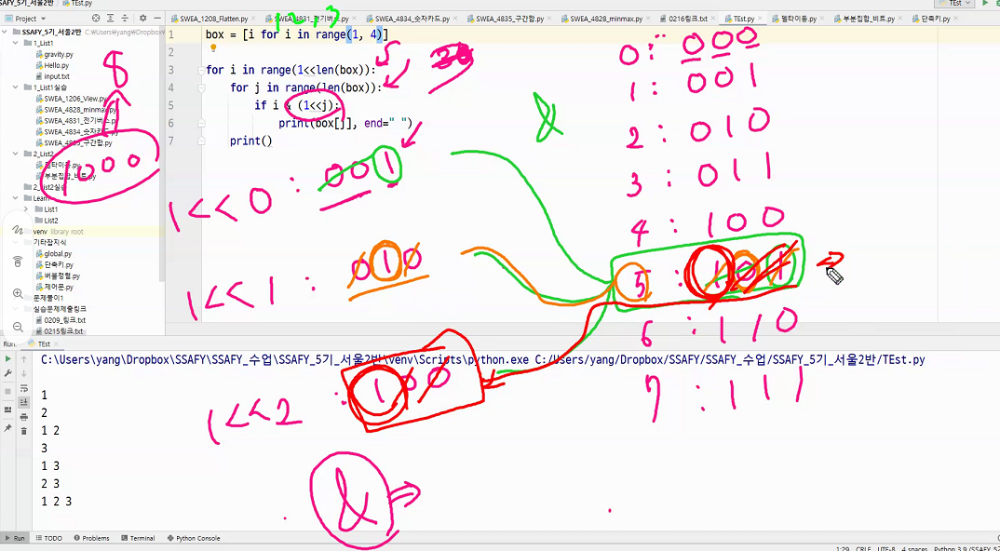


밖에 result 하나 두고. 

---

> 바둑판 만들때 주의할점!!

이거 * * 두번쓰면 다바뀌어버림 조심해야함.


굉장히 주의해야함 + 언패킹 연산자 활용 보기 = 구글


이건 진짜 주의해야함. 리스트 특성상.


---

#### 검색

> 순차검색과 이진검색


걍 포문 돌면서 하나씩! 찾다가 실패하기도 하고. 

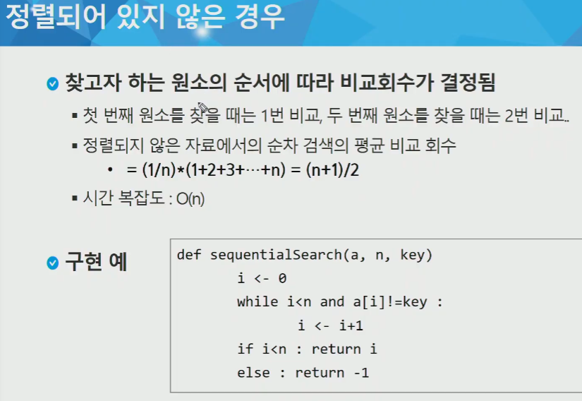


근데 어차피 시간복잡도는 n 임

순차검색의 예


> 이진 검색 (Binary Search)


start end가 교차가 되어버리는 순간 멈추는 느낌 while은


얜 걍 넘어감 인덱스.

* 셀렉션 알고리즘


---

#### 선택정렬


그럼 이게 버블정렬이랑 뭔차이냐 -> 버블정렬은 뒤에서부터 정렬이 됐음. 선택정렬은 앞에서부터 정렬이 됨. 아예 교환! 이 이루어져서.


기준위치란 인덱스 값을 의미.


그럼 마지막 원소는 정렬할 필요가 있을까?

어차피 얘가 젤 커서 정렬할 필요가 없음. 사실 버블정렬도 5개짜리 정렬시 4번이면 됐음. 


사실 0 없어도 되는데? len(a)-1 은 마지막건 정렬 필요 없어서.

여기서 min 이란 어떤 값이 아니라 `인덱스 값`을 의미함. 
내가 일단 가장 작은값이라고 하고 그다음부터 끝까지 검사하니까.

남아있는 리스트중에 가장 작은 값의 인덱스를 알려주게 됨 아래 for문은
만약 공교롭게 기준점이 가장 작으면 나랑 내 자신을 바꾸는거라 괜찮음.

> 만약 얘를 내림차순으로 하고싶으면 부등호 방향이 달라져야 함. max 값을 찾아서 뒤로보내야 하니까.


원래 교환은 이거.


기준자리 3까지 하더라도 어차피 정렬 더 해봄 컴퓨터는 4까지.
15 19 비교할때 15 15 자기자신 바꾸고 19하나 남았을땐 할필요없다!

* 연습문제 3 => 걍 SWEA의 달팽이 출력 문제 풀자.


---

### STRING 🧶

> 이론들


인터넷 발전 후 지역마다 코드 달라지는 문제 생겨서 아스키코드 나옴.


어떤 언어는 또 오른쪽에서 왼쪽으로 읽으니까. 
엔디언 뭐 이런거 중요하진 않음 걍 참고. 컴터 구조에 대한 깊은 이해가 필요.


여기서부터 잘 보자.


가변길이 문자열도 두개로 바뀜. java는 길이를 직접 조정하고, c쪽은 문자열 마지막에 문자열이 끝났다는 표시같은게 들어있음. 


파이썬에서의 len() , copy, cmp ---> compare 비교


str 으로 사용할거라는 자료형 쓰고, 변수명 쓰고 초기화 함. new string 이라는 객체를 생성. 

> 이제 파이썬! -> 여기서부터는 중요


타 언어는 문자 하나만을 지정하는 char 타입 있다면, 그냥 단일체도 str 타입임. 

i to a => int 형태를 아스키로 / a to i 반대로 -> 이런거 해볼것.

* str은 곱연산은 먹음


저기 . 만 찍으면 쓸수있는거 좌르르 뜸. line "  .  " 이것.


-> 인덱스 위치 찾아주고

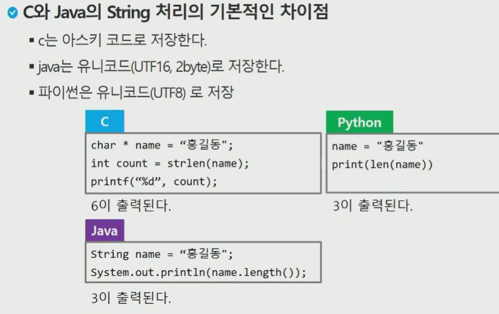

---

* 문자열 뒤집기


빈문자열 임시변수 하나 넣고 뒤부터 읽으면서 더하기로 저장하는것.
횟수제한 없이 하면 도루묵이 돼버림. 다시 바꿔버리니까.


2번째 swap 임시변수는 파이썬에선 필요없음.

* string 연습문제 1 -> 문자열 뒤집기의 구현!


c는 걍 변수고, string 1글자씩 가져오면서 넣고 널문자가 아닐때까지 while 돎
c라는 값이 널문자가 되면 종료가 됨. c가 0보다 크거나 9보다 작게 되면? 
숫자가 아니게되니 브레이크. value에 10곱해서 한칸 밀고 새로운거 더함.

파이썬도 이런식으로 가져온값에 10곱하고 다음거 붙이는 식으로 할 수 있음.


int 타입의 값을 가지게 됨. 문자열 이었던 1234를 int형인 1234로 변환.


아까 이 원리를 이용해서? c언어랑 다른점은 i 라는 문자가 실제로 숫자인지 확인하는 부분을 파이썬은 생략해도 된다는게 좋은거.
맨처음 value = 0 이니까..? for 문통과할때 맨처음은 0 * 10 이라 저 자릿수 바뀌는거 반응하지 않음.


print 저기 찍어보면 과정 나옴.

> 포인트는 : 애초에 아스키코드는 int랑 str의 1대 1 대응 연결점인데? 실제로 스트링 7 이 스트링 0의 아스키 값과 7만큼 진짜 숫자로도 떨어져있어서?
> 아스키값을 빼주면 '7' - '0' 같은게 숫자 7로 나오는 효과를 노린것.

* str 연습문제 2번


* 10으로 나눈 나머지를 하면 튀어나옴 -> 얠 문자열 처리해서 -> 리스트에 집어넣는 식으로 풀면 되지 않을까 하는것. 
*  10나눈 몫을 취해서 앞에거 떼고?  리스트는 반대일테니 뒤집기쓰면됨~

---

#### 패턴매칭

> 카프라빈은 해쉬가 들어가야해서 얜 일단 생략.
>
> kmp , 보이어는 동작은 맛보기! + brute force는 중요함.


  Brute Force =  `컴퓨터 파워로 계산 다 해버리겠다!` 


반복문으로 이동하면서 확인.

text control = t (idx는 i) , pattern control = p (idx는 j)


j는 패턴 다시 검사해야하니까 원점으로 돌려둠.
스트링 그려서 인덱스 찍어보면서 아래 while문 이해하면 됨.


이게 정확히 안에 저 있는 애들이 i = i + 1 이런거 좀 순서가 바뀌어야 하기도 하고 조건에 따라서 그런게 좀 있음. 정확히 정답이라는건 아니고 로직이 대충 저렇다는거.


continue 박는식으로 저기 정리해도 됨.


* for 문으로 Brute Force 하는거

왜 N-M+1 이냐? 요기까지만 하면 패턴길이끝이랑 원길이 끝이랑 맞춰져서.


위에서 브레이크 걸렸을때 cnt = 0 이었으면 아래 if도 안걸림.
일치하면 어쨌든 cnt 하나씩 증가할건데 그게 전부 일치해야 하는것.

마지막 if 는 else로 써도 될듯. 끝까지 못찾으면 -1  return


while for 둘다 시간복잡도는 같음. 이중루프가 아닌거같은데 while은?
while로 i  j 동시에 비교하니까 이중포문이 아니어도 효과는 같음.
이중포문이 중요한게 아니라 연산 횟수가 시간복잡도 기준이니까.

---

* KMP 알고리즘


패턴의 전처리? 테일러 배열을 만들어서..? 
이야기하기 앞서 접두사 / 접미사 이야기


전처리 과정에서 접두사 접미사 


패턴을 전처리 하는 과정이 있다고 했는데? 아무튼 그거후에 이런식으로 같다면?

이게 전처리과정


6에서 왜 4가되는지 한번 생각해보기 -> 젤 긴 접두사 접미사 길이 박은거.

AABA (0~3) 그리고 AABA (3~6) 이것도 1회 같은거임.


일치하는게 없으니까 0으로 하고 넘어간다? 


이경우 접두 접미 드디어 일치하는 최대길이 1이 뽑아져서 5의 숫자가 1인거.

시작점이 -1 이나 0이냐는 구현에 따라 좀 다름.


아까 상황에선 쭉 일치하다가 2에서 틀렸다면 -> 3번 위치부터 검사하면 된다! 라는 느낌.


kmp는 브루트포스랑 달리 i가 뒤로 돌아가지 않음.


 B에서 패턴 실패했으면 바로 전거 보면됨- > 그림으론 접두사 접미사 저런 느낌.


첫번째 자리부터 다르면 뭐 한칸 옆으로 가면됨. 구현따라 -1일수도 있지만.


---

* 보이어 무어 알고리즘


왼쪽부터 하다보면 맞다맞다 하다가 틀리면 한칸 옮겨서 또 그짓해야하니까 brute force는 거의 뒤에서 짤릴거라고 생각하고 뒤부터 걍 보는거.

근데 뭐 최악의 경운 O(MN) 이라서 별로고.. kmp는 O(M+N) 보장.


skip 배열만큼 jump! 1번째 비교에서 t와 t그럼 맞춤.  어 근데 m과 e 가 다른데? e는 ''다른 모든 문자'  에 해당하는 친구라 5칸 띄게됨.
마지막은 진짜 일치니까 5번 다봐야하고.

이게 근데 보이어무어 알고리즘의 전부가아님.

* 패턴 내에 동일한 글자가 있으면 어쩔건지.. 등등 이런건 구글에!

그럼 같은 글자긴 한데 가장 처음 나온 그 글자만큼 이동함 1칸 아래경우


이러면 보이어무어긴 한데 브루트 포스마냥 작동하게 돼버림. 최악의 경우.


n이 무시할정도로 크면 m + n 이어도 걍 n 인 느낌이라 (세타는 빅오랑 비슷하다고 걍 생각) kmp를 시행시간 n 이라고 하기도 함. 빅오메가는 최선.


* str 연습문제 3


---

#### 문자열 암호화 & 압축 : 참고

* 문자열 암호화


완전 탐색 해보는거 = 전사공격


<같으니까 0 다르니까 1>

다시하면 복호화가 됨.


---

* 문자열 압축

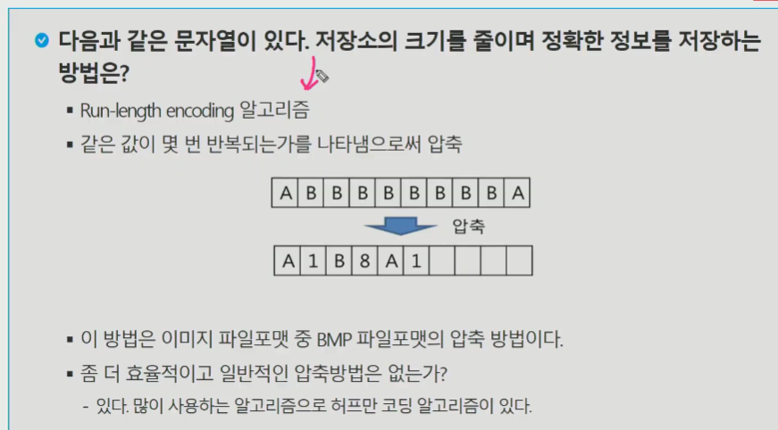

이 방법에 대한 단점은?  압축하려했더니 늘어날수도...


---

### STACK 🗄


리스트도 선형이니까. 뻗어나가면 트리 => 뻗어나갔는데 순환구조가 생겼다? 그래프

그래프 탐색 방법이 DFS, BFS 인 것.


자식노드가 최대 2개인거 -> 2진 트리


파이썬은 `리스트`를 활용하여 스택 구현. (탑변수 따로 관리 안해도 되지만? append, pop 써서, 혹은 인덱스 -1 쓰거나)

다른 언어는 배열 쓰니까 top으로 관리해 줘야함.

삽입 -> 마치 탄창에 총알 집어넣듯 하는것. 역순으로 pop 하면 삽입한 총알 쓰는것. (튀어나옴)

삽입 -> 리스트라면 append, 배열이라면 top 하나 증가시키고 그자리에 값을 넣어라! 연산 필요함.

삭제 -> pop() 함. 


근데 여기서 꼭 c를 지워야하나? 배열로 확인한다면, top은 마지막 원소를 가리키는 역할만 하고, 나중에 삽입시도 덮어쓰면 되니까 지워주는 과정이 필요하진 않음.
TOP 이용하면 이런 이점이 있음. pop() 하면 진짜 나오지만.

* pop 과 peak 의 차이?

pop은 자료값 반환하면서 빼고, peek는 그냥 확인하는것.


> 탑 증가 -> 값넣고 -> 값 빼고 -> 탑 내림
>
> 순서 개중요! (top 쓸때는 굳이 삭제까지 안해도 됨)


만약 배열을 이용했을때는 append 식으로 넣는게 아니라 top 변수 이용해서 현재 위치에 넣거나 빼거나 해야하고, 배열은 딱 크기가 정해져 있으니까 그 범위 안넘어가게 조심해야함.

* append 있는데 굳이 push 저런거 안만들어도 됨.
* 파이썬 리스트는 가변적이어서 붙이는건 자꾸 붙여도 됨.
* 그래서 이 코드에서 길이 검사가 없는거임.


던져주니 마니는 중요한게 아니라 그냥 스택임.


이거 재귀 아님 위에 pop 은 my_pop 같은거고 아래 return 절엔 내장함수 pop

값 -1 안써줘도 어차피 가장 끝값 가리킴 pop() 해도됨.
len(s)-1 을 idx로 하는거도 -1 로 하는거랑 마지막.

그리고 len(s) == 0 이면 어차피 더 꺼낼게 없음.
append는 걍 넣을수있는데 얘는 뭐가 있어야 꺼낼 수 있으니까 공백검사 부분이 꼭 필요함.


이건 좀 다른방법인데, top 하나 깎고 top +1 자리 반환하는 것도 됨.

아니면 아래 하늘색 부터 하든가.

---

Q. stack 연습문제 1


리스트를 활용해서 해도 되고, 리스트 크기를 미리 결정해서 배열처럼 활용 할 수 있기도 함. 후자의 경우 top 변수를 활용해서 함.

```python
class Stack:
    def __init__(self,n):
        self.top = -1
        self.stack = [0]*n

    def push(self,data):
        if self.top == len(self.stack) - 1:
            return None
        self.top += 1
        self.stack[self.top] = data

    def pop(self):
        if self.top == -1:
            return None
        self.top -= 1
        return self.stack[self.top+1]

my_stack = Stack(10)
my_stack.push('양명균 교수님')
my_stack.push('박정웅')
my_stack.push('권이혁')
print(my_stack.stack)
print(my_stack.top)
print(my_stack.pop())
print(my_stack.stack)
print(my_stack.pop())
print(my_stack.pop())
print(my_stack.pop())
```


* 연결리스트 안할거

> 괄호검사


-> 뭐근데 소괄호 안에 대괄호가 있는건 괜찮은데 제대로 닫혀야 함.

왼쪽 괄호는 append 고 오른쪽 괄호는 pop으로.. 하는데. 사실 빈리스트 pop하면 에러가 나니까? 

```
1. 같은 괄호에서 왼쪽 괄호는 오른쪽 괄호보다 먼저 나와야 함. -> ( ) ')' 이러면 안된다는거.
== 애초에 오른쪽부터 시작하면 안된다는 뜻임 = 스택이 0 인 상태에서 오른쪽 괄호가 뽑히면 안됨

2. 괄호 사이에는 포함 관계만 존재한다. { ( } ) -> 이러면 안됨.
== 오른쪽애들 만나면 스택에서 마지막으로 쌓인 왼쪽애 팝해서 대조해 봐야함.

3. 왼쪽 괄호의 개수와 오른쪽 괄호의 개수가 같아야 한다.
== 다끝났는데 스택에 왼쪽 괄호들 남아있으면 안됨 = process 완료라면 스택이 비어야 (for else 구문으로 처리)
```


열린괄호 무조건 담음 -> 닫힌다면 일단 pop 하는데, pop된애랑 지금 닫히는 시점의 녀석이랑 같은지 확인.


Q. stack 연습문제 2


* 만약 여러가지 괄호가 있을때도 그냥 왼쪽괄호 만나면 죄다 스택에 집어넣어 버리면 됨. 여러 스택으로 따로 괄호 타입 나눌 필요가 없음.

* 스택 응용 2


그럼 이런거 실행하면 뭐라고 뜰까?


리턴 쓰진 않았으니까 시스템 스택의 전단계 8라인 저기로 돌아가게 되는식. 나중엔 시스템 스택에서 다 pop 돼서 종료하는 느낌.


파이참 뿐만 아니라 다른것도 일단 시스템 스택이라는게 자동 생성이 됨. 그래서 그 원리를 그림으로 표현한것. 
내려가다가 11번 라인에서 맨처음 실행이 되면 이게 스택의 젤 아래 깔리게 되는것. 12번 수행 딱 하니까 (오 이건 펑션콜이다!) 지금 그러면 현재 내 상태를 전부 다 저장하고 펑션으로 넘어감. 
main 이라는 곳의 12번 줄을 수행한다! 라는걸 저장하고 펑션 1로 이동하는 것.  그러다가 펑션 1에서 펑션 2로 가게되는데? 이 펑션 1의 8번 라인에서 간다고 상태 저장하고 펑션 2로 감. 거기서 작업 다 하고나면 리턴 써도되고 안써도 됨. 리턴을 하면 시스템 스택에서 fun1로 돌아옴 8번 라인까지 수행한 상태로 돌아오게 되니까 그다음 9번 수행. 그다음 이제 fun1 튀어나오고 main 12번부터 아래로 다시 하고 종료.

* 재귀호출


재귀함수 -> base case 아니면 recursive case 이렇게 두개가 있음 유형이.

if 로 종료조건 주고 순환구조 생성.


else 굳이 안쓰고 들여쓰기 안으로 넣어도 됨.


실제 호출횟수 구해보면 겁나 올라감.


IDEA = 걍 구해뒀던거 재활용 하면 불필요한 호출 늘어나는걸 좀 줄일 수 있다는 것. 호출전에 그 값이 이미 구해둔 것이라면 바로 가져다 씀.


그냥 당시에 이름 멋있어서 다이나믹 프로그래밍이라고 지은거지 별 의미는 없음.


-> 이건 진짜 작동하는 코드임. 글로벌 안써도 되긴 하는데..(?!)


아까 안나오던 40도 바로 나옴.

`만약 len(memo)가 n 보다 크다면 이미 구해뒀단 뜻이 된거임.`

이런식으로 조건이 위배가 아니라면 트리 그려나감.


내려가다가--> f(1) 이 없으니까 -> memo[1] 인 1을 리턴.


f(4) 할때 오른쪽 아래에 달린 f(2)를 할때 이런데서 조건위배. 값만 가져와서 쓰게 됨.

아니면 이런방식으로도 가능.


위랑 다른건 이건 우리가 미리 저장공간 만들고 저장하기 시작하는거라 위처럼 append로 가변으로 늘려나가는거랑 좀 다름.


지금은 10까지 했으니까.

---

### DP


위의 fibo랑 비슷. 


DP 문제 해결중 하나에 반복문이 있는거고, 여러가지 기법이 있음. 재귀는 top-down 식으로 내려왔던 거고 아까는, 방금 이건 bottom-up 방식임(반복문).


메모이제이션은 반복적 구조쪽이 좋다는것. 효율적일 수 있다 라는 느낌 확정적인건 아니고.

재귀는 어쨌든 시스템 스택을 계속 쌓아야 하는데? 반복문은 그게 아니니까. 그렇다고 반복문이 더 좋다는건 아님.

---

### DFS  ↕

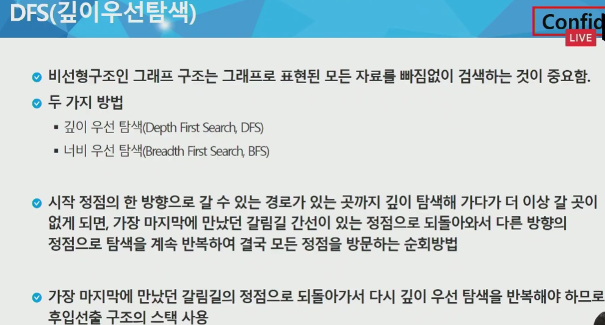

그래프가 깊이, 큐가 너비우선 -> 나랑 연결된 모든거 먼저! 아래로 안내려가고.


이런느낌.


v = 정점의 수

원래 인접리스트는 다른 언어는 다 링크드 리스트로 하는데, 파이썬으로 하면 쉬움. 걍 리스트 쓰니까.


정점 v를 스택에 push 한다는 것은 돌아갈 곳으로 마커찍어두는거.


슈도코드

visited[] = 방문 체크를 위한 리스트! 

DFS (v) = 현재의 정점

while w =  w가 비어있지 않다면~

`여기 아래 예제는 재귀 + 시스템 스택이 이러하다는 것을 보여주는 예`


A를 일단 방문처리함 +  A에서 갈 수 있는 값을 일단 확인함
뭘 기준으로 방문할거냐는 구현에 따라 다르고, 지금은 알파벳순 할거.


A는 방문 한 상태니까 B에서 D로 이동 할거임


방문 체크가 개중요함.

D는 F와 연결돼있는데 B간거니까 F 갈거임


C는 그럼 A E 갈수있다? 두군데 다 방문 했으니까?

더이상 갈 곳이 없잖아? 그러면 스택에서 pop 해서 현재 위치를 바꿔버림!!

가장위에있는 E pop 하고 현재 나의 위치를 E로 바꿔버림


근데 E도 갈데없음 E팝 -> 


G 갈데없음 G까지 가고나서? 그럼 또 pop


아까 C를 A에서 다이렉트로 안가긴 했지만 어쨌든 돌다가 가짐.


이제 스택 pop 해도 스택 없으니까 종료된거임. 경로가 필요한 문제가 있고 아닌 문제가 있을 수 있는데, 경로가 필요한 경우는 찍어봐야함.

만약 경로 딱히 중요하지 않은 경우, (궁극적인 목표는 모든 정점을 확인하는것.) 이거 뭐 기준을 다르게 줘도 되는거임. A 에서 큰거부터 가서 C로 가도 됨.


B에서는 다시 D로돌아가 -> A까지 돌아가다가 끝남. 두가지 모두 DFS 한거임. 

* 재귀함수 통해서 DFS 탐색도 가능하다!! keep in mind
* G는 그래프이고, v는 현재 방문 정점


나랑 인접한 모든 w에 대해서 내가 방문하지 않았다면 내려가봐 ! 하고 호출. for 에서는 B와 C가 차례로 들어올텐데. 방문 안했으면 한뎁스 내려가라고 함. 그러면 재귀호출 이후 안에서 방문처리도 될거고, B랑 연결된 A와 D 뜰껀데, A는 갔으니까 D로 가게 되는것.

`주의`


`return 해버리면 절대안됨`.  C는 어찌어찌 돌다가 됐지만, D는 영영 가지 않음 함수 종료돼버려서. 


print문은 그냥 알파벳 찍어보려고 한거. 인접 행렬이니까 V만큼 돈다고 해야함.
소문자 v는 방문하고 현재 내가 방문하고 있는 정점.

---

* 스택을 이용한 두번째 방법

얘도 visited 리스트 하나 파야함


D부터 시작한다 치면, 스택에 바로 D 넣을거임.


while은 스택이 비지 않을때까지 돈다는 의미고,

pop 하고나면 현재 v는 D니까? (지금경우 들가자마자 바로튀어나옴 저 D)

방문 안했으면 방문 처리


그럼 V(D)와 인접한 애들중에 전부 돌려볼건데

방문 안했어? 그럼 스택에 전부 넣음


이 사이클이 끝나면, while로 다시 나옴. 스택에 F B가 쌓여있어서 while이 끝나진 않음.

이제 V는 pop한 결과인 F가 됨. D에서 F로 이동을 하게 됨.

근데 F는 방문 안했으니까 방문 처리 됨.

 Fë‘ 인접한 애들 중에 EG 중에서 방문 안했으면 이제 또 스택에 넣음.


이러면 또 스택 안비니까 다시 또 돎. 이제 pop하면 V = G 가 됨. 

G 팝하고 


근데 인접한게 F뿐이고 뭐 없으니까 스택에 더 들어갈건 없음.

 pop 하면 또 위치 바뀌고~ 아무튼 스택 내부에 


일케 B 더쌓게 돼도 상관없음 그냥 넣는거임.


그리고 마지막엔 B pop 되고 하면서 끝. 그냥 자기 위치 B 니까 다시 또 B 위치로 옮기는 것만 되는데 별 차이는 없음 if문 작동 안해서.

아까 재귀로 한거랑 순서자체는 되게 다르게 됨. 

---

> 그래프에서 그럼 `인접` 하다는건 어떻게 그럼 판별한거냐


인접행렬은 정점의 수만큼 칸 만들어두고 연결 정보를 찍음

그래프는 쌍방인지 한쪽방향인지 이런것도 문제 유형이 있음.

서로연결이라면?


만약 한쪽 방향만이라면 저렇게 1 1 두개 쓰면 안되고 한쪽 방향만.


* 인접리스트는? 2차원 리스트 구현 할건데

원래 인접리스트는 링크드 리스트로 구현하는데 파이썬은 리스트 씀.


만약 방향이 없다고 하면 이렇게 작성을 하는게 맞는데?
4 - 1 1 - 4 다 되는데?

방향선이 아예 주어지는 경우?


옆에 1이 안붙게 됨.

---

* 그래프의 표현 - > 응용 볼것.


1~7 숫자쓸거면 8 X 8 만들어야함.

일단 0 다들어있는 바둑판 만들고. 인풋 데이터에서 연결돼 있다는 정보 1 2 이렇게 줌. 유향 그래프는 방향이 있다는 것. 


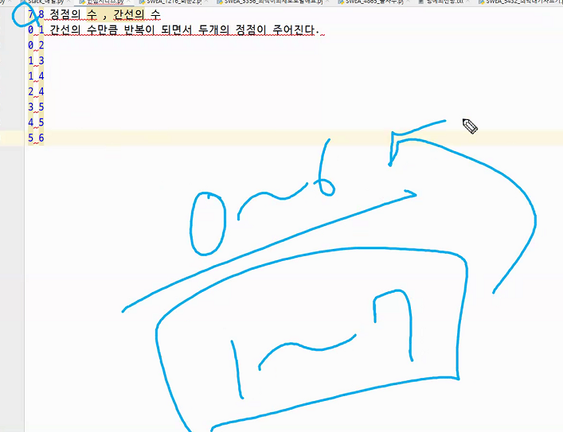

시작정점이 0인지 1인지 확인도 잘 해야함. 1~7 활용시 8x8 


이 동그라미 친 부분이 이거.

```python
V, E = map(int, input().split()) # 정점수 V, 간선수 E

# V*V 크기의 0으로 초기화된 2차원 리스트를 선언한다.
adj_arr = [[0]*V for _ in range(V)]
# 만약 노드가 7개인데 1~7 이렇게 표현돼있으면 V+1 해야함
# 지금은 노드 7개인데 0~6이라 7X7인거

for i in range(E): # 간선 수만큼 돌게 됨.
    A, B = map(int, input().split())
    adj_arr[A][B] = 1
    adj_arr[B][A] = 1 # 이건 유향이면 생략가능
    
```

* 인접리스트


정점의 갯수만큼 빈 리스트 하나 만들고. 여기 4번 정점에 4번 연결은 오타임.

인접행렬은 연결 안된것도 0 으로 하지만? 얜 연결된것만.


이런 느낌

근데 간편하다고 좋은게 아님 -> 불필요한 0이 주는건 좋은데?(조회만 하는 경우면 좋음) -> 데이터 가지고 0과 4가 연결되어 있냐? 를 살펴보려면 저 리스트를 다 뒤져야 한다는게 단점임. 행렬은 그냥 인덱스 값만 찍어보면 바로 이건 확인 가능한데


---

#### DFS 구현 : 연습문제 3


재귀는 그냥 작은거부터 찾아가가다가 같은거 만나면 돌아나오는 식으로 하면 1 2 4 6 5 7 3 찾아짐. 실제 코드에서 레인지에서 뽑으니까. 뭔가 괜찮음.

1 3 7 6 5 2 4 도 됨. 재귀 / 인접리스트에 따라.

* 스택 + 인접리스트

```python
N, M = map(int, input().split())

arr = [[] for _ in range(N+1)]

for i in range(N+1):
    start, end = map(int, input().split())
    arr[start].append(end)
    arr[end].append(start)  # 단방향이라면 이거 안하고

# arr = [[], [2, 3], [1, 4, 5], [1, 7], [2, 6], [2, 6], [4, 5, 7], [6, 3]]

visited = []
stack = [1]  # 맨처음에 시작할 노드 일단 하나 넣어주고
while stack:
    current = stack.pop()  # 맨처음 넣은걸 바로 뽑게 되긴 함.
    for i in arr[current]:  
        if i not in visited:
            stack.append(i)  # 걔랑 링크됐는데 visited 도장 안찍힌 애들을 일단 죄다 넣어버림 스택에 (이과정에서 같은게 들어가기도 함)
    if current not in visited:
        visited.append(current)  # current 도 일단 visited 넣음.

print(visited)

```

* 재귀방식


리턴 굳이 안써도? 어차피 할게 없으면 시스템스택 상에서 나를 불렀던 곳으로 돌아가게 됨. 

* 재귀 + 인접행렬

```python
def dfs_recursive(v):
    # 방문도장찍기
    visited[v] = 1
    # 경로확인
    print(v)
    # 현재 정점에 인접해있는 정점 확인
    for w in range(V+1): # adj_arr[v] 하면 틀림.
        # 인접해 있는 정점이 방문해있지 않고, 연결이 되어있다면?
        if visited[w] == 0 and adj_arr[v][w]:
            dfs_recursive(w)

# 간선, 정점
# 인접행렬, 인접리스트
# V; 정점수 E:간선수
V, E = map(int, input().split())
# input데이터에 따라서 range를 결정
adj_arr = [[0]*(V+1) for _ in range(V+1)]
# 간선에 대한 정보 받아오기
for i in range(E):
    a, b = map(int, input().split())
    adj_arr[a][b] = 1
    adj_arr[b][a] = 1
# 중복방지를 위한 방문체크
visited = [0]*(V+1)

dfs_recursive(1)

인풋 :
7 8
1 2 
1 3
2 4
2 5
4 6
5 6
6 7
3 7
```

재귀 돌돌 도는거

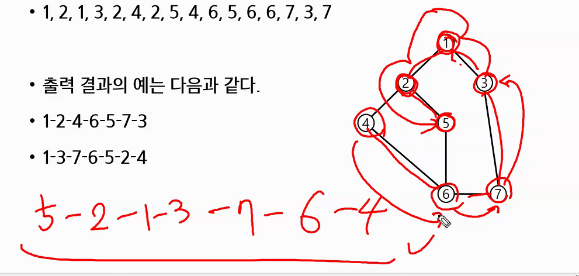

---

#### 2차원리스트 DFS


```python
# N*N크기의 배열이 주어졌을때 1의 개수는 몇개인지 세어보기 dfs를 이용해서
# 하나의 시작 1로 부터 붙어져 있는 연속된 1의 개수 세어보기 => 2, 13이 답이 됨.
# 7
# 0000011
# 0000000
# 0011100
# 0010111
# 0110010
# 0011100
# 0000000
# 방향잡기(상,우,하,좌)
dr = [-1,0,1,0]
dc = [0,1,0,-1]
# 행과 열의 좌표가 들어옴
def DFS(r, c):
    global cnt
    # 해당 arr[r][c] 자리값이 1이므로 방문체크와 동시에 카운트를 1증가
    arr[r][c] = 0
    cnt += 1
    # 4방 탐색
    for i in range(4):
        # 새로운 좌표값을 활용
        nr = r + dr[i]
        nc = c + dc[i]

        # 새로운 좌표값을 활용한 범위검사
        # 범위를 벗어나면 다른 방향을 탐색
        # if 0<=nr<N and 0<=nc<N: 조건도 가능(파이썬에서만)
        if nr<0 or nr>= N or nc <0 or nc>=N:
            continue
        # 이미 방문을 했어도 종료(이것이 없으면 무한으로 방문)
        # 이 범위를 위에 추가해주는 것도 가능하다
        if arr[nr][nc] == 0:
            continue
        # 걸러낼 조건을 모두 걸러내면 재귀가 가능
        DFS(nr, nc)  # 또한뎁스 가라!!

N = int(input())
arr = [list(map(int, input())) for _ in range(N)]  # 행의 길이만큼 만들어준다

# 입력이 끝났으면 처음 시작 위치 찾기
for i in range(N):  # 행우선순회 하면서 전부다 보되
    for j in range(N):
        if arr[i][j] == 1:  # 그자리가 1이야?
            cnt = 0  # prep 하고
            DFS(i, j)  # dfs 해!
            print(cnt)
```

2차원 visited


---

### STACK 2

#### 계산기


1. 토큰? : 각각의 문자열 원소 하나를 토큰이라고 부를거. A  * 이런거
2. A, B 이런것들이면 토큰 출력


`6번 조건 굉장히 중요!`

```python
Step 1 : 중위의 후위표기 변환방법.

게임의 목표 : 각 캐릭터들의 살생부에 늦게 적히기 -> 되도록이면 살생부에 적히지 않으려고 노력을 하게 됨.

스택 : 두목의 집
살생부 = 출력라인

2,3 같은 피연산자 = 원장실이 열리고 호출당하면 살생부에 바로 적힘. 얄짤없음. 안락한 두목의 집에서 쉬어갈 자격 조차 없음.

+ -  == 둘은 동급이고 약한 애들
* /  == 둘은 동급이고 강한 애들
(   == 정웅님
)  == 두목님

이제 하나씩 뽑혀 나오면서 살생부에 적히지 않으려고 노력하는데, 두목님은 살생부에 적히지 않습니다.

<두목의 집에서 쉬어갈 수 있는 조건은 다음과 같습니다.>

스택의 top 인덱스가 가리키는 원소 부분을 '문지기' 라고 하면, 

1. 만약 문지기가 없다면 자유롭게 들어감.

2. + - * / 애들이라면, 문지기가 자기보다 약하면 그냥 들어감.
아니라면 권모술수! 자기보다 약한애를 만날때까지 자기보다 강하거나 동체급인 애들을 살생부의 구렁텅이로 밀어넣고 최종적으로 자기가 그 자리 차지.

3. 정웅님 : 매우 따뜻하고 자상하신 분이라 다른 사람들이 좋아함. 집으로 들어가고자 할때 문지기가 누구든 간에 정웅님을 알아보고 들여보내줌.
반대로 정웅님이 문지기일 경우도 측은지심이 발동해 다 넣어줌.

4. 두목님 : 자기 집에 세도 안내고 들어간 애들이 싫은데 특히 정웅님이 더싫음.
일단 정웅님을 찾아서 제거하기 위해 정웅님과 자기 사이를 가로막는 모든 세입자들을 뽑아내 살생부에 적고 정웅님을 찾아감.
정웅님을 만나면 집에서 내쫒긴 하는데, 그래도 열심히 발표 하시므로 살생부에 적진 않음.

5. 이런식으로 호출하면서 반복

step 2 : 후위 표기법의 수식을 스택을 이용하여 계산.

1. 살생부에 들어간 애들이 불쌍했음. 이제 하나씩 꺼내줄건데, 이번엔 쉬어갈 기회가 없던 애들이 특히 더 불쌍해서 일단 집에 하나씩 넣어줌. 

2. 그런데 코딩에 쉴시간은 없음. 쉬어가던 친구들(연산자)이 호출되면 그친구랑 페어프로래밍을 시킴. 2인 1조. 
쉬어가던 친구들이 더 잘하니까 중간에서 둘을 조율.
그 페어프로그래밍 결과(피연산자)를 집에 넣음.

-> 반복 - > 마지막이 답
```


* 예제


왼쪽 괄호는 스택 우선순위 톱.

isp = in-stack precedence , icp = incoming precedence 


아까 top은 ( 이거였는데? + 우선순위가 높으니까 push. 그다음 5는 피연산자니까 스택에 안넣고 바로출력. 그다음 * 은 우선순위 + 보다 높음


그다음 왼쪽 괄호는 외부검사일땐 가장 높음 (내부일땐 가장 낮음)


그다음 -는 이제 들어오기만 하면 ( 이거는 스택 내부에선 우선순위 낮으니까 넣음.

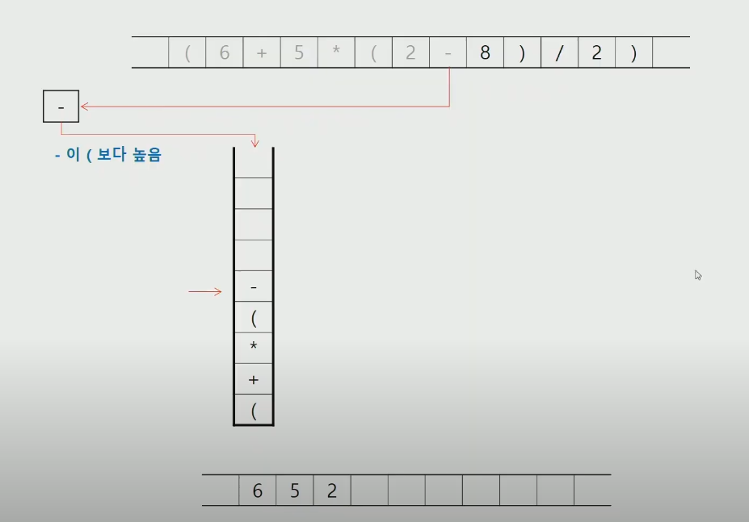

그다음은 오른쪽 괄호 만났다면?


여기서 곱하기 팝하고 나누기 넣음.


2찍고 열린괄호 오른쪽 괄호 만났으니까 팝팝팝

Q. 연습문제 1


 

이건 그냥 근데 틀렸음 연습문제1은 제대로된거 풀것.

---


스택 특성상 LIFO 니까 8 뽑아져 나온걸 뒤에 박아야함.


이 결과들을 스택에 넣음


더이상 읽을게 없어졌을때 후위표기식으로 계산한 결과가 스택에 들어있게 됨.

이거 팝하면 답임. 


이거 순서조심.


eval() 안에 넣으면 이것들 해주는거

---

#### 백트래킹


* 미로찾기


s에서 바로 오른쪽 보면 간선으로 연결돼있다고 생각하면 됨 (0이니까 갈 수 있는 길이다!) DFS 처럼.


이번엔 1번이 벽이라는거 조심. 인덱스 검사 할거면 벽 안둘러도 됨.


4방향 -> 우 하 좌 상 순 으로 확인

`방문체크` 개중요 => 사방탐색 하면서 다음자리 갔는데 스택에서 팝되고 돌아갔을때? 다시 또 거기가서 사방탐색 할 필요는 없으니까!!


돌아왔을때 아래쪽으로 살펴보니까 갈 수 있으니까?

내 위치 옮길거임.


중간그림에서 아무튼 저상태인데, 오른쪽부터 확인하니벽이고, 그다음 아래를 확인하니 갈 수 있으니까, (2,1) 아래쪽이라는 상태를 저장하고 이동함.

DFS 재귀를 이용한 방식도 생각할 수 있음.

`2차원 리스트 DFS 연습!` , 그래프에서 dfs는 해봤으니까.


이건 슈도코드.

* N - Queen

`N*N 체스판에 N개 퀸 넣을건데 공격당하지 않는 경우의수 구하기`

유망하지 않는애 버림.


이래서 조금 더 효율적인 것임.

---

#### 부분집합 구하기


원래 뭐 이런식으로 했는데? 아니면 뭐 비트연산자 사용하거나


이건 슈도코드


* 실제코드


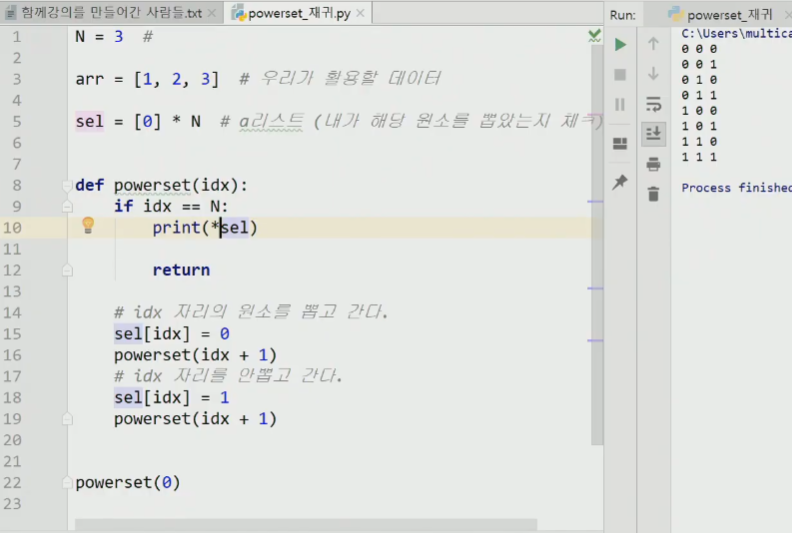


요코드 아래 powerset(0) 을 호출했음. 그리고 오른쪽 저기 저렇게 뜬거.


3에서 if 걸리고 return으로 종료됨. 여기 return 안쓰면 안됨 아래도 또 하려고 할테니까.

돌아온게 idx = 2 의 16인데?


다시 이제 아래것들 하기시작.


이렇게 해도 됨 else 안에 들여쓰기 해도.

그다음 다시 쌓인 idx 3 수행하고 나오면 idx = 2 의 19라인 수행상태까지 돌아오는데? 더 수행할 코드가 없으니까 이제 pop!

그러면 idx = 1 이고 16번라인 수행상태. 그럼 17 이상으로 가면서 다시 스택에 idx = 2 한칸 더 쌓이긴 함.


이런식으로 올리다가 idx = 3 이면 또 출력문 작동

다시 점점 19라인 쪽으로 가다가 pop 되고. -> 반복


... 이런식으로 쭉 됨. 내려갔다가 올라갔다가 3찍고 다시 내려갔다가 다시 3찍고 하면서 출력 되는 매커니즘. 이거 이후로 생각보다 sel 도 되게 바뀌고 엄청 왔다갔다 거려서 김.


이러면 좀 개많아짐.

Q2. 재귀로 짜서 제출하자


재귀함수는, recursive case, base case 있음.


이런식으로 해도 같은 결과.

이걸 sel 이 true false로 하면 반복문에 i 넣는건 안됨. 다른 처리과정이 필요하게됨. 뭐 true 면 i 넣어 이런식으로 한줄 더써줘야함.


여기서 return 이 있으니까 날 불렀던 곳으로 돌아가라는거 명시함. return 만 쓰면 이런 역할.

포문아래 리턴만 떡하니 있는거랑 없는거랑 같음 어차피 더 할게 없어서 밖으로 나간다는 점에서는 같음.


이러면 반대 될거임. powerset은 모든거 구한다는 느낌이라 순서 별로 안중요.


---

#### 순열

> 재귀함수 + 비트연산 + swap방식
>
> 나중에 요기 전부 풀어볼것.
>
> 


이런식으로 했었는데?


교재는 후보군의 갯수 C 이런거 해서 N 만큼 아래처럼 돌지 않음.


N = 3 은 이미 다 뽑았다가 되는 것.

썼으면 continue 식으로 해도 됨. 안썼으면 처리해! 식도 있고.

check는 초기화해줘야하는데 sel 은 초기화 안해도 되는게 알아서 덮어 씌워져서 별로 상관은 없음.


처음 [1,2,3] 출력되는거


* 부분집합 비트연산 style


여긴 원상 복구가 필요없는데 1회성 비교하고 끝낼거라서.
if 문은 j번째를 써버렸다면 그럼 안된다는것.

idx + 1 하면서 check 파이프는 해당 원소 썼다고 하는것.


종료조건에서 그냥 flag = 7 이면~ 2**N - 1 이렇게 하면 됨. (1<<N)-1

* SWAP 방식


idx 가 0 일땐 본인 포함 1 2 옆에 있는것들이랑 바꿀수있음.


돌아나가면서 원상복귀.

얜 자기자신을 스왑할거라 visited check 이런거 필요없음. sel도 필요없고.


원상복귀도 저기 있음.

이거 이외에도 next_permutation 방법도 있음.

-> 오늘한거 = > 반복문이용, 재귀 , 비트, 스왑, next(생략)

---

#### 분할정복 🧩


저 logn 생략일땐 밑수가 컴퓨터에선 2라는거 기억.

수도코드는 한뎁스 내려가서 반짜리 구해오라는 것. 구해오면 그거 두번 곱하겠다!

위코드가 iterative_power라 선형시간이고? 아래가 분할정복


이쯤 하면 차이 많이 남.

---

#### 퀵정렬  🎿


a 는 내가 정렬하고픈 arr -> 시작점이 더 작을때만 수행한다.

pivot 의 위치는 partition 함수를 통해 가져옴.  -> 파티션 함수 구현도 좀 다양함.

퀵정렬 두파트로 나뉘어서 포탈 태워 내려보냄.


호어 안에서도 피벗 위치 첨 중간 끝 으로 나누는거에 따라 좀 다름.


근데 L은 벌써 첫 와일문 끝남 시작부터 69라

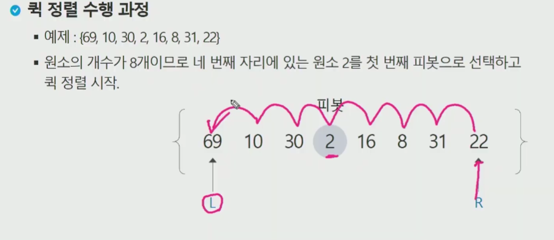


L은 R 못넘어가니까..


합병정렬은 nlogn 으로 확정인데?
그냥 합하는 과정이 없어서 빠른 정렬. 근데 최악 시간 복잡도 저런건 실생활에 잘 없음.


오름 퀵 -> 하면 n2 시간 걸림 -> 악의적 데이터.

```python
# 다른 풀이
def quicksort(array):
  if len(array) < 2:
    # 배열의 길이가 0 이나 1이면 더이상 정렬하지 않아도 된다.
    return array
  else:
    # 계속 재귀 돌릴 곳
    pivot = array[0]
    # pivot 보다 작은 원소들의 모음집
    less = [i for i in array[1:] if i <= pivot]
    # pivot 보다 큰 원소들의 모음집
    greater = [i for i in array[1:] if i > pivot]
    return quicksort(less) + [pivot] + quicksort(greater)

print(quicksort([10, 5, 2, 3]))
```


---

### QUEUE 큐

> 주의.. queue.py 같은거 만들면 안됨. import 걔랑 충돌할수도있음. 디렉토리 이름도 Queue 이러면 안됨. import랑 충돌함.


Front = 마지막에 꺼내진 위치 라고 하기도 함.


pop(0) -> 해도 앞에거 튀어 나옴. 그치만 배열 기준으로 설명될것.
deQueue 에서는 어차피 포인터로 활용하니까 굳이 삭제 안해도 상관없음. 
createQueue => Q = [0]*100 뭐 이런식으로 파이썬에서는

`isEmpty = front rear 같은 값을 가리키고 있으면 빈거임!!`

while not isempty() => 빌때까지 돌아라 이런식
while front != rear:  이런식으로

ifFull 은 파이썬에선 좀 메모리 버틸때까지 붙였다 빼고 이러니까 괜찮은데.
배열 고정크기라면 검사 필요함.

Qpeek => 걍 삭제없이 반환만 =? Front 변수 하나 증가시킨 값 가져온다 정도.


고정크기 배열로 선언했다고 치자

front = rear = -1 은 끝인덱스라기보다 그냥 초기화 상태라고 생각
그 끝에 값이 있으면 파이썬은 들고와버리는 문제점이 있긴 함. 마이너스 인덱스 좀 주의해야함.

삽입시는 rear 증가하고 그자리에 B 넣고, front는 가만히 있는다.

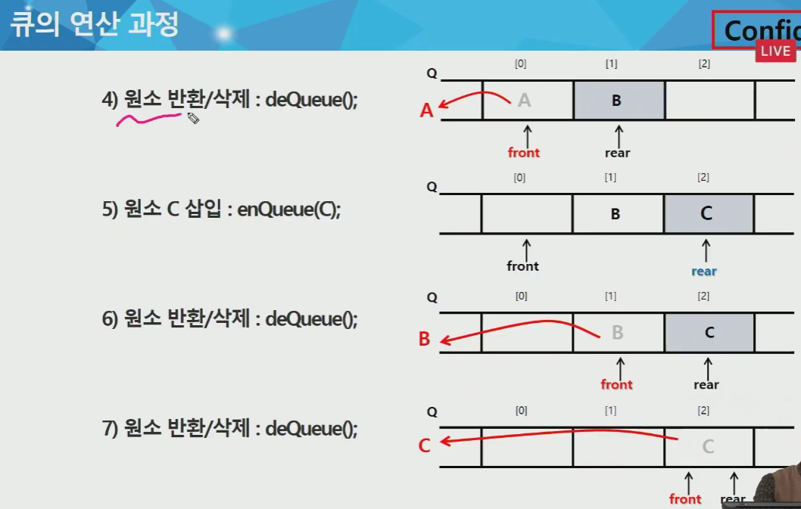

반환삭제 => front 하나 증가시키고 그자리에 있던 A 없애버림.


#### 선형큐  ➖


`front = 마지막에 꺼내진 원소의 인덱스다!`

일단 선형큐 구현부터 해보자.

import deque = > 더블 링크드 리스트 인데 이것도 나중에 볼것.


글로벌 rear 로 변경 해야해서 def 안에 있으니까!


if front == rear => return True 이런거.


이거랑 deQueue 랑 좀 다름. 

Q. 큐 연습문제 1


파이썬은 rear 안써도 append 쓰면 큐 삽입은 가능. (배열크기 안준상황)

근데 pop(0) 이렇게 해야 하는데? 이건 좀 그럼


알아서 3명 출력이 될것.

앞으로 밀착 안하는 친구는 큐길이만큼 삽입 가능한 1회용임

근데 이경우 그냥 둘이 오른쪽으로 쭉 가는데 앞에 뚫려있어도 꽉찼다고 인식하게 돼버리니까 코드상???

1. 하나를 꺼낼때마다 앞으로밀착하거나 (앞공간은 활용 하겠지만 밀착하는 부분이 비효율적임)
2. 원형큐 쓰든가

---

#### 원형큐 💫

문제점?


넘어가면 자연스럽게 논리적으로 0으로 이어지게끔 ?!


> 주의할점 = 원형큐는 0으로 초기화 시킨다

`나머지` 연산자!! 로 쓰면 됨. 빙글빙글 돌게 하려면 => % !

0 1 2 3 4 이러면 %5  이렇게 순환체계 만들 수 있음.

원형큐의 경우 앞에거 떼서 뒤에 붙이거나 뒤에꺼 빼서 앞에 붙이면 시계 or 반시계 방향 회전 효과도 낼 수 있음.


빈자리로 둔다는 것의 의미? : 선형큐의 공백상태 판단은 front == rear 일 때 공백이라는 판단을 했는데?

원형큐는 뱅글 돌다가 front == rear 같은 경우 단순히 이렇게 해버리면 사실 꽉 차있을수도 있잖아? 한바퀴 돌다가 시계처럼 맞을 수 있으니까? 물론 front == rear 인 경우 선형큐처럼 비어있을 가능성도 있겠지만.

`빈자리` 로 두게되면? rear + 1 과 front 가 같다고 하면 가득찼다고 생각하면 됨 원형큐에서는. 

그럼 front == rear 일경우만 딱 단독으로 공백상태의 의미가 됨.

mod n 에서 n 은 큐 size 임.


어차피 덮어씌워 질거니까 굳이 안지워도 됨. front rear 포인터 쓸거니까.


(rear+1) % 4 => 0 임. front가 있는 자리는 비어져있음 여기서도. 

6) 그림처럼 front rear는 붙어 있어야함 == 같지 않아야 == 같으면 헷갈리게 되니까 저런식으로 욕심내서 front 자리까지 더 넣진 않음. 

`구현`


모듈러(나머지)연산 꼭 빼먹으면 안됨. 

가득찬 검사는? -> len circular queue  로 나머지연산을 통해 체크.
rear + 1 를 모듈러 연산한것이 front와 같다면?! => 가득찼다.


이런거 공식문서도 있음 참고.

> 원형큐 코드


여기서 또 서예리 들어가면 김동찬이 나가긴 했는데 있는 것처럼 보이긴 하겠지만?


어차피 덮어져 씌일거니까 없는 데이터나 마찬가지임. 


이런식으로 덮어 씌워지게 될것. 이경우 박나영은 죽은 데이터.

---

#### 리스트큐

근데, 선형큐가 가득찼을때의 해결로 원형큐 쓰는건 아님(노는공간 해결을 위해 원형큐를 쓰는거지)


근데 이거 리스트 방식 하면 거의 시간초과 나서 별로 안좋음.

---

<여기서부턴 가볍게 이야기> => 연결큐

링크드 리스트와 우리의 파이썬 리스트와는 다름


끝이 None 이면 앤 더이상 그다음 연결된게 없구나 == rear

각각의 원소는 노드같은거


front rear 초기화 -> none 으로

맨처음 A야 뭐 더 연결된게 없으니까 None.


---

#### 우선순위 큐


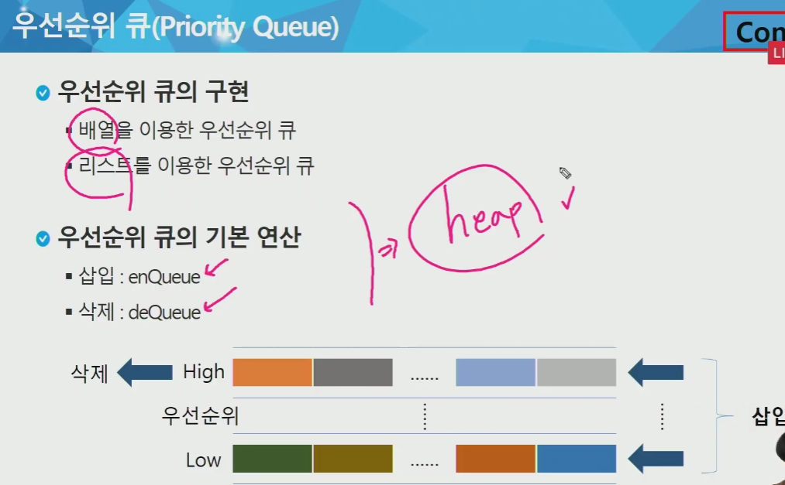

트리 배우고 나면 더 자세히 할거.


근데 어쨌든 재배치는 피할 수 없음.


Q. 큐 연습문제 2 => 엔터는 일단 생각하지 말자


20번째 마이쮸는 누가가져갔는지? 해보기


20번째 마이쮸는 2번이 가져가게됨.

---

### BFS  ↔

> 너비 우선 탐색


얜 A 일단 큐에 넣고 걔를 꺼낼때, 인접한 애들 죄다 큐에 넣음. (BCD)

그런다음 B 꺼내지면서 (FIFO) E,F 큐에 들어가고 => 이런식.

D 에서 시작했다고 치면 D - A - G - H - I - B - C - E - F 이 될것.


정점개수 저 visited 도 노드가 0이냐 1이냐 시작에 따라 좀 다를 수 있음.

```python
visited = []
queue = []
while queue:
    current = queue.pop(0)
    for i in arr[current]:
        if i not in visited:
            queue.append(i)
    if current not in visited:
        visited.append(current)

print(visited)
```


이게 앞에서부터 뽑는 스택 원리상 bfs가 되는것. 


이러면 C가 두번 들어가긴하는데, 문제가 있는건 아니지만, 불필요한 메모리를 잡아먹는 감이 있긴 있음. 선형큐 크기를 줬는데, 모든 그래프가 깔끔하게 큐에 쌓이는게 아니라서 ? -> 완전그래프같은 경우는?


아까같은 코드로 작성하게되면 길이 개커질거임.

그래서 이런 부분을 고치기 위해서 ?


visit(t) 는 경로찍기든 뭐 작업 할거면 해라 라는 슈도코드.


파란 박스 부분은 덜어내도 됨

일케 바꾸면?

어차피 큐에 쌓이는 애들은 방문하게 될거니까 ?


큐에 들어가는 순간 방문 체크 해버려라.

이러면 이제 B가 뽑아져나올때 C가 큐에 안들어가게됨 !!!


넣음과 동시에 체크 방식.


이렇게 보면 결국 거리별로 방문 한거나 같음.

그래서 거리까지 저장해서 표시해줄 수 있음 visited 활용해서


5넣었으면 사이즈는 1이고 반복문은 한번 돌것.  거기서 2 6 나옴

다음은 사이즈가 2가 될거고 반복문은 두번 돌거임 1 4 7 나올거임.

그럼 이런거 어디 쓸거냐? 미로문제에서도 BFS?

검정색은 visited 2차원 버전


미로탈출 가능하다면 거기까지 길이가 얼마인데? 도 알 수 있음.

visited를 안쓰면 생기는 문제?


큐가 빌때까지! 라는 조건 주게 되니까 큐가 안비어서 난리남.

* 사이즈 묶기


1. 이렇게 튜플로 아예 오른쪽에 거리까지 주면 사이즈로 묶는게 필요 없겠지만?

2. visited => 를 distance (dist) 로 하기도 함 이때는 T F 쓰는게 아님.

넣을때 + 1 씩 해주면 ? -> 알아서 들어가있게 됨.

3. 사이즈 묶기

보통은 while Q : 이런식으로 작성 하니까?


첫번째 Q 사이즈는 1일것. 반복문 1회 돌것


---

#### 2차원리스트 BFS

bfs -> 재귀 안씀 --> '큐' 쓸거
근데 큐는 다시 --> 리스트큐(append, pop(0)),  선형큐, 원형큐가 있음.

bfs 의 경우 visited 나 dist 같은 2차원 배열을 하나 더 파두면 문제풀이가 용이함 (bfs 특성상 최단거리가 뭐냐? 문제가 나오기 때문) 


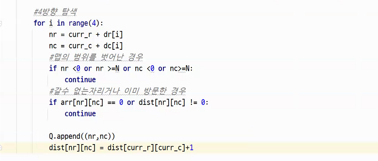


1 중심으로 등고선 그리는 느낌.

```python
# 1이 시작되는 부분부터 거리들을 기록해보기
# 7
# 0000011
# 0000000
# 0011100
# 0010111
# 0110010
# 0011100
# 0000000

# 동서남북
dr = [0,0,1,-1]
dc = [1,-1,0,0]
def BFS(r, c):
    # Q를 초기화
    Q = []
    Q.append((r,c))
    dist[r][c] = 1
    # Q에 요소가 존재할때까지만 돌 것(빈컨테이너가되면 멈춰버린다)
    while Q:
        curr_r, curr_c = Q.pop(0)
        # 4방향탐색
        for i in range(4):
            nr = curr_r + dr[i]
            nc = curr_c + dc[i]
            # 범위를 벗어나면 다른방향 탐색
            if nr<0 or nr>=N or nc<0 or nc>=N: continue
            # 갈 수 없는 자리거나 이미 방문한 경우
            if arr[nr][nc] == 0 or dist[nr][nc] != 0: continue

            Q.append((nr, nc))
            dist[nr][nc] = dist[curr_r][curr_c] + 1

N = int(input())
arr = [list(map(int, input())) for _ in range(N)]  # 행의 길이만큼 만들어준다
dist = [[0]*N for _ in range(N)]
# 입력이 끝났으면 처음 시작 위치 찾기
for i in range(N):
    for j in range(N):
        if arr[i][j] == 1 and dist[i][j] == 0:
            BFS(i, j)
for i in arr:
    print(*i)
```


---

## 에러들

> 시간초과(비효율성) or 런타임에러 : 런타임에러는 인덱스거나, 입력 기다리고있거나, 10%는.. 진짜문제.

---


## 과제 + 연습문제 풀이

#### LIST 1의 4문제 + 1주차 추가문제들

* 조망권 문제


max 직접 구현!! 

1차원 리스트

```python
# test case 입력받기
T = 10
for test_case in range(1, T + 1):
    c = int(input())
    apart_list = list(map(int, input().split()))

    idx = 2  # 인덱스 번호 세기용
    count = 0  # 조망권 호수 세기 용 변수
    # 각각의 아파트를 살펴보자 (양 옆 2개 씩은 건물이 없기 때문에 뺀다)
    for tc in apart_list[2:len(apart_list)-2]:
        # 좌우 아파트의 해당 층수에 대한 건물 유무 파악을 위해 공갈 리스트 생성
        fake_b_left1 = [1] * apart_list[idx - 2] + [0] * (tc-apart_list[idx-2])
        fake_b_left2 = [1] * apart_list[idx - 1] + [0] * (tc-apart_list[idx-1])
        fake_b_right1 = [1] * apart_list[idx + 1] + [0] * (tc-apart_list[idx+1])
        fake_b_right2 = [1] * apart_list[idx + 2] + [0] * (tc-apart_list[idx+2])
        # 아파트의 각 층을 살펴보자
        # 아래에서 i 는 층이 된다
        for i in range(tc):
            # 양 옆에 건물 있어?
            if (fake_b_left1[i] == False and fake_b_left2[i] == False and fake_b_right1[i] == False and fake_b_right2[i] == False):
                count += 1
        idx += 1
    answer = '#{} {}'.format(test_case, count)
    print(answer)
```

tc보다 키큰애가 좌우에 있으면 그냥 빈리스트 concat.


2차원 리스트.


* 디버깅시 예를들면 그림그리는 함수, 확인용 함수 이렇게 두면 좀 편해짐.  실제로 width-1 이라고 했는데도 인덱스 오류가 안났던 이유는 이미 바로 아래줄 if 에서 통과하지 못해서 아래가 실행이 안됐기 때문.

---

* MINMAX

min_value 저래 설정하는것도 할 수 있음. if 자리에 뭐가될지 생각.
num의 0 인덱스 주거나?!
T 받았으면 그냥 위에서 range(1, int(input()) +1) 이런거도 가능.


* 전기버스

일단 최대한 충전 안하고 갈 수 있는데까지 가볼거임.
거기 충전기가 있다면 충전하고 아니면 한칸씩 돌아오자!


> +들어온 정류장 만으로 확인하는 발상

충전기들 사잇값이 k보다 크면 종료
갈 수 있다고 하면 일단 가보는 것.
last는 버스의 위치. 


0 + 3 해서 3까진 갈수있는데 0+3으로 5는 못가니까 내위치는 3이고 충전횟수 1 추가! (여기서 이미 1은 아까 확인하고 넘어감.)

두칸 늘렸으니까 m+2 로 만드는것


* 구간합


굳이 소팅 안하고 그냥 min max만 뽑아오기.


다른방법?  -> 사실 좀 중복이 되는데 ?!


그냥 하나의 구간합은 그다음 구간합에 1빼고 3더한 이런 느낌.
중복 연산을 좀 막아보자! -> 윈도우 슬라이딩.


* 숫자카드

이런식으로 숫자를 10씩 나눠서 나오는? 몫으로 카드 고를수도있는데0으로 시작할 수 있다는 점이 제한이 됨.


등호 = 가진 값이 같더라도 바꿔야 하니까 들어가 있는것.

뒤에서부터 세면 어떤 차이가 있을까?! 등호 필요 없음.

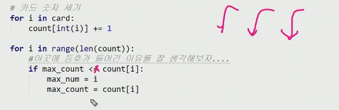


이후 과정은 모조리 할 필요 없음. 

* Flatten-1208


이걸 정렬 덤프 정렬 덤프 이래도..


추가방법!


1차원 리스트로 카운트 배열 만듦. 이때 max 값은 최대높이인 100


시작점과 끝점을 알아야함. 가장 낮은 높이의 인덱스가 어딨고 가장 높은 높이의 인덱스 어디냐.

이제 이걸 이런식으로 깎고 올림.

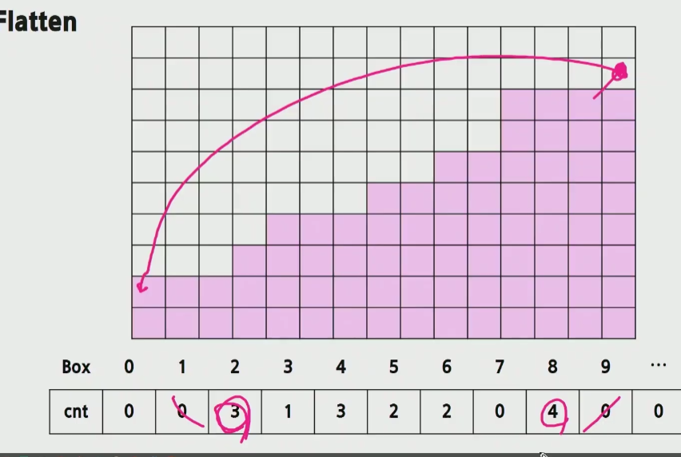


-> h_cnt로 바꿔야함. 위에 에러.

* 두개의 숫자열


---

* 삼성시 버스노선_6485


문제에서 5000을 보면 보통은 0~4999 인데? 1~5000쓴다고 했으니까? 5001개 로 만들어서 5000 포함하는거 주의.


이건 그때그때 입력받고 출력한 느낌이고.

answer = [~~] 이렇게 담아놨으면 정수형 리스트-> join 쓰자.

map(str, arr) 하고 join!

---

* 간단한 소인수분해


---

#### list 2의 4문제 + 2주차 추가문제들

* 달팽이


* 부분집합합 + 정민님 코드 보기.


* ladder -> 유진님 코드 보기.

* GNS


---

* 문자열비교


* 4861 회문


* 회문 2


 zip 쓰는방법


* 글자수


* 세로로말해요


* 쇠막대기 자르기


닫힌괄호가 나왔을때 바로 직전 애가 닫힌괄호라면 레이저라는 뜻.

일단 left bracket 나올때마 cnt ++ 이고 right bracket 만나면 cnt --


레이저 만나면 여태까지 있던 애들이 다 잘림. 조각 생긴다는 뜻.

막대 끝나도 조각 하나씩 나오니까..


+


---

#### STACK

Q.   괄호검사


++ 다른사람 코드 보기

Q.  종이붙이기


이러면 중복연산 많으니까, 메모이 써볼것.

---

Q. 미로


소영님 코드에서 이거 범위검사 이후에 넣어야 단축평가 응용해서 idx 에러 안띄울 수 있음.

++ 정민님 코드에서 원상복귀는 필요없음.

---

Q. 토너먼트 카드


```python
# a를 기준으로 이기고 짐을 표시해보자
# 1 가위 2 바위 3 보
def rsp(a, b):
    if stu_list[a-1] == 1:
        if stu_list[b-1] == 2:
            return b
        elif stu_list[b-1] == 3:
            return a
    if stu_list[a-1] == 2:
        if stu_list[b-1] == 1:
            return a
        elif stu_list[b-1] == 3:
            return b
    if stu_list[a-1] == 3:
        if stu_list[b-1] == 1:
            return b
        if stu_list[b-1] == 2:
            return a
    # 숫자가 같은 경우 a가 더 작은 번호이기 때문에 a 가 이긴다
    if stu_list[a-1] == stu_list[b-1]:
        return a

def div(start, end):
    # 부전승으로 올라갈 경우
    # + 더 이상 내려갈 곳 없는 경우
    if start == end:
        return start
    # 계속 나누어 버리자
    # 문제에 나온 공식을 기준으로 시작과 끝 점을 붙인다
    man_a = div(start, (start+end)//2)
    man_b = div((start+end)//2 + 1, end)
    print(man_a)
    print(man_b)
    return rsp(man_a, man_b)

for tc in range(1, int(input())+1):
    N = int(input())
    stu_list = list(map(int, input().split()))
    print('#{} {}'.format(tc, div(1, N)))

```

Q. 배열최소합

```python
# 정민님 코드
```


---

## 디버깅 + 단축키

CTRL + SHIFT + F10 이어야 현재 있는 거 실행.
CTRL + ALT + L => 자동정렬.


단축평가 + 함수의 if 응용

이건 아무것도 안나오는데?

먼저 idx < 3  부터 이미 보지도 않음 뒤에 false 니까


순서만 뒤집었는데 왜 아래는 인덱스 에러냐?

얘는 앞에 딱 들어갔을때 이미 index 에러가 남.


뭘까?


첫번째 5는 if에서 걸려서 min은 갱신 ㄴㄴ

두번째 5는 또걸림 두번째 5로 갱신.

세번째 5도 또걸려서 elif 못넘어가고.. if만 5번 되고 치워버림.

그래서 elif 못가니까 min 은 9~로 고정.


이걸 elif 뒤에 막 60만 적어도 되는 이유가 위에 if 에서 걸렸으면 불필요한 조건문 줄일수도 있는것. 

---

#### 디버깅

>중단점 설정 + SHIFT F9+ F8 (단계별 실행.)
>
>제대로된 인풋 디버거는 SHIFT F9!

디버거 안쓸거면 이래해야하는데?


'+' 누르면 위에 좀 고정시킬만한 것들 올릴 수 있음. 


졸라 장황한 input 이라면, 바로 알아먹을 수 있는 test case 임의로 작성할 수 있음. 조망권도 젤 짧은게 100개짜리니까? 한 8개짜리 만들어서 검사 해보면 로직만 체크할 수 있음. 

---

* 글로벌 키워드!


리스트는 주소로 접근해서 바로 control 가능


새로 뒤집어쓰는 거니까? 이건좀 다름 


값을 `수정` 하려면 global 키워드 필요.

읽기만 할거면 global 키워드 필요 없음.

---

#### 단축키

* 들여쓰기 안맞는다 =  ctrl alt L
* ctrl + D 하면 복사됨.
* 실행취소 = ctrl + z
* 실행취소의 취소 = ctrl shift z
* alt + shift + 방향키 -> 줄 옮기기
* shift enter  다음줄이 됨. 위치  상관 없이.
* 한줄삭제 = ctrl + Y
* shift + F8 위단계
* ctrl shift f10 = 현재 실행

---

### 주의할점


