# Youtube Live

정적 웹

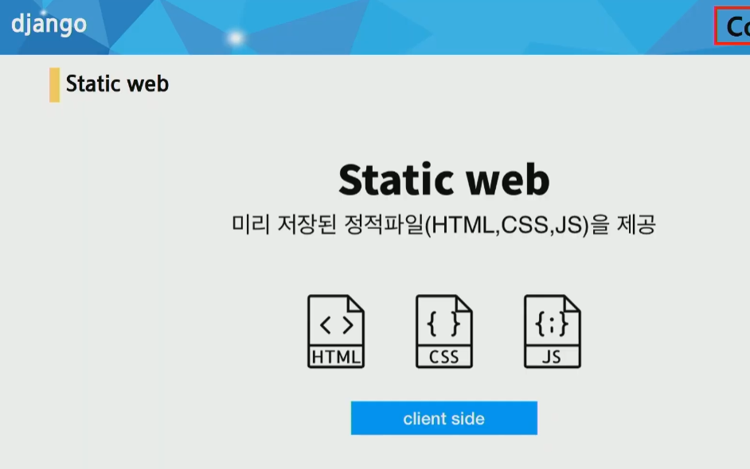

데이터 처리 이런거 안이루어지고 미리 준비된 것들을 보여줌.

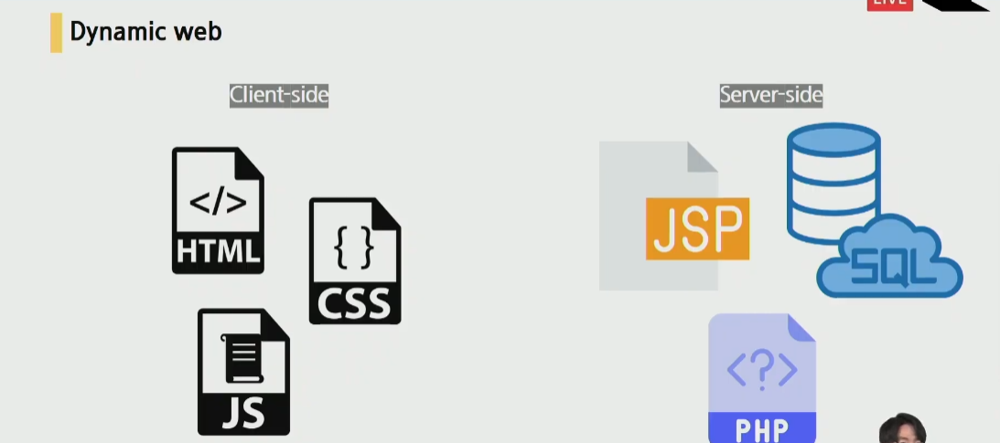

서버쪽에서 추가적으로 일 해서 답변 주는게 동적 웹 그리고 쟝고


---

> 쟝고 = 파이썬 웹 프레임워크

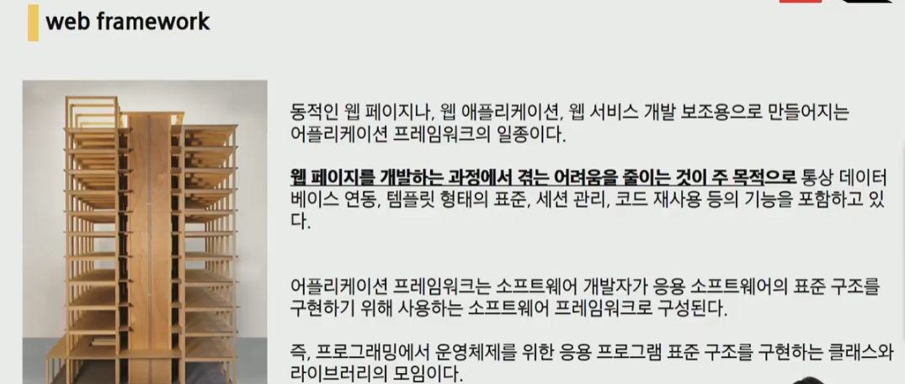

카페 창업이라고 치면 모든걸 처음부터 하긴 힘듦

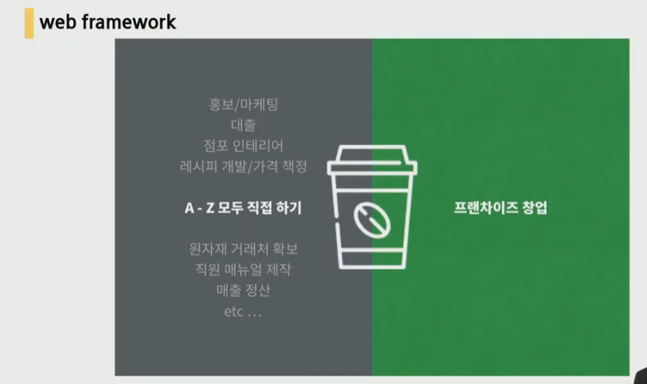

웹 으로 치면? 잡다한 기능은 전부 구현하기보단 프레임워크가 제공

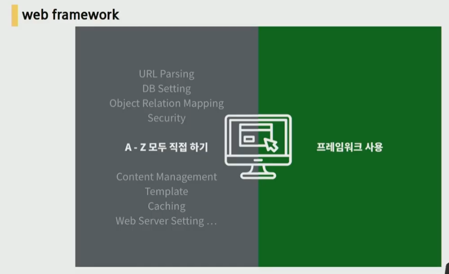

기본적 구조, 골격 필요 코드들을 제공하면 좋은 웹서비스 만드는데 집중이 가능하게 됨.

쟝고 => 커뮤니티가 큼 (파이썬 생태계가 크니까)

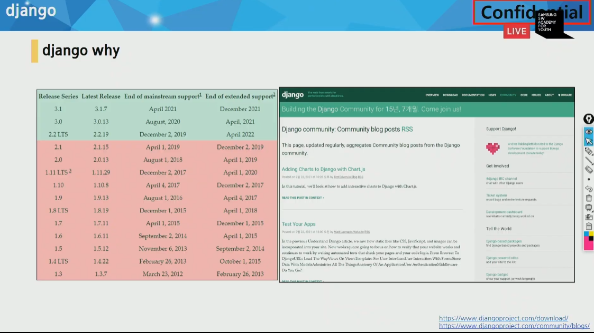

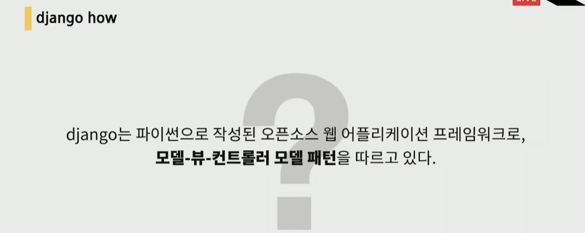

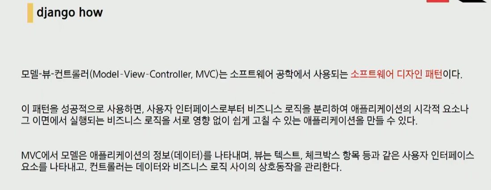

MVC 디자인 패턴 이 많은데? 쟝고는 `MTV`

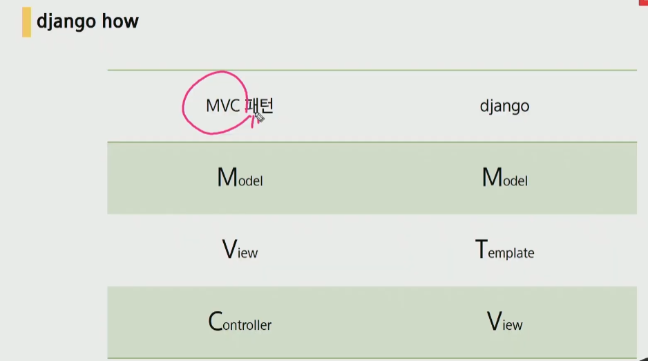

그냥 거의 같은데 이름만 다른거임. View가 두개라 좀 헷갈리겠지만.

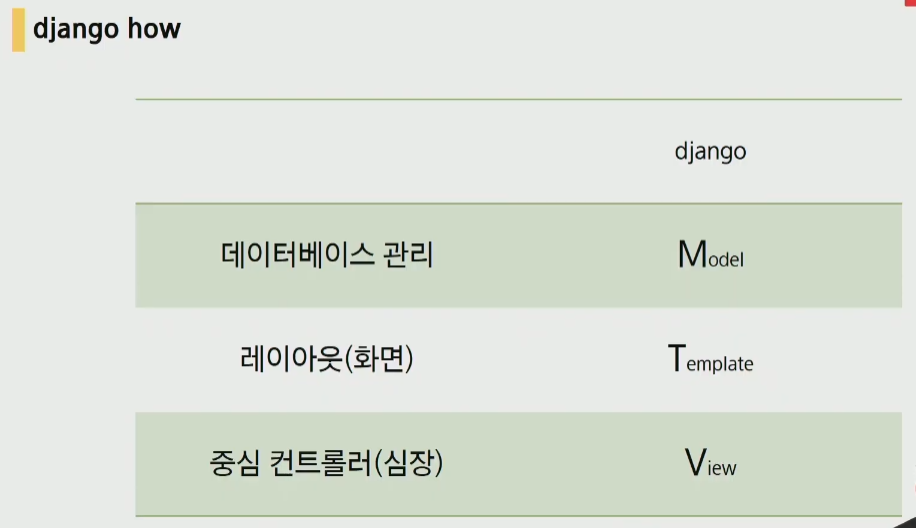

* 도식화

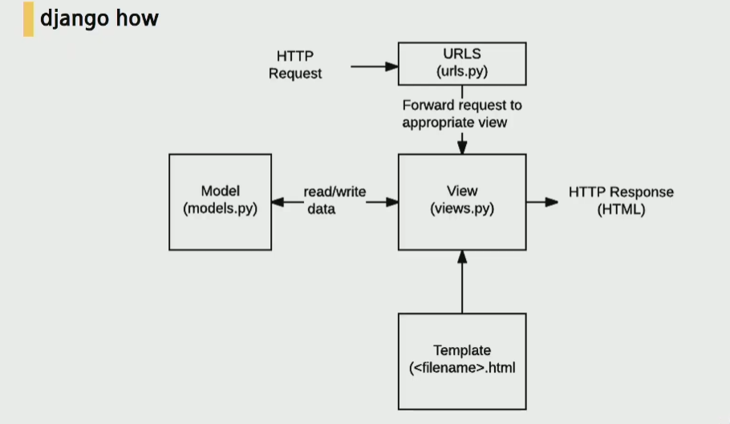

서버가 응답하기 위해서는 요청이 와야하는데, request 오면 쟝고의 urls 로 오고 어떤 요청인지 방향 잡고? view가 모델로부터 데이터 받고 처리해서 템플릿에서 하나의 완성된 html 만들고 최종적으로 우리에게 응답 주는 구조.

이것도 설치해야됨 -> pip list 로 3.1.7? 3.1~ 뭐인지 확인 쟝고.

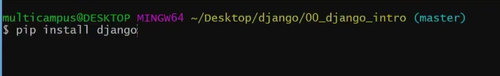

---

> 명령어 해줘야함 3등분 되어있는 명령어

쟝고 어드민 , 스타트 프로젝트 , first project => 이건 이름

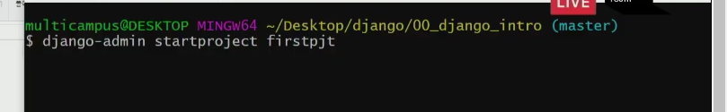

쟝고 하이픈 어드민 스페이스 스타트프로젝트 (오타 주의) 스페이스 그리고 프로젝트 이름을 쓰는 구조

이거 쓰면 뭐 별거 안된거 같을텐데 

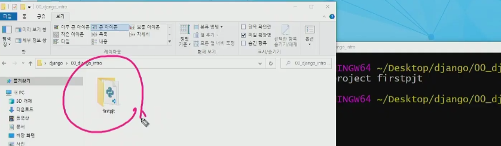

실제로 가면 이런 폴더 있는데, 이폴더 안에 가면?

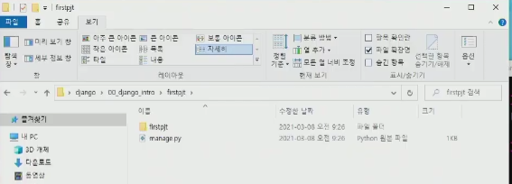

firstpjt 안에 firstpjt 가 또있음.. manage.py 도있고

이 `위치` 에서 배쉬 켜서 명령어 다른거 칠거임.

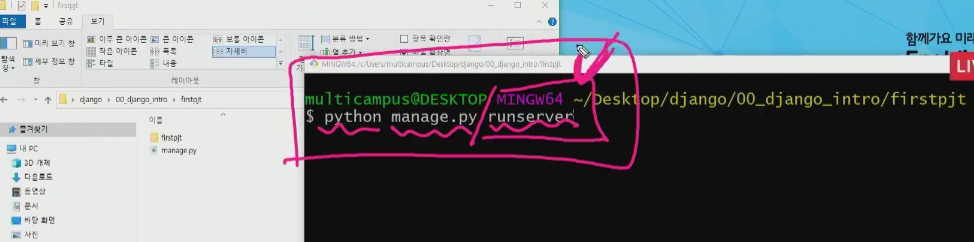

이 명령어는 서버를 키는 것.

python manage.py runserver => 파이썬을 통해서 manage.py를 실행 하는데 뒤에 runserver라는 `키워드` 가 붙는것. 다른 명령어도 뒤에 키워드가 달라지는 구조가 될거임.

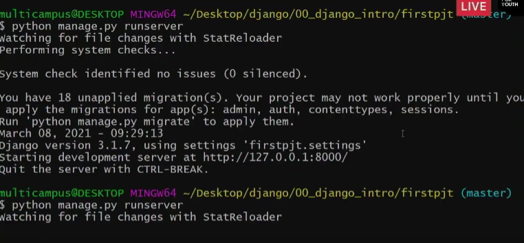

잘 켜지면 원래 윗부분이 되어야하는데, 안켜지면 깃배쉬 문제일수도.

켜져 있는데 배쉬에 출력이 안될수도 있으니까? 일단 ctrl c로 꺼버리고?

이 위치에서 vscode 열면?

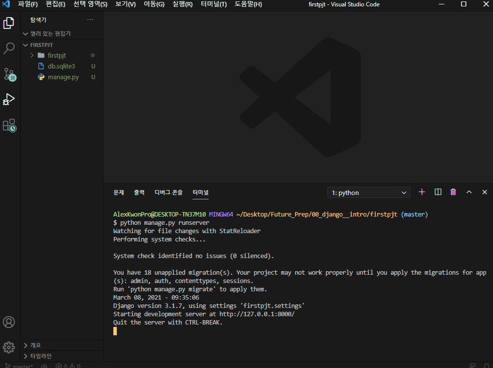

여기까지 뜨면 정상인것.

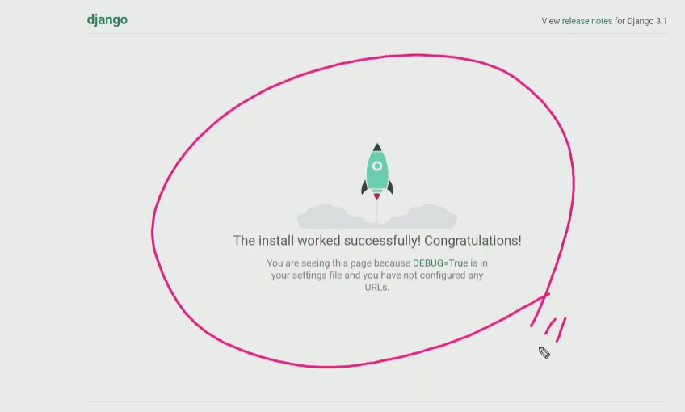

저기 127~ 저기 주소 ctrl 클릭으로 가면 이런 로켓 그림 뜨면 성공.

여기서 `주의사항`

pjt 이름으로 쓰면 안되는 것들이 존재함 -> requests 및 함수명 등등 파이썬에서 겹칠만한 것들 쓰면 안됨.

`하이픈` 도 쓰면 안됨!!! 언더바로 대체 하자.

ctrl + c 하면 꺼짐.

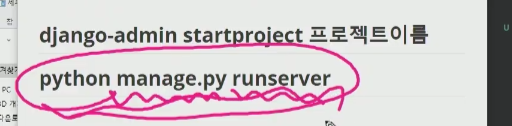

지금 두개 썼는데, 아래 저기는 manage.py 가 있는 폴더 위치에서 vscode 켜야한다는걸 생각해야함.

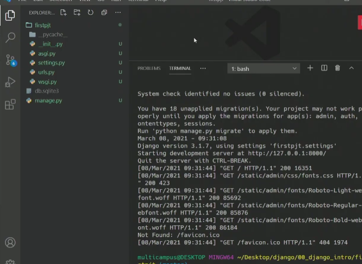

이거 켜보면 꽤 여러개 생겼는데 파이캐시는 무시하면 됨.

1. `__init__.py `=> 빈파일임 여기 뭐 있으면 안됨.

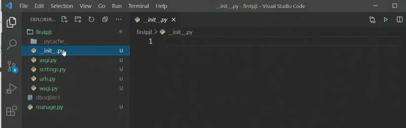

패키지라고 인식할 수 있게 해주는 파일이라서.

2. `asgi.py`

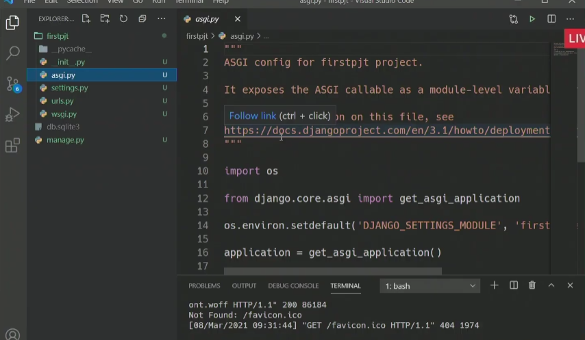

장고 3 버전의 신생파일 => 비동기 웹서버랑 같이 연동할때 사용하는 것.

3. `settings.py` => 굉장히 중요함.

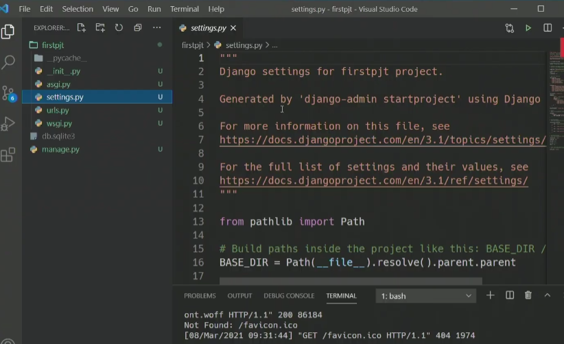

쟝고 웹 사이트의 모든 설정을 포함하고 있는 파일.
우리가 만든 어플리케이션이 등록이 되기도 하고, 파일들의 위치, 데이터베이스 세부 사항, 보안 관련 것들이 다 여기 작성. 

4. `url.py` 이것도 중요.

사용자 요청을 가장 먼저 만나는 애임. 작성이 뭔가 좀 되어있긴 함 사이트의 내부 연결을 규정할 수 있음.

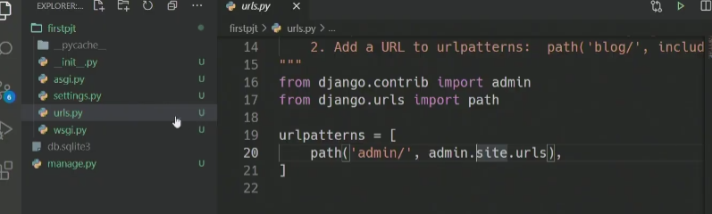

5. `wsgi.py` 

asgi랑 비슷한데 배포할 때 도움을 주는 파일임.

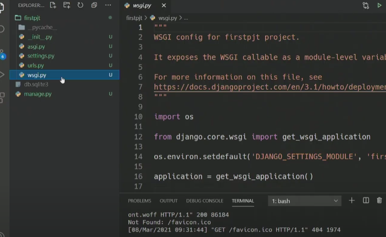

사이트의 기능적인 측면은 프로젝트가 아니고(프로젝트는 하나의 큰 개념) 여기서 목적을 가지고 동작하는 애들은 어플리케이션이고, 우리는 어플리케이션을 만들지 않은 상태 

---

APPLICATION

startapp  까지가 중요 뒤에는 이름

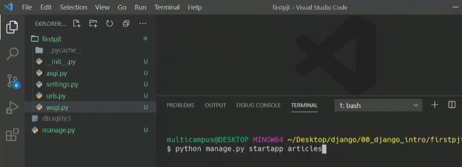

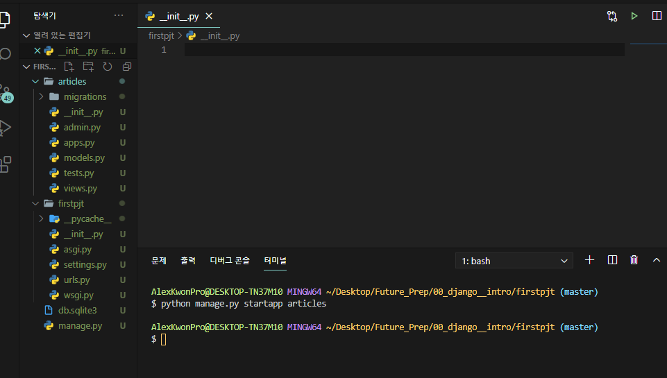

그러면 또 articles 라는 폴더가 생기고 안에 또 엄청 많음.

migrations 가 약간 패키지가 되는 건데 init 또있음 여기안에.

`admin.py?` => 관리자 페이지 관리하는 공간. 관리자 사이트를 커스텀 하는 파이썬 파일.

apps.py? => 앱에 대한 정보 있는데, 장고 끝날때까지 절대 수정하지 않음.

`models.py` => MTV 디자인패턴의 M !!

tests.py => 쟝고 코드의 테스트 코드 작성하는 공간. (정규수업에선 다루지 않음.)

`view.py` => 디자인 패턴의 V 의 역할 => 중간관리자 역할을 함.

* 직접수정 => 어드민, 모델, 뷰 이거 3개만!! 수정

근데 MTV 중 Template 는? 쟝고가 자동적으로 만들어 주지 않음!

---

여기까지 해도 앱 생성이 끝나지 않음. 프로젝트 입장에서는 앱과 프로젝트가 동일 레벨(선상)에 만들어져 있는데?? 쟝고의 하나의 프로젝트는 어플 여러개 가지고 있는데, `동일 선상에 폴더`가 만들어지게 됨.

어플리케이션이 만들어져도 프로젝트 입장에서는 어플리케이션이 만들어졌는지 알 수 없음. 그러니까 어플 어떤거 만들면 프로젝트에 `등록`을 해줘야함.

프로젝트의 settings.py 가서?

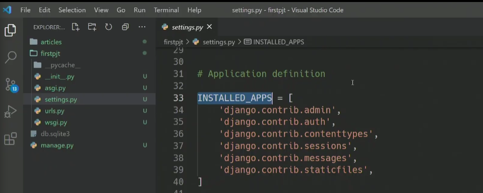

이런 부분이 있음. 근데 articles 라는 앱만 만든거밖에 없는데 뭐 많은데? 장고가 기본적으로 구동되는데 필요한 내장 앱들임. 각각의 어플리케이션인데 얘들도? 미리 등록이 되어있는것.

쟝고는 installed app 에 `order` 가 어느정도 정해져있음!!

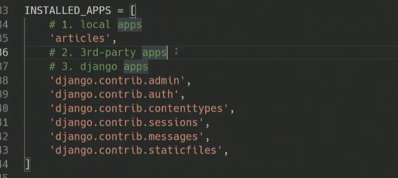

이런 식이니까, 가급적이면 로컬앱들을 저 위에 작성해 주는게 좋음.

근데 이거 보니까 파이썬 문법 어겨버린게 있음

마지막 값 trailing comma => 권장됨. 리스트 끝 요소에 , 해주는 것.

---

settings.py 에서 좀 손볼게 있음.

107번째 줄에 Internationalization 있음 랭귀지 코드라고 하는데? 표준이 다 있긴 함. 쟝고는 기본적으로 en-us 로 되어있는데? 우리는 ko-kr 이렇게 바꿀거.

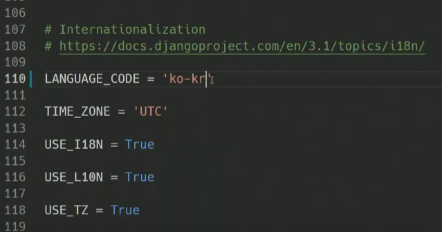

이러면 뭐가 달라지나?  서버 함 켜보면?

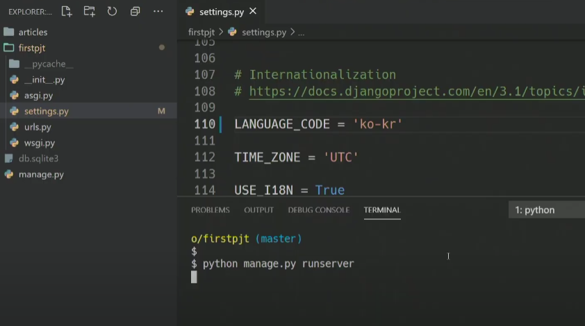


그리고 타임존 = 데이터베이스에 출력되는 시간대
UTC 인 부분을?  이런거 검색해보면 됨.

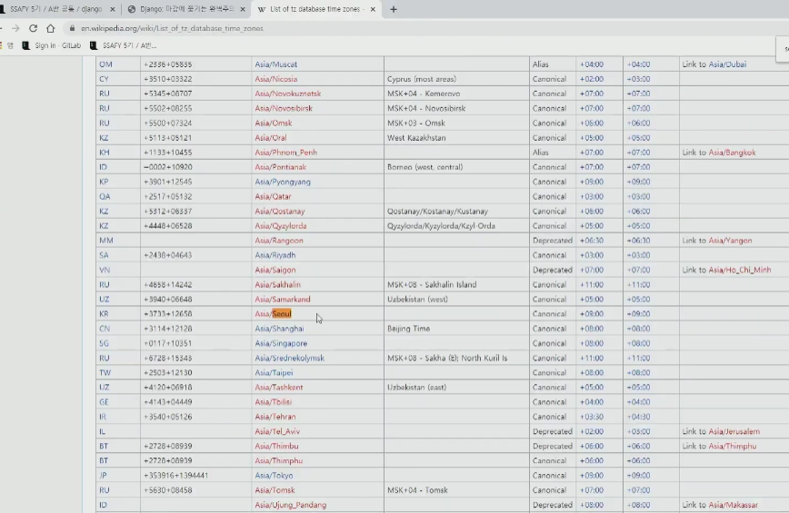

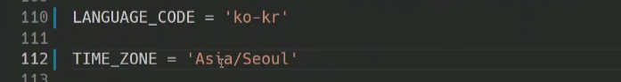

얘는 앞에 대문자로 함.

나중에 데이터베이스 저장될때 시간대에 대한 출력을 서울에 맞춰서 출력을 하기 때문에 그거 하면 실감 날거임.

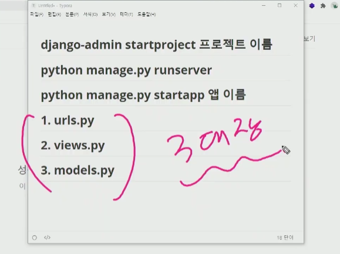

---

> 이제 장고 서버를 구축했으니, 요청-응답 사이클 공부해볼것.

요청을 가장 먼저 받는 곳은 아까 그 그림에서 urls.py! 임.

얘가 http request를 알맞은 Views.py로 전달해줘야함!!

`요청이 들어오면 그 요청이 어디로 가야할지 파악하고 적절한 함수를 찾아서 그 함수를 호출하는 역할을 하는 것이 urls.py 임!!`

그럼 urls.py는 어딨냐? 프로젝트! 에 있음 좀 헷갈리는데 파일이 좀 많아서,` firstpjt 이게 프로젝트`이고, 쓰지 않는 앱들 폴더는 같은 레벨에 있어서 헷갈리니까 닫아두는게 좋음.

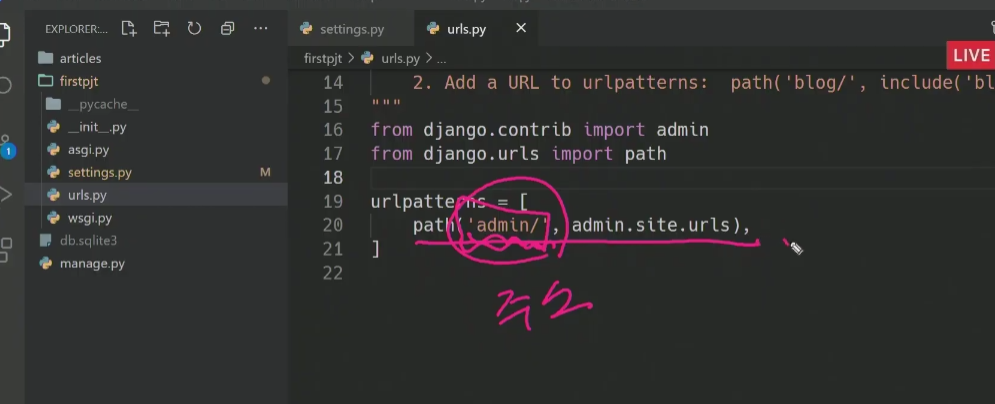

이거 슬래시 있는거 보니까 어드민이라는 주소 같은데?

우리 url 하나도 만든적없는데? 어드민 주소는 기본적으로 하나가 들어가 있음. 이 주솟값이 뭐냐면? 
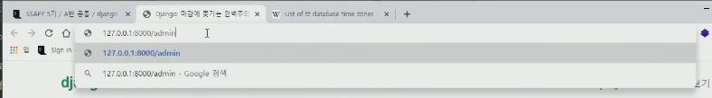

여기 이렇게 쳐보면

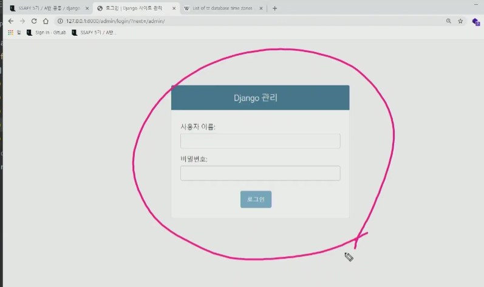

만들지도 않았는데 어드민 사이트가 있음!! (로그인은 할 수 없음 만든적이 없으니까)

이게 진짜 쟝고 프레임워크의 강력함. 어드민 페이지를 직접 만들거나 다른 라이브러리 통해서 만들어야하는데 이걸 기본 제공 해주는게 좋음.

아까 settings.py 는 우리가 설치하지 않은 앱들이 존재했는데?

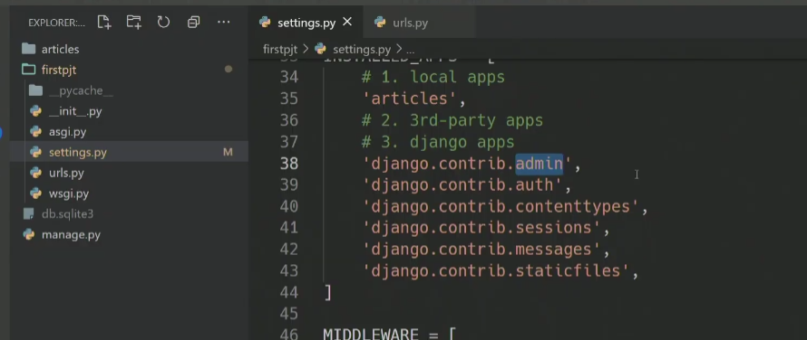

실제로 내부 쟝고 앱중 admin 이있으니까 이런식으로 서로 작동하는거임.

trailing comma 있으니까 바로 엔터 누르고 작성.

urlpatterns 라는 리스트 안에 path 함수를 통해 url 만들어 나갈거임

---

`메인 페이지로 들어오는 url 만들거`

쟝고는 항상 end slash 작성해줘야함 /  이거.

path 함수안에 두번째 인자는?

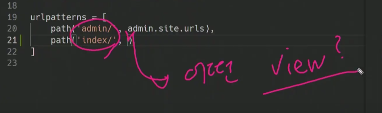

`어떤 view 함수를 실행 시킬건가 알려줌`

view는 요청에 따라 적절한 view 함수 호출하는게 일인데?

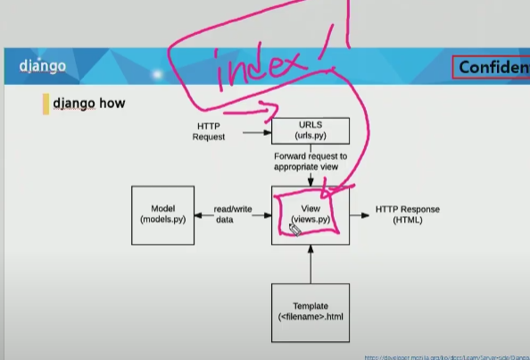

클라이언트가 인덱스(메인페이지)로 들어오고자 하는 요청을 보내면? urls.py의 두번째 path 함수가 동작해서 주소가 인덱스네? 하니까 여기에 맞는 적절한 view 함수 호출하는것.

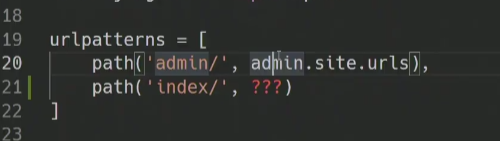

아직 view 함수 작성 안했으니까 쓸수는 없음. 그러니까 view.py 가서 만들어줄거임. 이건 articles 쪽에 있음. 

이제 아티클의 view 쪽으로-> view 함수의 첫번째 인자는 `반.드.시` request 여야 함!

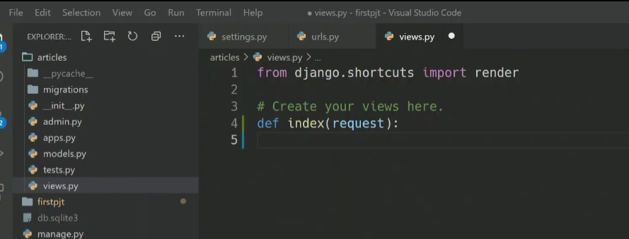

`이 요청은 url 로 부터 받아 오는거다`. 사용자 요청이 큰 덩어리로 들어간다는 뜻.

근데 뭐 함수니까 반환값이 있어야 하는데,

뭐 어떤 사이트 들가든 문서 하나 보는거니까(우리가 실제로 보는건) 그리고 사용자가 실제로 보는건 `템플릿` 인데? 

저 위 보면 render 라는 함수 자체가 import 되어있음.
(잘 포장하거나 만들어서 보여주겠다 라는 것)

`렌더 함수의 첫번째 인자도 request 여야함!!`

`두번째 인자로 템플릿의 경로를 작성하게 됨`

(근데 또 여기서 템플릿 지금 없어서 경로 적어주긴 힘들고)

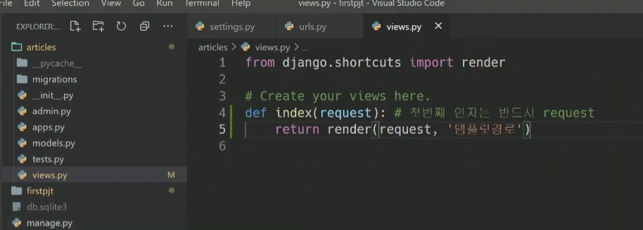

아까 url 못만든게 -> 뷰함수 없어서 그랬던거.

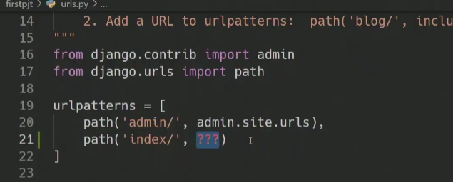

이제 여기 작성 가능. (url 은 프로젝트 쪽에 있음)

여기에 => 인덱스 뷰 함수를 호출해야함 (인덱스 뷰 함수는 views.py에 있음)

`init.py를 통해 패키지 접근이 가능한데,  이제 아티클 앱에 있는 views.py 안에 있는 index view함수를 가져와야함 지금`

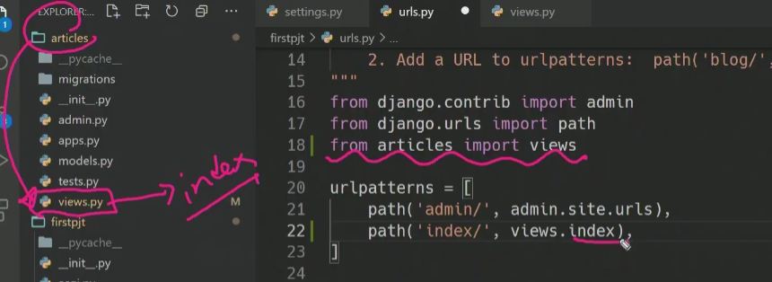

사용자 요청이 인덱스라는 주소값으로 들어간다면 urls 파이가 그걸 인식해서 어 메인페이지네? 하고 view 함수 적절한거 호출한다는 뜻.

그러면 얘가 호출됨

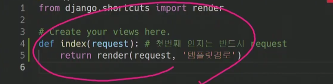

---

마지막으로, 템플릿 작성해볼거

`템플릿은 앱에다가 작성함`

`템플릿들은 어디 폴더에 있는게 룰이냐면, templates 라는거 안에 해야함 이 뒤에 복수형 s가 빠지면 템플릿 경로라고 쟝고가 인식 못하니까 주의해야함`  == 템플릿 폴더는 내가 직접 이름 주의해서 만들어야 함.

여기 html ! 텝 하고 대충 안에 바디에 보여줄만한거 적어주고~

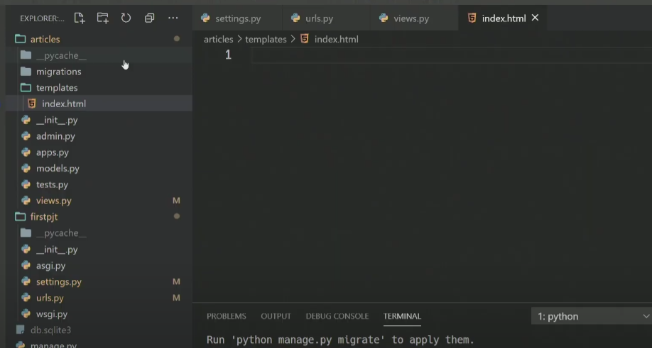

아까 여기 아래부분 다시 채울거임

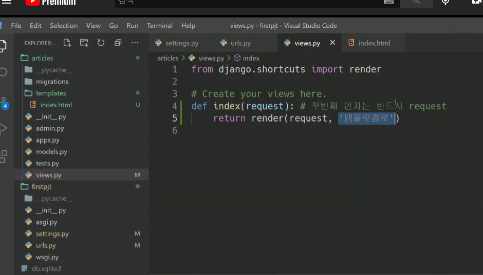

쟝고는 템플릿츠 안에 있는걸 인식 한다고 했으니까?
쟝고는 템플릿츠 까지는 경로를 `알고있다` 라는 거니까?

이후 경로만 작성해주면 됨.

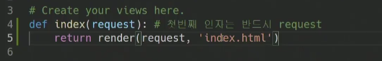

렌더 함수의 첫번째 인자도 request 라는 것에 주의

서버 구동한 상태에서 실제로 저기 가보면 이런거 나타남.


요까지 하면 한 사이클이 돈거임 -> 인덱스에다 요청 -> urls.py가 받아서 -> 인덱스 뷰함수 호출 => 리턴값을 https response 우리에게 전달함.

 `우리는 지금 클라이언트 역할도 하고 서버 역할도 지금 동시에 하고있어서 좀 헷갈림`


모델이 붙는건 다음에 할거.

---

#### TEMPLATE

`표현` 을 제어해줌. 연산하거나 데이터 관리하는 이런게 아니고 화면을 표현하기 위한 로직들을 작성하는것. 템플릿 사용을 위한 빌트인 시스템이 있음. DTL 이라는 쟝고 템플릿에서 사용하는 언어가 따로 있음.
이건 프로그래밍 언어는 아니고 템플릿 로직을 작성하기 위한 언어임.


프로그래밍 언어 같은데? 조건 반복 이런거 있으니까?
근데 다 파이썬이랑 똑같이 씀. 파이썬 문법이랑 유사하긴 한데?
그냥 쟝고 애들이 자체적으로 만들었는데 그 표현이 파이썬 문법이랑 비슷한거임. (파이썬 웹 프레임워크니까 뭐 비슷하겠지)

`파이썬이 html 에서 쓰이는게 아님!!`

comments 는 주석임

변수 필터 태그 주석


* 변수부터 작성 해보자

항상 코드의 작성은 데이터의 흐름 순서대로 할거임. (아까 그 도표)

첫번째로 작성해야 할 파일은 애초에 urls.py 였음. 
두번째는 views.py 그리고 세번째는 template 


이제 새 페이지 만들거니까 새로운 주소가 필요함.

view는 이미 import 되어있음을 명심.


구조 아니까 미리 작성하는것. views.greeting 이라는거 만들거니까 이제 이미 해줌. 미리 하니까 에러 뜨긴 함 (서버 구동한 상태에서)


그런다음


여기가서 이거 작성해줄건데? 

아까 위의 인덱스랑 다른점은, 템플릿에서 변수 출력하기 위해선 템플릿에 변수가 뷰로부터 전달이 되어야 하는데? `그런 값들이 context라고 불리고, 3번째 인자! 로 딕셔너리 형태로 들어감`


뷰함수가 -> 템플릿 만들건데 -> 딕셔너리가 같이 들어가서 만들어짐.

context는 key value 값으로 넘어감.

이제 템플릿으로 넘어가서 html 만듦.


이렇게 되어야하는데? html 은 무슨 f스트링 이런거도 안되고 변수값으로도 못쓰는데? 

쟝고 템플릿 랭귀지로 변수 사용 가능.


변수 기준으로 양쪽 공백에 더블 중괄호.

`키값` 이 변수명이 되는것. 원래 딕셔너리 값 사용하려면 키로 접근했으니까. 


저런식으로 {{ name }} 해주면 됨.


인스펙트 찍어봐도 뭐 ㄱㅊ음.

이제 views.py 에서 값좀 늘려볼거임 => 푸드 리스트

근데 졸라 늘리면 아래 딕셔너리도 개길어진다는 소린데 별로 구조상으로 좋지 않음.


이런식으로 컨텍스트라는 딕셔너리 하나 박고 그걸 저기 return 인자로 넘기면 좀 ㄱㅊ음.


그러니까 여기도 이렇게 바꿔줘야함


`이게 info[name] 이라고 착각하면 안됨 지금 파이썬 하는거 아니니까.`


그러면


이래뜸.

그러면 리스트 자체가 뜨는데?


이렇게 해주면? 잘 나옴 ㅋㅋ


---

#### FILTER

표시할 변수의 출력을 수정하거나 할때 사용

파이프 변수 붙여줌.


DTL 에서도 lower 필터가 파이썬 필터마냥 역할을 함.

공식문서에 가서 설정 하고, 하면 저기 아래 쟝고꺼 html은 쟝고 html 이라고 알려줌.


* 404?


내가 가지고있는 url 이런거 3개 있는데 이 3개중에 하나지 않을까? 라고 친절히 에러를 알려줌. 

`로켓` 은 주소 하나 추가하는 순간 사라짐 ㅋㅋ 그냥 처음 환영인사 같은거.

---

실습하느라 dinner 해볼거


당연 여기 하면 no attribute 뜸. 그러니 views.py 가서 이거 만들고


그리고 html 만들어주고 이런거 만듦


이 필터들은?

django built in filters 구글에 치면? 여기가보면 됨.


좀 어지러우니까 메인페이지에 왔다갔다 할수있게 링크작성


---

#### TAGS


각자 태그들은 역할들이 있음.

쟝고 익스텐션이랑 하면 for 하고 텝 하면 저렇게 {%~}

이런거 해줌. for tag는 닫는 태그가 있음.


뭐 태그는 출력이 안되긴 함. 그냥 로직이니까.

----

#### 주석

쟝고 html 은 html 그대로 사용하니까 주석을 좀 나눠줘야 함.


여러줄 주석은 comment 태그라는게 따로 존재함. 닫히는 태그도 있고 얘는.

---

#### 템플릿 상속


플젝 전체에 부트스트랩 적용하고 싶으면?

이게 막 dinner index 등등 전부 cdn 해주기가 어려우니까...


지금까지 app에 작성 했는데 템플릿?

app 이 들고있는거보단 프로젝트에 들고있는게 나을거같음. 다른 애들도 쓰려면.


이런식으로 플젝쪽에 템플릿츠 폴더 만들고, base.html 만듦.

일단 부트스트랩 가져오고.

* block 태그는 블락을 제외한 나머지는 자식템플릿이 전부 들고감.

블락 이름도 지어주면 됨.

여긴 부모템플릿 base.html


일단 좀 좋게 하기 위해서 부트스트랩 컨테이너 해줌.


그런다음 index html 에 가서? 

extends 태그 뒤에 부모 템플릿의 `경로` 적어줌. 


이것만 하면 끝나는게 아님 자식 템플릿이 어딜 재정의 하는건지 명시해줘야함. 


이런식으로.

다만 이상태로 런서버 해보면 안됨.

쟝고는 app 안에 경로야 자동으로 아는데, project 안에 템플릿츠 경로는 모름. -> 그럼 앱에다만 해야하나? 그렇지 않음. 경로 추가만 해주면 됨.


다른 경로 추가는 settings.py 로 가야함.

여기로 간다음?


DIRS =>  `템플릿 추가경로` 요기 넣을 수 있도록 비워져 있음.

app 경로 안에 템플릿츠 까진 알고있다는게 app dirs : True 설정임.

경로표현이 윈도우랑 맥이랑 달라서? 슬래시 방향 이런거.


이렇게 적어주면 됨. 베이스 디렉토리 안에, 프로젝트 이름 디렉토리 아래, 템플릿츠 디렉토리 까지 경로를 뚫어준거. 
python 의 pathlib 이 객체지향파일시스템 주소표현방식 -> 이런건데 그거라서 그럼. base_dir 은 자동완성이 됨. 

이파일 위에보면 이렇게 이미 임포트 되어있음.


이게 베이스 디렉토리 라는 것.

쟝고가 그냥 시작점으로 설정해둠 이걸 = 맨위의 firstpjt


* 쟝고의 설계철학


* 강조사항
* 

클래스가 비슷한 단수형일 수 있어서 무조건 app 이름은 복수형으로 맞추자. (컨벤션)

settings.py 에 먼저 등록하고 앱 만들면 안됨. startapp 으로 먼저 만들고 등록하자!

---

#### Forms

우리는 지금 장고로 서버 만들고 있는거.


action : 사용자에게 받은 데이터를 어디로 보낼거냐 하는것.

method : 전달 방식 (https 이런거)

여기서 name은 데이터의 키값의 역할을 함.


서버는 name에 접근.


실제로 인스펙션 찍어보면 input 임.


실제로 그부분 보면? 핵심 속성들이 있음.


name은 input 태그가 들고있음.

구글의경우


q = 검색어 이렇게  넘어가서 서버에 들감.

---

HTTP 


get 은 뭐 데이터를 손대지 않음. 정보 얻고 싶은 로직.


Query String Parameters = URl 관련

쟝고에서 데이터베이스 모델 이런거 없어서 get 요청만 했음 첫날은.

그럼 메아리 치게 만드려면 view 2개 템플릿 2개 이렇게 나와야함.

1. 데이터 받을 템플릿 출력하는애 (form 태그 있음)
2. 1에서 보낸 데이터를 받아줄 애


그럼 다시 시작 일단 throw 하나 파주고


views.py 는 사용자에게 입력 받을 템플릿 출력해줌.


그리고

templates(app쪽의) throw.html 만들러감.

get은 소문자로 해도 상관 없음

form은 액션과 메서드 쓰고 시작하면 됨. 메서드 디폴트는 겟이지만 확실히 써줌.


이상황에서 사용자가 아무리 입력해도 빈데이터 받을 수 밖에 없음.


왜냐? name이 없음. 현재 사용자 값은 그냥 value 니까. 해당하는 key값이 필요한데?` key 값은 인풋의 name 속성임!!`


제대로 하려면 라벨 써야함


상속도 잘 됐음. nave 바 있으니까


실제로 저기 뭐 안녕 치면? 뒤에 주소가 바뀌긴 함. 


근데 보낼 주소가 없으니까 페이지 전환은 안됐음.

이제 보내진 데이터를 다시 받아주는거 만들거. (catch 부분)


여기해주면 어쨌든 또 터미널에 에러 뜨고,


이렇게 작성한다음?

저 get부분이 좀 까다로움 저런 형식으로 가져와야 함.

이제 마지막으로 템플릿만 만들면 끝남.


---

#### URL


urls 는 보면 프로젝트 쪽에 있음. 얘 하나가 다관리함.


근데 뭐 앱추가하고 더 겹치고 등등 이렇게 많아지면? 

이런상황에 대비하기 위해 => urls.py 를 articles 앱쪽에 만들거임.

---

그다음 두번째 앱을 만들어볼거


앱 생성하면 바로 먼저 해야할게 settings.py 에 등록 해야함.


이렇게 pages 등록.

이제 앱이 두개가 됐기 때문에 url 에서도 view 함수 연결해야함.


여기서 좀 문제가 발생함. 이미 첫번째 앱이 view를 사용하고 있었는데??!


근데 이래 일일히 만들기도 좀 어려움. 그래서 앱 분리 해버릴거임.


원래 프로젝트쪽 url 저거 어드민만 남기고 지우고 뺸다음


자기쪽으로 가져옴.

그러면 view 경로도 바뀌게 됨.

현재 디렉토리( . )에서 뭔가 가져올건데~ 


명시적 상대경로 표현하는것.

이제 두번째 앱도 자기만의 urls.py 가져야함.

urls.py 만들었을때, urlpatterns 이쪽에 빈리스트가 있어야함.


이렇게 만들면 처음 요청 받았을때 pjt url 이 먼저 받고 어디로 보내야할지 또 하는 허브 느낌이 된것. pjt url의 역할이 증발한게 아님.


url 의 유지보수 떄문


include 의 사용법임.

`주의` 기존에 쓰던 주소가 다 바뀌어져있음 그러니까.

기존에 잘 쓰던 메인페이지가 증발함.


articles/index/ 이렇게 해야함


이런걸 url 새로 `매핑` 했다고 함. = 유지보수의 목적.

원래 이거


근데 이게 버거우니까?


판단해서 나눠주겠다는거.

* Variable routing = 동적 라우팅


주소 자체를 변수처럼 사용해서 동적으로 주소를 만드는 것.

사용자 입력에 따라 바뀌는 느낌.


동적 라우팅 시는 2번째 인자를 맞춰주는 식으로 하게 됨.


그런다음 html 만들어주고


하고싶은게 이거였음


int 이런것도 있음 str 이 기본값이긴 한데.

기존엔 위의 검정박스 느낌으로 했다면?


아까 이거 articles 없던 주소들이라 다 비활성화 됐을텐데?


이걸 전부 하드코딩해서 바꿔줄 수 없으니, url에 이름표를 붙이자고 하는거임.

url 태그를 써야함.


왼쪽에 index/ 이거 간단하긴 한데 개 길어지면 이거 일일히 쓸거냐 라는거. 지금 index a태그 3개나 있는데 이거 수정하는것도 귀찮은데?
사실 throw catch도 동작 안하게 될거임. 왜냐면 throw의 action 값이 달라져서. catch url 주소가 없어졌으니까.

뭐 전부 url 분리 전에 해뒀던거 죄다 바꿔주면 되겠지만?


페이지 말고 깊어지면 일일히 비활성화 링크 찾는게 너무 어려워짐.

그래서 url 이름을 만들거임.

url tag를 쓸거.


이제 path는 name까지 무조건 작성 할것.

그다음 여기를 이렇게 바꿔줄거.


실제로 인스펙션 찍어보면 맨처음 거랑 똑같이 해석이 됨.


---

### MODEL


`Model과 database는 다름. Model 은 도구!`  1 Model == 1 Database


쿼리 날린다 = db 조작하는 명령어 날린다!


DB는 테이블 형태로 되어있음. DB에서의 행과 열은 조금 용어를 다르게 말함.
`Field & Record` => 레코드는 튜플이라고 불리기도 함.


사진을 통해 보면, 기본 구조에 뭐가 있을지 나타내는게 스키마.


엑셀에 있는 sheet 하나가 테이블 1개 같은 느낌.

스키마에 name 추가해야함(사진에서)

`열`


데이터 넣으면 `행` 이 늘어나는거임


Primary Key = Required


데이터 조회시 name이나 age 식으로 조회 할  수도 있지만?
42라고 조회하면 42살인 사람이 하나라는 보장은 없지만, id는 exclusive 하니까.

---

* Model 정의


모델이 좀 더 큰 범위의 개념임.

---

#### ORM


사실 DB는 SQL 쓰고 코드는 파이썬인데? 서로 쓰는 언어가 다르니까?

우리는 그냥 계속 파이썬 쓸거임. 번역기 돌려서 집어넣고 나온거 번역기 돌려서 받을거임. 계속 OOP 언어 쓰면 됨 유저는. == 객체 관계 매핑


SQL도 할줄은 알아야함. 근데 생산성이 젤 중요하긴 해서 ORM 씀.


> 우리는 DB를 객체(OBJECT)로 조작하기 위해 ORM을 사용한다
>
> (파이썬 쓰고 싶으니까)

---

#### MIGRATIONS

모델은 어디 있냐 그럼? startapp 하면?


앱의 요기 models.py 있음.

클래스 찍을거임.

파이썬에서 클래스 이름 스타일가이드 지켜주고, 단수형으로 함.

모델 완벽 구현이 좀 어려우니까, 어느정도 핵심 틀은 다 구현 되어있는데?
사실 프레임워크 그러려고 쓰는거고!

그래서 `클래스 상속` 받을거임. 위에 import models 했으니까 저 모듈이 가지고있는 model class 있는데 이걸 상속 받을거임

`models 라는 모듈 안에 Model 클래스 상속 받을거임`


어떤 클래스 우리가 찍든간에 model 클래스 상속 받은 상태에서 시작할거임.
`이제 스키마 작성할거`

뭐 이런 테이블 만들고 싶은게 목적인데?


column 에 대한 클래스 정의 할거임.

`1` 클래스 변수 작성 할거임 = 이게 컬럼이자 필드명이 될거!!


근데 3개 컬럼 만든다면서 왜 content 까지만 쓰나? 쟝고가 id 부분은 알아서 해줌

이 필드는 그럼 어떤 타입을 가지냐? 라는게 이슈인데

`아까 각각의 컬럼은 고유한 데이터 형식이 있다` 라고 했었음
age는 int고 phone_num 은 text고 뭐 이런식으로~

이런걸 모델 필드 라고 함. 모델 필드는 또 어디 들어있냐면 import 됐던 models 안에 있음.

`지금 뭘 하고있냐면 설계도 작성하고있는거임` C F T F  이런것들 중간에 대문자 유의


우리가 쓰는 모델들은 상위 모델의 서브클래스 같은건데,
title과 content는 모델의 필드를 나타냄. (데이터베이스 입장에서 컬럼(열))

각 필드는 클래스 변수로 지정되어 있고, 각 속성은 각 컬럼에 매핑이 됨.

근데 둘다 text 타입인데 왜 또 필드 이름은 다르냐? CharField 랑 TextField 지금 다르니까

뭐 인터넷에서 뭐 작성한다고 할 때, 제목은 개길게 하긴 좀 그럼. (제곧내 하는 인간들 방지용)
캐릭터 필드는 텍스트 필드이긴 한데 길이 제한 주는 느낌.
그래서 필수 인자인 max_length 같은게 등장하는거.

내용이야 뭐 길이제한 거의 안줄거니까? 

---

이렇게 model 세팅하고 Migrations 착수


우리가 지금 필드 추가했다거나 해서 model에 변화를 방금 줬음.
이걸 반영하는 전반적인 과정을 migrations 라고 함.
이중에 `makemigrations`와 `migrate` 진짜 개중요함.


근데 이미 설계도 만든거아님? 설계도의 도안을 만든거고 지금 상태로는 DB 적용할 수 없음. 우리가 방금 작성한 클래스는 DB 입장에선 해석이 안됨.
이걸 ORM이 해석할 수 있도록 실제 설계도로 변경해야 함. 이 과정이 바로 makemigrations!
하나하나의 설계도는 단수형으로 마이그레이션 이라고 함. migrations는 전반적인 과정을 뜻하는거.

실제 DB로 명령어 보내는게 migrate. 위에서 만든 설계도들을 실제 DB에 반영.


Model 에 클래스 하나찍은 상태면, DB쪽엔 뭐가 없는 상태인데?

왼쪽 찍어놓은 클래스가 ORM 통해 번역돼 들어가 DB랑 같이 형태가 되면 이게 바로 migrate 됐다는거 (동기화)


생각해보면, 쟝고에서 파이썬으로 아무리 클래스 찍어서 설계도 제작해도 이걸 번역하고 동기화를 시켜줘야 뭐 쓰던말던 할거.


---

models.py 찍고 저장한다음?


aricles 의 migrations 폴더안에 변경이 생겼는지 14개 트리생김.


자동완성 하지말자..


실제로 까보면 migrations 안에 0001~ 이거 생김. 이런거 작성한적도없는데 막 생김.


더 보다보면, 뭔가 우리가 한게 있음.


근데 필드는 오토필드라고 id 만들어준거.
나머지 타이틀 컨텐츠는 우리가썼던거 그대로 됨.

`이거 정체는 ORM이 쓰는 파이썬 코드`


이제 이게 SQL 문으로 바뀌어서 DB로 넘어갈거임. SQL로 어케 바뀌는지 이런건 우리가 상관할 바가 아님 지금은.

그다음 이제 동기화 해야함.


이런거 좌르륵 뜸.

근데 이시점에서 테이블이 제대로 만들어졌는지 이런건 좀 알기가 어려움.

확장프로그램 하나 깔꺼. == 그 extension 저기가서 `sqlite 이거 깔거 `

근데 이 db 파일이 항상 존재는 하고 있었음 ㅋㅋ


확장 프로그램 깔면 우클릭하면 open database 있음


그러면 sql 탐색기 하나 등장함


얘들이 전부 테이블인 거임. 그 ok ok 떴던 것이 하나의 테이블임.


근데 클래스 하나당 테이블 하나 매핑이라며 뭐이래 많이생김?


대체 이거 뭐가 ok 되고 있는거? migrate 명령어 이후 뜬건데?
`0001_initial.py` 가 마이그레이션 이었는데?
0001 0002 0003 이런애들은 migration 파일들임. 근데 우리는 
`0001_initial.py` 이거 하나만 보이는데? 

사실 내장 앱들이 있었음


각각의 내장된 migration 파일들이 있음.
이게 첫 migrate때 같이 넘어가 주는거. 그래서 테이블이 지금 여러개임.


우리는 class article 로 만든게 하나임. 나머지는 내장 앱들이고


실제로 우리는 이름을 Article 이라고 지었는데??
쟝고가 지멋대로 합성해줌


열어보면 스키마도 보임.


우리가 만든것도 잘 넘어가 있었음.


---

`sqlmigrate` ?


어떤 설계도를 확인할거냐~ 앱이름 먼저 치고, 번호까지만 치면 됨.


0001번 설계도가 SQL 로 어떻게 해석해서 나갈지 궁금해!

그래서 이 파이썬 코드는 쟝고의 ORM에 의해 이렇게 해석되어서 나갈거다! 라는걸 볼 수 있음.


ORM 없으면 이런 코드 다 작성해서 SQL에 요청 보내야함.

---

`showmigrations`?


이건 걍 이거만 치면 됨. `x 가 안됐다는게 아니고 체크 표시임.`


뭐 문제생기면 뒤에 옵션 줘서 디버깅 할 수 있음


---

Model  migrate 한 상태인데? 수정할 필요성이 생길수도있음.


여기만 툭 보면 어느게 최신 글인지 알 수가 없음. 게시글의 작성일과 수정일을 추가해볼거.

작성일은 created_at 이 컨벤션, 수정일은 updated_at
얘들 사실 대문자화 된거 보니까 메서드 쓰는게 아니고 클래스 가져다 쓰는거.


이렇게 해주면 됨. 


우리는 글 쓰고 수정할때 이때 수정했느니 썼느니 직접 수정 안함. DB 측에서 저장되는, 수정되는 시간을 자기가 넣음 사용자가 넣는게 아니라.

그래서 부가적인 인자들을 넣어줄거임.  아래는 `auto_now` 라는거 주의해야.


여기서 확인 가능 맨 위에.


뭐 이런식으로 필수인자가 필요하다 이런 정보도 읽을 수 있음.


maxlength 쓸거면 charfield 써라


datetime 라이브러리 쓰고 있었음 내부적으로.

얘 설명이 좀 짧은데 datefield 상속 받아서 그럼.

autonow 이런거 여기 적혀져있음.

ever time saved = 니까 수정임 auto_now 는.


---

다시 돌아와서, 수정사항이 생겼으니? 0001_inital.py 에는 수정 필드 없는데?

이건 `낡은 설계도`인 셈이어서?  아무리 models.py 수정해서 저장한다음 migrate 해도? 안됨. 어차피 migrate는 설계도 기반으로 넘기는거여서.

그냥 설계도 새로 찍어서 넘겨야됨.

그래서 py 수정하고 이 설계도 찍는 명령어 치면 뭔가 아래 다른게 뜸. 아까는 0001 바로 만들어줬는데?


그러니까 우린 이걸 하고 싶은건데?
쟝고 입장에서는 핑크색까지 해뒀는데? 
새로 뭔가 추가하는데 너 기본값은 뭐라할건데? 라는거.


그래서 선택지를 주는거임. 
1) 기본값 줄거라면 이거

2) quit 나가 (이 명령에서)=> models.py 에서 직접 코드로 작성 할거니? 

여기서 옵션 1) 해보면? 한번 더물어봄.
직접 넣을거냐? 그럼 일단 도와줄게. 그냥 엔터 누르면 timezone.now 라는 내부함수를 통해 기본값들 넣어줄게~


여기서 걍 엔터 치면?


timezone.now 들어간거고 디폴트로, 마이그레이션 진행 된것.

설계도 2번째꺼 찍힘.


근데 문제 생기면 백섭 해야할텐데? 0002 하다가 문제 생기면?

그럼 낡은 설계도인 0001 이 있음. 마치 모델 버전 관리같은거임.


그래서 2번 까보면

아까는 없던 dependencies 가 생김. 1번에 의존하는구나


그러니까 id title content 다시 반복같은거 안함. add field 만 함. 기반으로 만드는게 있으니까.


이시점에서 설계도만 만든거지 DB에서는


아직 없으니까?!

`migrate` 최종적으로 해야함.

항상 make migrations -> migrate 식으로 해야함.
이번엔 한줄 ok 뜸. 두번째 설계도 넘어감!!


실제로 변경됐는지 보면 sqlite3 확장프로그램 보면


새로고침 눌러서 확인하면

실제로 변경 스키마로 됨. 설계도는 git 처럼 쌓여도 여긴 합친거 뜸.


---

#### Database API


근데 우리가 쓰는건 파이썬 이니까? 파이썬으로만 하면 소통이 안되니까...
그럼 ORM의 힘을 빌려야 하는데? ORM 쓰더라도 파이썬 쓰는건 사실 같지만, 특수한 문법에 따라서 써야하는건 좀 제약이 있음. 


걍 모델만 만들면 지가 알아서 생김. 얘는 DB에 명령(조작)하기 위한 도구로서 사용. SQL 문법은 여전히 안쓴 상태라는게 포인트


이 3개 조각 포함해서 database api 라고 함.

이거 뭐 파이썬 문법이긴 한데, 클래스 매서드 이런거니까.
근데 중간에 objects 라는거 저쪽 부분은 모델 만들면 저런거 쓸수있게 자동생성됨. object 매니저 안에 all() 저거는 `메서드` 인데 이게 `핵심명령어` 임.

article모델한테 전부 달라! 이런느낌.


아티클엔 컬럼 두개나 만들어놨지 object 없으면 아예 메서드 쓸수도없어서, 옵젝 저게 모델과 메서드 사이의 인터페이스 역할 한다고 생각하면 됨.


QuerySet?
쿼리셋 안에 0개인데 왜 쿼리셋이냐? 쿼리셋은 약간 리스트처럼 오는데 빈 리스트 오면 그냥 빈 쿼리셋인거.

쿼리셋 api 통해 조건 걸거나 정렬(오름차순으로 받고싶다)하거나 그런거 할 수 있음.

모델 뒷쪽에 objects가 꼭 붙어야 이후에 명령어를 수행할 수 있음. 그냥 이렇게 생각. objects 는 걍 고정으로 붙어있는 문법적 특질이라고 생각하자.

도식화해보면 쿼리셋으로 이게 준다. 이런 느낌.


걍 DB API는 DB 조작하기 위한 도구임.

일반적인 메서드사용방법이나, 클래스인스턴스 생성이나 이런 파이썬 문법보다 조금 독특한 부분이 있을 뿐.

`쿼리셋 API` 종류가 개 많을거라고 예상 해볼 수 있음. 뭐 여러개 조건 걸고 그럴 수있으니까.  결국 저 all() 부분 잘 쓰냐 마느냐가 소통 잘 하느냐의 척도가 되는거. (당연히 공식 문서가 존재함.) 구글에 django queryset api 검색하면 됨.


근데 쿼리셋 api 종류긴 한데 쿼리셋 안주고 단일객체 주는 애들도 있음.


뭐 1번 조회했는데 줄줄히 딸려올 필요는 없어서.

all() 은 전체니까 쿼리셋 줄거임 당연히. 이것은 쿼리셋 주는 메서드다! 라는것만 알고있으면 됨.


DB API 쓴다는건 DB 조작한다는 거니까 뭐 아무데나 쓸순 없음. CRUD 구현 위해서는 쟝고 안에서 파이썬 실행해야 하니까

파이썬 콘솔 여는건 이렇게 했는데?


일단 파이썬 쉘스크립트 안에서 파이썬 쓰는데, 여기서 아무리 써봐야 말도 안됨.
`쟝고라는 환경 안에서` 해야하는게 포인트.

쟝고도 기본 파이썬 쉘 주는데, 빈약한 녀석이라 그걸 좀 강화해줄 확장 프로그램 설치할거임. 

구글에 `django extensions` 치고 나서, (구글 크롬 확장프로그램처럼)


다시 vscode 가서 설치. (워닝은 걍 무시)

이렇게 설치하고 사용할수있네? 이러고 넘기면 안됨. 꼭 문서는 끝까지 봐야함.


설치문서 자세히 봐야함. 이거 눌러보면


`쟝고에서 뭐 설치한다고 하면 설정까지 꼭 봐줘야함` 심지어 여기는 언더바(_)임


이제 쟝고에서 켜는 파이썬 쉘을 업글해줄거


원랜 이건데 기본쉘은 (끌때는 exit)


쉘플러스는? (언더바) 쉘 켜지기 전에 잔뜩 뭔가 됐음. 쟝고에서 사용하는 모든 import 문을 다불러와줬음. 그냥 쉘 쓰면 죄다 임포트 직접 해야함.


심지어 우리 모델까지 import 해주고 시작함. 위에 보면 articles.. 있음.

저 초록불 in [1] 이건 ipython 설치 해야 나옴. 
`pip install ipython` 이건 쟝고 쉘 업글이 아니라 파이썬 쉘 자체가 업글.

import  되어있기 때문에 무슨 객체인지 바로 확인 가능한거.


---

### CRUD

#### C, R


아까 .all() 은 조회니까 읽기임.


게시글 쓴적이 없으니까 빈 쿼리셋이 옴. 쿼리셋은 잘 보니까 대괄호로 감싸져 있는거 보니 `리스트처럼` 쓸(조작 할) 수 있음. => 인덱스 접근이나 슬라이싱, 반복문도 가능함. 근데 `리스트`는 아님. 마치 쿼리딕트 같은거임. 딕셔너리랑 100% 동일한건 아니고 쟝고 내부의 타입인데, 딕셔너리처럼 사용은 가능했음.

OOP 문법 쓸거.

article 인스턴스 만들건데 우리가 만든 아티클 클래스로! 행동은 인스턴스가 할거. 이 인스턴스를 통해서 진행할거임 CRUD.


얘 정체 확인해보면 None임 이건 데이터베이스의 PK 값임. `파이썬 단에서 인스턴스로 존재`하는거지 얘가 뭐 게시글로 완성된게 아니라서 아직 그럼.

이상태에서 값을 몇개를 넣어야 할까? 직접 넣어야하는건 2개임 created_at 이랑 updated_at 은 db 저장시 자동적으로 될거니까?

title, content 값을 넣어줘야함.
파이썬 oop 하는거랑 똑같음. 뭘 하고싶은거냐면 게시글에 글과 제목 쓴거.


파이썬 마냥 인스턴스 변수에 뭐 담아주는거임. 여기까지 하면 기록 될 준비가 되었고, 아직은 DB에 저장된건 아님. `작성 버튼을 안누른 상태라고 보면 됨 작성까지 해둔건데`. 아직 근데 전부 가져오라 그러면 여전히 빈거.


그러면 `작성` 버튼은 뭐냐? save() 임. 이건 우리가 구현한건 아니고 아까 상속받은 기능중에 하나임.


이렇게 해주면 뭔가 드디어 번호가 생김.

우리는 쟝고의 파이썬 쉘을 사용하고 있기 때문에 쟝고에 조작하는 것들이 전부 반영되고 있음. 실제로 sqlite  확장프로그램의


이거 눌러보면 실제로 테이블이 뜸.


우리는 물론 title과 content만 넣었고, id는 오토필드이며, 맨오른쪽 두개는 그냥 작은 시간 단위까지 작성이 되어서 자동적으로 테이블로 넘어갔음.

* 의문점


---

이렇게 인스턴스 생성시도 바로 넣을 수 있는데?
아까보다 좀 짧게 코드 쓸수있겠지만 결국 save 안했으니까 아직 none 임.


이렇게 해줘야함.


.save() 는? 어떤 메서드일까?? `인스턴스 메서드` 임.


같은 기능인데 pk로 조회하는걸 권장함.

이번엔 인스턴스 생성 안하고 게시글 작성도 됨. 한방에 리턴 아웃풋이 생김.
이때는 save() 안해도 됨. create가 save 까지 해준 느낌.


근데 이 출력값 같은게 좀 사람친화적이진 않음.


바로 자동적용은 좀 안돼서 쉘플러스 껐다 켜야함.


쉘 새로 시작하면 인스턴스 날라가서... 인스턴스로 찾는건 어렵고.

찝어서 조회해야함. 옵젝 하나만 조회하는거 get 메서드 있음. (pk) 찍어주면 됨.


조건이 좀 중요함 이 read가.


반드시 바꿔야 하나???  걍 새로운 인스턴스가 또다시 된거임.

1번글에 영향을 주는게 아님 걍 다음 글이 작성이 되는거.

---

다음으로 all get 차이는 이런거

뭐 나중에 삭제한다 치면, 뭘 삭제할건지 가져와야 하는데?


쿼리셋 api 겟은 없으면 에러남. 


에러나는 경우가 하나 더있는데? 만약 5번째를 첫번째랑 내용이 같은 걸로 해주면???


이걸 이렇게 조회하면


아까랑 에러가 좀 다름


그래서 .get 은 유니크한걸로만 조회해야함. PK로 해야함

`이게 딕셔너리의 .get이랑 헷갈리면 안됨 전.혀. 다른거임`

filter는? 지정된 애들 모두 포함하는 `쿼리셋` 줌. .get()은 멀티플이라 안됐는데?


근데 필터 조회했는데 하나나오면? (여러갠줄 알았는데?)

뭐 그래도 쿼리셋 줌 ㅋㅋ 데이터 하나가 됐다고 `객체가 하나 온게` 아니라 `쿼리셋이 온건데 그냥 쿼리셋 안에 데이터가 하나`인거.


---


lte는 less than equal


아래 select는 sql식 해석

포함으로 물어봤으니 전부 다나옴. 그리고 GT 이런거 해도 되고.


---

#### U, D

일단 하나 찝어서 가져오고?


바꾸고 (인스턴스 속성 바꾸듯) 세이브 해야함. updated_at 시간도 바뀌고


이미 있는 애를 가져오고 바꾸면 save() 했을때 ?!
알아서 아 이거 업데이트구나 하고 해줌

수정은 새로운 인스턴스가 아니고 뭘 가져와서 수정하는거.

---

`Delete` 는 되게 간단함. (얜 세이브 안해도 됨 걍 자동적용)

뭐 하나 가져온 상태에서 삭제하면 뭔가 리턴되고,

저거 36번 하면 바로 에러남


여기서 다음 글 작성한다고 치면?  1 번에 들갈까 6 에 들갈까?


1은 재사용되지 않음. DB에서 뭔가 삭제가 됐다는 것은 문제가 있거나 불필요해서 삭제됐다고 생각해서? 물론 재사용 옵션을 줄수도 있긴한데 암튼 그럼.

---

* 어드민 사이트?

쟝고에서 맨처음에 작성된 URL이 있긴 했음. 이건 뭐 로긴도 됐는데?


이제 crud 배웠으니까 관리자 계정도 만들 수 있음.


관리자 페이지


admin.py 가서 => 현재 디렉토리의 모델스 안에 article 클래스 가져옴. 저거 임포트문 쳐줌.


저 import admin 은 원래 되어 있던거고.. 이렇게 적어줌.


근데 뭐 여까지 해봐야 로그인 안됨. 아직 관리자 계정 생성 안했으니까.


띄어쓰기 없이 create super user 임

엔터쳐보면 막 하나씩 옵션 줘야함 그냥 엔터치면 멀캠으로 하겠다.


address 는 옵션이고..

`password 아무리 입력해도 커서는 멈춰 있을거임 (일부러그런거임)`


again 도 한번 더 쳐줘야 하고... 뭐 실제로 유저네임이랑 너무 같으면 뭐 이런 구문 뜸.


근데 계정 만들려면 계정 들어갈 테이블 있어야 하는거 아닌가?

오늘 처음 migrate 할때 죄다 때려박아서 이주시켰으니까, 테이블이 사실 하나만 만들어진게 아니었음. 요기 어딘가에 슈퍼유저가 저장돼있음 그러니까 슈퍼 유저가 만들어 졌을꺼고?


auth_user => 가보면 됨. (이건 우리가 만든 테이블이 아니고 auth 쟝고 내장 앱이 migrate 통과하면서 생긴 테이블임)


심지어 가보면 password 암호화 돼서 쟝고도 알 수 없음.


실제로 저기가서 로그인해보면? articles 라는게 뜸

admin.py 등록해둬서 저 위에 그게 뜸.

클릭해보면 되게 신기함 여기 출력이 타이틀값으로 나옴.


여기서 수정해도 됨 막 인스턴스 만들고 난리 치는 것들을 어드민 페이지에선 클릭하는 식으로 가능


저 표 보기싫으면 좀 수정도 가능함 형식. admin.py 가서? 
얘는 파워를 admin 임포트된 애를 상속받아서 씀

여기서` list_display는 정해진거임 자유도 없음. 상속받은거 오버라이딩 할거라서` !!!!!!!!!!!!!!! 오른쪽 인자들은 필드들 넣어줌


그리고 우리가 만든거 레지스터에 넣어줌 => 커스텀 완료


django admin site 검색하면? list_display 말고 또 뭐 모델 어드민이 뭘 사용할 수  있을지 여러가지가 뜸.

사용자 클릭 해보면? 뭐 이런것도 수정 할 수 있음.


아까 옵셔널했던것도 넣을 수 있음.


비번에 뭐 알고리즘은 뭐썼고 등등... 안보인다고 하고 수정은 가능하다 뭐 이렇게 나와있음.

활성 이런거는 휴면계정으로 바꾸는 뭐 이런거

---

#### CRUD의 Views.py 이용

새플젝 하나 파고일단 시작은 골격부터, 랭귀지 코드 바꾸고 UTC도 바꾸고 DB 출력 볼거니까. 플젝명은 그냥 crud 라고 할거. 앱만들고 등록까지.


여기서 상속 쓸꺼니까 걍 플젝안에 템플릿츠 안에 base.html 박고, 템플릿츠 경로 뚫어줘야함. BASE_DIR


article 앱 안에 urls.py 만들고 안에 세팅


이제 앱 역할 나눌거니까 플젝 url 쪽 조정해줌


이거 끝났으면 앱의 urls.py 가서?


그다음 뷰 정리


그다음 html 정리 + 부트스트랩 임포트하고 컨테이너 주고 등등


 extends 는 최상단이라 그랬는데?  두개는 안됨 주의
상속은 무조건 하나만 해야함? 그럼 확장성이 좀 떨어지지 않나??????????


이런 태그 있는데 나중에 보게 될것. 막 가져올수 있는게 있음.

여기서 지금 하고싶은건 CRUD로 게시판 만들고 싶은 거니까?


일단 대충 html 정리해놨음

---

실제 플젝에서는 모델을 먼저 함==> `원래 스키마 구상을 하고 플젝을 시작함.`


이렇게 모델 설계가 끝났으면 뭘 해야하냐면, 모델에서 중요한 3단계가 있었는데 그중 첫번째가 끝난거. (모델의 변경사항이 1단계) models.py 저장 하고 1단계 마무리 하는거 유의

2단계는 설계도 찍는거. articles폴더의 migrations 안에 설계도 찍혔다!


3단계 = > 설계도 기반으로 실제 테이블 작성하게 하는 명령어

안찝어서 할거면 내장도 다 넘겨주고


그다음 슈퍼유져 만들어줌


서버 키고 어드민 페이지 가서


로그인하면 


문제 생길거니까

어드민 사이트에 등록해줌


그러면 이거나옴.


들가서 대충 글 두어개 적어두자


모델 정의할때 _ _ str _ _ 이거 안써서 객체값이 기본값으로 나오는거뿐.

---

이제 `R` 해볼거

 views.py 로 감.

Article 쓰려면 뭐 import도 해야하고 리턴값도 있으니 변수에 담아야함.(변수명은 articles 로 복수형으로 함) 전체를 가져오는 컨셉이니까.


뭐 그러면 articles 안엔 쿼리셋이 담겨있을건데? 컨텍스트로 넘겨줌


그런다음 index.html 가서? 출력해보면?


마치 쉘플러스에서 많이 봤던 애가 나옴


뭐 포태그로 풀면?


이런 느낌이 됨. 이걸 DTL 단에서?  온점으로 접근할 수 있음.


---

### Forms.py


이전까지 인풋 태그 사용했는데, 캐릭터 필드 max length 줘도 html로 우회가 가능했음.

form도 forms 라는 모듈에서 formclass 상속 받아서 우리만의 form을 재정의 하는 구조.


앱의 forms.py 안에 작성. 근데 이 위치는 반드시 forms.py에 있을 필요는 없음. models.py 안에 있어도 되긴 하는데, 일반적으로는 따로 빼서 작성해줌.


이게 모델에서의 CharField 라는거랑 완전 다름 그냥 이름만 같음. Model에서의 TextField 있지도 않음. TextField 같은거 해주려고 위젯도 사용했었고.. (인풋타입 변경)

렌더링 명령어 => HTML 안에서 {{ form.as_p }} 뒤에 () 없음 주의


위젯은 폼필드 도와줌.


원래 여기 forms.py 에서 Charfield 썼을땐? input type=text 자동으로 해줬는데? 이걸 변경해주는게 위젯이라고 생각하면 됨. 

html 인풋 요소를 표현하는 방법 중 하나. 다만, 위젯은 독자적으로 사용할 수는 없음.

`위젯은 유효성 검사에는 관여 안함`


그런데,  모델에서 이미 이런거 다 했는데, forms.py 에서  한번 더 정의하고 있는것도 이상하잖아?


그래서 모델을 기준으로 연결되는 form을 만들땐 model form 기능 제공

공식문서에서는 helper 라고 함.


필드를 재정의하지 않음 여기서 중요한 포인트는. 대신 메타클래스에서 모델 이름을 등록하고?
여기 필수적으로 `model` 그리고 `fields` 는 필수적임.


메타는 데이터들의 데이터. 메타는 모델클래스에 대한 정보를 작성하는 것이다.


이름자체를 등록하는거지 Article() 쓰면 not callable 뜸.


그럼 언제 쓰고 뭐가 더 좋은거냐?? Form 보다 더 나은게 ModelForm이다 이게 아님.


모델에 연관되지 않은 데이터 수신을 위함 그냥 Form은

ModelForm 은 모델에서 필요한 양식의 데이터라면 이걸 사용함.


이런것들도 가능함.


원래 기본은 이정도인데? 위젯 넣어서 풍부하게 가능


TextInput 안에 키워드인자 attr이 딕셔너리로 들어가있고... 이런거 좀 조심해야함 인덴트 구조같은것들. CharField 안에서 label widget 이런거 빌트인 단어들 잘 넣어야함. 정해진 Core Field arguments.


메타클래스는 모델 정보만 하고!!  위젯은 따로 쓰는 것을 권장함 쟝고는

django coding style guide = 뭐 이런거


리스트를 만드는데 각각의 값은 두개값 가지는 튜플

> 근데 모델 필드랑 form field랑 좀 다른 경우도 많은데?

django modelform 검색해서 공식문서 가서

필드타입 좌우 비교가 되어 있음 어떻게 맞춰서 사용할지.


이런식으로 없으면 위젯까지 해야 맞춰줌 이런느낌.

---

그다음 views.py 쪽 격변

http 메서드가 put catch... 등등 다른 메서드도 있어가지고 정확히는 이렇게.


이렇게만 쓰면 POST로 갔으면 유효성검사 망했을때? 처리해줄 구문이 없어서 value error 뜸.


그래서 들여쓰기 이렇게


위에서 내려오는 form은 쟝고가 에러메시지까지 포함해줌!!

이거 맨처음 할때... 이것부터 작성 할 수 있는가? if 구문부터?


통째로 외운 경우가 아니고서야 불가능함.

정상적 데이터 흐름은 GET쪽부터 받아야함. 아래 템플릿쪽이 렌더링 한 다음되어야 거기서 submit 버튼 구현 끝나고 나서 if쪽 post로 가는거니까.

---

근데 대체 {{ forms.as_p }} 이건 대체 어떻게 스타일링 하냐? 원래 태그들이 이렇게 있을때는 클래스 주거나 하면 되는데?


검색을 하면 요기로 들어가자


오른쪽 목차에 보면 이런게 있는데 rendering fields manualy ㄱㄱ


나눠둠 => form.title, form.content 이렇게 찢을 수 있다!


이런식으로 일일히 찢어줌 {{ form.title }} = > 이게 인풋일거


저 error 메시지 지워주면 됨. 에러당시에 싫으면


요런식으로 해서? div로 감싸줌


근데 이경우 문제점이, 필드가 개많으면 또 html도 굉장히 길어지는 문제도 있고..

포태그로 푸는 방법


뭐 굳이 이게 왼쪽은 field 아니어도 되긴 한데..

결국 이런 문법안에서는 class 줄수가 없음


`위젯` 의 `attribute` 쓸거. 여기 작성하면 위젯 안에 attr 안에 저게 html 식으로 저렇게 번역돼서 나감.


bootstrap 클래스를 저런식으로 주면 ?! 태그에 클래스 적용하는것마냥 돼서 나옴


이런것도 할 수 있음


약간 이중포문마냥 이래 해주면? 틀림 조심해야하는게 field.error 해줘야함


유효성 검사 항목이 많아지면 에러가 많이 떠서 ?


이건 뭐 클래스 직접 주는식으로 가능


ol 태그때매 번호 나오긴 한데 아무튼 이렇게 가능 ol 지우고 li 안하고 div로 해도 되고.


이것도 진짜 힘듦 근데 위젯에 일일히...??????????? class 주면 또 한참 해야하니까?????????

쟝고 bootstrap 5 검색 => 약간 일괄적으로 css 적용 가능하게 해주는데?


얘도 3rd party library 라서 인스톨 해줘야 함.


근데 이건 또 로드해야함 템플릿상에서 쓰려면 로드 태그 써서.


근데 extends 태그 위쪽에 쓰면 안됨. 이건 반드시 최상단에 있어야 하니까.

이 라이브러리의 태그들 사용 가능하게 됨.


이런 느낌


이 윗부분은 widget + form.as_p 인거 / 아래부분은 bootstrap_form form 이거.


로드를 하고 나면 이런거 사용 가능하다고 문서에서 알려줌


그 검색 두번째 결과는라이브러리 자체의 문선데 거기 가보면,

pip install 후 로드 후엔 cdn 대체도 가능함.


이런식으로 가능한데?  반드시 최상단에 로드 해줘야함!


인스펙션 찍어보면 쓰던 CDN이랑 완벽히 같음


이런것도 있음


이러면? 라벨 왼쪽 인풋 오른쪽 뭐 이런식으로 바뀜 9번줄 주석 후 10번줄만 보면


이거도 해보면, 리셋 속성? 이 있음


지금 부트스트랩 라이브러리 문법 써보는거


ok cancel 생겼는데 ok는 우리가 알던 submit 그거고


수정하다가 캔슬 누르면 원래대로 돌아감


이건 쟝고 라이브러리의 특수한 기능이라기보단 원래 있던 거임.


베타버전이라 라이브러리가 엄청 내용이 많진 않음. 위젯도 뭐 있고 볼게 많음 문서에

---

#### load 태그


extends 하나만 하면 다중상속 안되잖아? 최상단에 있어야 한다는 것 때문에. 확장성 한계 있는거 아니냐?  로드태그 위쪽에 있음 설명은 = 템플릿에서 다른 템플릿을 불러오는 기능


가령, nav 바 기본만 가져와도

개큼 : 베이스 자체도 굉장히 코드가 커질 수 있으니까? 코드 유지보수가 굉장히 힘드니까?


유지보수때문에 상속 쓰는건데 애초에.. base 자체도 굉장히 관리가 힘들어짐.

그래서 nav바도 따로 템플릿으로 만들거임

이런식으로 nav 를 위한 html 만들고. 이런 별도의 템플릿을 include 태그로 가져올거임 base가.


이건 이미 추가해 뒀으니까?


 base.html 구획 가능 그럼 base.html 을 상속받는 모든 html들에 자동적용 됨.


나중에 nav 바 일일히 찾아다니면서 수정할 수 없으니까? 독자적으로 nav 빼두면 요거 그냥 수정하면 되는거임. 

---

#### View Decorators

기존 함수 수정 안하고 추가하고 싶을때 씀.


머리 가린 부분은 require_safe()

현재 view함수는 get 이든 post든 뭐든 다받아줌. 기본적으로는 모든 메서드들 view함수 일단 다 받긴 함. 안에서 if로 분리하는거랑 다름. 일단 받고 안에서 처리하는 거니까 이건.

그래서 POST 여야지 view함수 자체에 접근이 가능하게끔 함. 아니면 접근조차 불가능하게끔.


쟝고 문서 들어가서?~


이 함수는 get post만 허용한다~ 이런거. 같이쓰고싶으면 위에 데커레이터 사용

일단 어딘가에서 import 됨. 함수 위쪽에 사용하는데 골뱅이로 표시

겟은 거의 안쓴다는 느낌. Note 읽어보면 이유 나옴


그럼 이렇게 인덱스 페이지 갔을때, 무슨 메서드여야 좋을까? 라고 생각해보면 됨.

어떤 http method가 이 뷰 함수에 적합할까? == GET임 어차피 메인 페이지 달라! 라는 요청에 응답을 주는 역할을 하는 곳이니까? 이 인덱스 뷰함수에 POST나 그외 PUT등 다른거 보내도 똑같이 동작을 할거임. 그냥 안거르고 index url 로 요청 들어오면 일단 저 로직 실행 해버릴거니까.


요기 위에 임포트 해주면 뭐 쓸수있는거 많아짐


이렇게 함. 데커레이터 함수는 뒤쪽에 괄호 안씀


이러면 에러났을때 에러 응답을 데커레이터가 클라이언트에게 주게 됨. 


얘도 이렇게 가능

그리고 삭제 url 주소를 사용자가 알게되면? 좀 문제가 있어서 post로 분기해줬는데?

이제 이부분이 되게 불필요해짐 데커레이터 주면


이게 서버는 클라이언트에게 명확한 이유 줘야하는데, 저렇게 리다이렉트만 되면 사용자는 왜 거부당했는지 알수가없음.

POST 아닌 요청 했으면 데커레이터가 `POST 아니잖아` 라고 알려주니까!


url로 삭제시도 하는경우? 405 띄워줌. 


get인지 알고는 있는데 이건 사용할 수 없어! 하는 느낌.


이것도 확인 함 해보고싶은데 크롬 브라우저로는 POST DELETE 만돼서 PUT DELETE는 못보냄


이런 프로그램이 있음~


이런식으로 ㅋㅋ 요청 보내주는 프로그램


약간 이거 대신 포스트맨으로 하는거

토큰 같이 안보내니까 ㅋㅋㅋ 이렇게 됨.


이거 인스펙션 찍어서 이거 토큰 가져와서 이걸로 준다해도 안먹힘. 환경따라 토큰 바뀌어서


이건 이렇게 포스트맨으로 보내면 미들웨어단에서 막히는것. 뷰 데커레이터까지 오지도못함.


미들웨어단 주석 처리하고 put으로 보내면? 이젠 405 주는건 데커레이터

---

### USER AUTHENTICATION


> Login & Logout

이제 앱을 하나 더찍을거. + settings.py 등록도 하고.

이 앱안의 urls.py 만들고, 마스터앱 urls.py도 include 길 뚫어줌.

인증관련 앱 이름은 accounts 를 권장함. => 이유도 있음.


키워드가 중요함.

1. Web Requests


로그인 된 경우라면 User 클래스 인스턴스로 설정.

이미 인증시스템 자체를 request객체에 연결을 해놨기 때문에 .user 제공 받을것.

`로그인`


User에 관한 것도 CRUD 흐름에서 벗어나지 않음. 유저가 만들어지고 조회하고 수정하고 삭제하고 과정이 있으니까.

그래서 로그인은 세션이라고 하는것을 Create 하는것과 같다고 하는것.

로그인 하기 위해서 로그인 함수 자체를 이미 쟝고가 제공함. 
`로그아웃`


세션이 만료되었습니다! 하는게 세션이 삭제되었다고 하는것과 같음.

얘는 주의할게 요청 객체만 받음. 

---

`일단 http 특성부터 공부.`


왜 그러면 쿠키 세션전에 이거 배우냐?


예를들면 네이버 접속시 네이버 메인페이지를 받고나서 네이버 서버와 계속 연결돼있다고 생각하는데, 네이버 서버는 html 던져주고 연결 끊음.

접속 끊어진 상태라면, 상태를 저장하지 않는다? = 우리가 네이버 메인페이지 로그인을 하고 뉴스 탭으로 이동했다면?? 로그인이 없어지나??????
로그인 풀리지는 않는데? http 특징상 무상태의 특징측면에서 생각해보면 로그인이 풀려야하는데? 왜냐면 로그인되어있는 상태라는 것도 어떤 상태인데인데 이 상태를 저장하지 않는다는건데? 페이지 이동하는 순간 로그인 상태라는것이 사라져야함 사실은.

그래서 `상태`라는걸 붙잡아야 하는데? 이걸 유지시키기 위해서 쿠키라는 개념이 등장함.


쿠키 들고있다가, 같은 서버에 요청할때 요청시 쿠키도 붙여 보냄. 쿠키는 서버로부터 받은 거였음. 

웹페이지 접속시 쿠키받아서 저장하고, 재요청시 쿠키도 같이 보내는것.
그래서 계속해서 상태를 만들고자 할 것.

`세션` = `상태`를 만들기 위한 것

`세션 관리` 목적이 매우 중요!


http 특성은? 상태를 알 수 없는데? 하루안보기 눌렀다는걸 쿠키 보고 아는거. 상태를 유지하지 못하면 뭐 장바구니 담았던거 있는데 다른창 넘어가면 날아가버리니까???????

개인화 ? 트래킹? 이런것들은 구현하는게 아니고 이런게 있다고 공부.

`세션`


세션은 결국 => HTTP의 특징이자 단점인 stateless를 상태로 유지시키겠다고 하는것.

클라가 서버에 접속하면 서버가 쿠키 주면서 그안에 session id 있음. 그걸 브라우저에 저장하고, 재요청시 쿠키를 다시 보낼건데 그 쿠키 안에 session id가 들어 있을거니까?

어떤 페이지에 갈때마다(요청 보낼때마다)  계속해서 session id를 보내는것. http는 비연결 지향이니까 요청 보낼때마다 매번 쿠키를 계속 보내야 하는것. 이러면 사용자 입장에서는 로그인이 계속 유지되는것처럼 보이는것.

실제로 계속 유지되는게 아니라 우리가 유지되게끔 만드는것.

네이버 입장에서는 매 요청마다 session id 확인하고 로그인 상태를 주는것.


이경우 로그인 유지 상태도 같이 보내주는것

그럼 쟝고는 세션 관리 어케하냐?

Django는 세션아디 포함된 쿠키 줌. 로그인하면.  

우리한테는 id만 주고(열쇠만 주고), 데이터에 대한 근본은 쟝고가 들고있음.

근데 테이블에 저장된다는데 테이블이 있다는건 앱이 있다는건데, 세션에 대한 앱은 인스톨드 앱에 등록되어있음. migrate 할때 세션 데이터 저장 위한 테이블도 넘어가는거.


세션은 결국 주로 로그인 상태 유지에 사용된다고 생각.

++ 쿠키의 일생


받은 쿠키 영원히 저장 안할거니까 (브라우저에도 용량이 있으니)

로그인 했다가 브라우저 껐는데 다시 로긴 돼있는 경우도 있는데 이게 세션 복원. 

영구 쿠키는 유통기한이 있는 느낌. 2가지 유통기한 버전이 있음.

`쿠키를 확인해보자`

개발자도구 -> 네트워크탭 가면 새로고침 한번 해보면 막 이것저것 뜨는데,

실제로 쿠키 보면 개많음.


이정도의 쿠키를 쿠팡으로 보내는데, 여기 어딘가, 우리 장바구니에 어떤 아이템이 담겨있다는 정보가 담겨져 있을거임.

이  sid 인데 아무튼, 이거 delete로 지운다음에 왼쪽 새로고침 해보면? 요청 보낼때 더이상 내 장바구니에 쌀뜨물 있다는 정보를 못보내게됨.


유통기한 있거나, session 이라고 적힌애들이 세션 역할을 하는것.


로그인 상태따로 장바구니 따로 뭐 아니면 유저정보에 다 담거나 이런건 설계에 따라 다름.

네이버에서 받은 쿠키를? 다른데 쓰거나 뭐 그런건 없음. 그냥 키벨류 값이라서 다른데선 읽을수 없는 키들 있거나 하니까. 애초에 동일 서버에 날릴때 쓰는거.

---

그럼 로그인 관리 어떻게 할까?

로그인 상태가 유지가 안된다면 페이지 이동시 로그인 풀린다는 건데?
어떻게 유지가 되는것처럼 보일까?

request 쿠키가 2개가 있는데?


이름 하나는 gitlab_session 인데, 유통기한이 없음 보니까 세션쿠키임.

요청쿠키 (요청할 때 보내는 쿠키) => 깃랩 서버에 요청시 요 2개 쿠키를 보낼거임. 저 세션쿠키 없어지면 로그인 풀림.

로그인 하고싶다는 키를 계속 보내는거니까.

어플탭에서 실제로 지워보면? 깃랩 서버 입장에서는 키가 없으니까 로그인된 사용자가 아니라고 판단하고 로그인 페이지로 돌려보낸 것.


장바구니 -> 여기도 쿠키 개많이왔음


요청쿠키의 키값과 응답쪽의 밸류가 같음. 


---

이제 다시 로그인으로 돌아와보면? 세션은 어쨌든 상태를 만들어주는것. 상태를 없애는게 로그아웃. 세션키를 서버입장에서 확인할 수 없는 상황.

쿠키는 브라우저에 키벨류값 저장


근데 뭐 세션은 서버에 저장될 수도 있고 PC, 캐시 저장이나 등등... 아무튼 `쟝고는 서버에 저장됨. `

실제 데이터(서버에 저장됨)를 사용하기 위한 키를 세션 아이디라고 하는데 이걸 발급받음. 깃랩은 깃랩세션 뭐 이런 이름 부여했고 쟝고는 이름 다른거 부여함.

> 상태라는걸 존재시키기 위해 쿠키가 존재함.

---

`로그인 구현`

항상 순서는 urls.py부터!


이제 views.py ㄱㄱ 대충 이런 로직으로 하면 됨.


쟝고는 로그인 관련된 폼은 authentication form 있는데,

대신 이건 뭐 forms.py 에서 따로 클래스찍어서 작성하는게 아니라? import 해서 쓸거임. GET쪽 논리는 이런 느낌.


오... 한방에 해줌.


이제 로긴 로직 만들건데?

`첫번째 인자가 request` 라는거 주의해야함!! 그다음 데이터임


로그인 함수조차도 만들어져 있음. 그래서 import 하고


로그인 함수도 첫 인자로 요청이 들어감! 그리고 request 객체와 User 객체를 받는다고 했으니까?


두번째 인자로 유저객체를 넣어야하는데, 대체 유저를 어떻게 얻을 수 있나?

form 메서드가 몇개 있는데? 로그인 시도하는 유저에 관한 정보를 리턴할 수 있음. form.get_user() 이건 로그인하는 유저 객체가 튀어나옴

게다가 지금 문제가 있는데, 이게 로그인 함수를 바꿔야함!!!! 이름 겹쳐서 망하니까. (재귀함수도 아니고)


이걸 바꿔줘야함 임포트에서


그럼... 이제 request 가 왜 첫번째 인자인가? 가 의문이 들고 또  .get_user() 는 또 어디서 튀어 나왔냐.. 가 문제.


이것도 공식문서 가보면 상속을 받음. 서브클래스였음. 


이미 생성자로 첫번째 인자가 request 들감.

얘는 조상뻘 base form 까본건데? 두번째 인자가 data 라고 정해져있어서?


인스턴스는 한참 뒤에 있어서 명시해준거고, data는 두번째라서 그냥 명시 안하고 넣은거.

원랜 이렇게 해줘야하는게 맞긴 함.


그냥 인자 순서는 그냥 클래스가 그렇게 찍혀져 있어서 그런거.

AuthenticationForm 은 그냥 form 이고 모델폼이 아니었던 이유는 굳이 모델에 있는 정보랑 비교할 필요도 없고, 얜 인증만 해서 세션 create만 하면 되는거임. 

그리고 model form들은 애초에 data가 첫번째로 왔는데 얜 request 받는 부분에서 다르다는거 알 수 있음.

그럼 get_user() 는? 


그냥 간단하게 유저 준다! 캐시같은거 리턴하는거 보니까.


좀 풀어 쓴다면 이런 느낌인데 그냥 한방에 써준거.

일단 유저들 없으니까(아직 회원가입 로직이 없음) 슈퍼유저 하나 만들어봄 실습 위해서


이 슈퍼유저를 로그인해보자

가서 로그인해볼건데, 로그인전에 쿠키 확인해보면 csrf 토큰밖에 없음


슈퍼유저로 로그인해보면?


쿠키에 뭐가 생김 막 sessionid 같은게. 애는 로그인 상태라는 것을 쟝고한테 계속 알려줄 수 있는 키가 있음. 

이 핑크색 박스 부분은 쟝고가 준거. 로그인 했네? 로그인 정보는 쟝고가 가지고 있을거고 이걸 열기 위한 키만 우리가 가지고있는것 . 이 세션아디 쿠키에 가지고 있으면서 쟝고 서버에 어딜 돌아다니든 이걸 갖고있는거.

그러면 세션 상태는 쟝고 DB에 저장한다 했는데? 확인해보면


그래서 세션 아디 다른걸 넘기면 이 세션 키와 다르니까 로긴 풀림.


이렇게 키벨류 값이 매칭이 됨.

이거 보니까 이경우 sessionid 쿠키는 permanent 쿠키인데?


쟝고가 한 2주치 줬음 대충 디폴트로

++ 그리고 유저가 로그인돼있는지 한번 base.html 에 찍어보자 (매번 개발자 도구 키기 귀찮아서)

쟝고에서 request 에 user attr 제공하니까? 바로 html 단에서 이렇게 쓸 수 있음


그리고 세션 아이디 지워버린다? 새로고침한다? 이렇게됨!


---

#### 코드의 구현

뷰함수 컨텍스트로 넘긴것도 아닌데?


쟝고는 자주 사용하는걸 내장 컨텍스트로 넘긴게 있는데 이건 settings.py 에서 확인 가능함. 사실 이런게 있었음. context_processors.

따로 context 안넘겨줘도 기본적으로 접근해서 사용할 수 있는 context 값들이 나열되어 있음. `debug, request, auth , messages!!`

그래서 request context 값들 바로 사용할 수 있었음!!


auth 있어서 그냥 한방에 user 저런식으로 해도 먹힘.


근데 request.user 로 했으면 객체이름이 나온게 아니고 제대로 잘 출력 됐는데 쟝고 내장 유저 클래스의 _ _str_ _ 함수가 유저네임 리턴 하기 때문.
사실 이걸 보고있는거랑 같음. 아무튼 user 까지만 써도 잘 출력된다는거.


---

그럼 쿠키 유효기간 커스텀은 어떻게 할까?

쟝고 세팅스 말고 그냥 세팅스 문서 보면?


세션에 관한 설정이 있음. 120만초가 default 대략 2주~ 이런게.


뭐 이런식으로 넣으란 이야기.


근데 좀 의미가 있는 숫자는 할당해서 넣어주는게 좋음. 스타일가이드.


---

`로그아웃`

로그아웃은 둘다 지우게 됨.


로그아웃도 좀 간단한데, 

얘도 as 로 대충 좀 바꿔주고


로그아웃 하는 함수 자체가 설정돼있어서 진짜 별게 없음.


그리고 뭘 지우는 애니까 http method로는 post만 받아야함

한줄에 쓸수도 있긴 함. 그치만 가독성이 더 중요하니까 2줄로 하자.


base.html 가면 대충 이렇게 됨.


뭐 이상태는 AnonymousUser 니까 로그인된 상태가 아니긴 한데

로그인해보면 어드민으로


실제로 db상에 세션 데이터가 몇갠가 보자. 일단 두갠데


로그아웃 누르면 인덱스로 돌아오면서


테이블상에서도 1개 날라감.


로그아웃은 두개를 지운다 했는데? 쿠키에 있는 세션키과 db에 있는 쿠키랑 매칭되는 데이터를 지움. 근데 남아있는 이놈은 뭐냐?

아까 그냥 logout 함수로 지운게 아니고 쿠키를 이상한 방법으로 지워서 그럼. 원래 logout 함수는 어쨋든 2개를 한꺼번에 날려줌.

`비로그인 상태에서는 로그아웃 버튼이 보일 필요가 없는데??`

버튼 필터링 위해서는 각각 권한을 확인할 수 있어야 함.

1번 `속성` (메서드아님!!) 활용하는 방법

2번 데커레이터  사용 방법


`1` 번


is 붙어있으니까 리턴이 불리언임을 알 수 있음.

그냥 얘가 User를 통해서 만들어진 인스턴스인지, AnonymousUser 로 만들어진 인스턴스인지만 판단함(로그인 했는지 아닌지만 판단)

그래서 이런식으로 사용


이래도 버튼만 가려진것 뿐이지 `url` 로 접근할 수 있다는게 문제임!!!

분기처리해서 보여지는것만 바꾼거지, view 에 대한 접근까지도 근본적으로 확인해야 한다는게 문제임

그러니까 로그인 상태인데 이러면 안되지


이게 속성이니까 is_authenticated: 지 뒤에 () 붙는게 아님

데이터 메서드부터 확인하기 전에 로그인했는지 아닌지부터 봐야하는거임.


이제 로그아웃 상태에서 create도 거슬림. 로그인 사용자만 create 열어주고싶음.


첫번째론 가리고(HTML 단의 처리), 두번째는 뷰함수 접근차단


그래도 여전히 강제로 url 주소 알고있으면 갈 수 있으니까?

이제 앱이 왔다갔다 하니까 헷갈림. 이번엔 articles.view로 가야함

여기 건드려줄거.


---

`2` 데커레이터 쓰면 자동으로 리다이렉트 시켜버림. 그게 accounts/login 으로 보내버림. 이게 자동 리다이렉트 기능이, 우리가 만든 login 주소랑 같아서 아까 그래서 앱 자체의 이름 컨벤션이 accounts 였던것!!!!


login_required 라는 이름 주의 require~ 뭐가 아님.


이제 데커레이터 위에있는거 먼저 확인함. 두개 이렇게 쓰면


이제 create url 치면 강제로 로그인 페이지로 리다이렉트 시켜버림.

얘도 이렇게 해주면 됨. create delete update ㄱㄱ


근데 평소 돌아오던 주소랑 뭔가 다름....


? 하고 파라미터 붙어버림. 아까 create 하는 주소가 붙음.

넥스트라고 하는 값이 파라미터 붙여서 되돌려 보냈는데??

이 구조를 데커레이터가 자동으로 만들어버린건데? 보내면서 파라미터까지 붙여버린건데?

`사용자가 여기로 돌아오기 직전에 하려고 했던 바로 그 주소로 로그인 한 다음 다시 보내주려고!!!!`

일반적으로 로그인 성공하면 mainpage index로 가는데? 데커레이터로 통해서 index 온 경우는? 파라미터 붙여서 주소는 달아주긴 함.

근데 이 파라미터 붙여주는거까지 만들어주는건 하는데, 이걸 사용해야하는건 우리임.

이걸 어디서 처리하느냐? 로그인이 진행되고 나서 index로 무조건 가게 redirect 되어있는데? 

`약간 파라미터 가만히 보면 request.GET 안에 들어가있을거같은데 url에 덕지덕지 붙은거 보니까?`


생각해보면,  이렇게 ping 받을수 있었던 이유도? 뒤에 파라미터가 덕지덕지 같이 와서 이렇게 쿼리딕트에서 꺼내 쓸수있었는데?


넥스트 키값에 해당하는 밸류가 url 이니까??


url은 뽑아서 redirect에서 쓸수있음.

편의로 데커레이터가 넥스트 파라미터 붙여주긴 하는데 이거 뽑아서 쓰는건 따로 views.py에서 처리해줘야한다는거임.

그래서 이렇게 데커레이터가 보내고 나면 위에보면 파라미터 덕지덕지 있을거같은데?


로그인할때 절대경로 이렇게 있으면 안돼서.. 넥스트파라미터 씹어버려서


이렇게 액션 지워주면, next 파라미터도 잘 넘어옴


자이제, 비로그인인데 주소창에 create 쓰면


데커레이터가 파라미터 붙여버림


그래서 이걸 로그인하면 비로그인상태에서 뭘 하려고 했던 페이지로 돌아오게 됨!!!!


++ 이거 잘 되는거 같은데 사실 함정있음.


비로그인 상태로 강제로 지우려고 하니까 당연히 안되긴함.


login_required 때문에 넥스트 파라미터 붙은상태로왔는데


여기서 로그인 하면?? 지워져야 되는데


갑자기 이게뜸. 로그인 성공해도 못지우는 이유가뭐냐? login 된상태로 다시 가는데? 

파라미터로 넘어가는게 GET요청임. 근데 지우기 위해서는 POST로 가야하는데? 로직상 함정이 생김. 서로 이게 데커레이터가 상충되어버림.


그래서 그냥 저 데커레이터 형식을 포기하고

내부에서 attribute로 하는거!!


---

`signup` 회원가입 할거


이것도 뭔가  또 가져와야함. 유저 만드는 폼!


지금 accounts app 에서 html 만들거


UserCreationForm 의 스켈레톤.

저런거 helptext 들은 위젯으로 조정가능.


빌트인폼이 다 되어있기 때문.

회원가입 되지 않은 사람이 signup 봐야하니까?


그다음 views.py 에서는 일단 첫째 인자가 request 일지 데이터일지.. 모델폼인지 아닌지부터 확인하고 싶음.


목차 최하단 보면 이 페이지에서 여럿 볼게 많음.


모델폼인거 확인했음.


3개 인자를 받는다고 나옴. pw 2 는 비밀번호 확인 같은거.

벨리데이터 함수가 내부적으로 등장한다는거지 우리가 뭐 한다는게 아님.

그래서 모델폼은 첫번째가 데이터가 들어가니까? request.POST

게시글에 저장하는것처럼 유저를 저장하게 됨 뷰함수는


회원가입 ㄱㄱ 비로그인 상태에서


제출 누르면 갑자기 일단은 로그인은 안됐고, 회원가입 됐다고 확인하기가 좀 힘듦.


어드민사이트가서 사용자들 보면 가입은 됐다고 하고 스태프 권한은 없음.


보통 가입 끝나면 뭐 자동적으로 로그인 상태로 바꿔주는데?!

근데 회원가입이 끝나면서 로그인 해주려면 view함수쪽 처리를 해줘야함.

유저만들어지고 난 다음 바로 로그인 해주는 함수 붙여주면 됨.

근데 갖다 붙이려니까 클래스마다 인스턴스 메서드가 다를거임. 
이거 핑크색 여기를 갖다 붙이면 이건 authentication 폼의 인스턴스 메서드였으니 아마 우연의 일치가 아니라면 다를것.


여기다가 유저객체를 그럼 어떻게 넣어야 하나?

usercreationform 의 역할은 유저를 만드는건데, save()를 했을때 뭔가 리턴이 유저이지 않을까? 라는 생각을 해볼 수 있음.

.save는 UserCreationForm의 인스턴스 메서드임 여기선. 군데군데 save() 나왔다고 다 같은애가아니었음.


리턴이 유저 맞네. 새롭게 가입된 유저객체 맞음.


그래서 여기 이렇게 적어 두면 됨.

가입되면서 로그인이 됨 이제


이러면 더 튼튼하게 되고.


뭐 유저 조회는 어차피 어드민 사이트에서 되니까..


---

`delete`

이제 유저 delete 해볼것. 회원탈퇴!


얘도 두개 데커레이터 못쓰는 이유가 아까랑 같음. 이제 html 정리


탈퇴 누르면?


실제지워졌는지 보면? 없어짐.


회원탈퇴랑 세션쪽이랑은 좀 다름 . 계정 지운거랑 세션지운거랑 다름 세션 지우는건 로그아웃이고. 어차피 뭐 계정 지워지면 얜 남긴 하는데 유효기간 있으니까 시간 지나면 없어질거임.


머 이게 꺼림칙하면 로그아웃하고  탈퇴하게 코드 하면 되는데 굳이..

---

`update` 회원정보 수정  =  하이라이트임

얘도 이중구조 => UserChangeForm 쓸거임.


이제 템플릿 ㄱㄱ


여기도 한방에 갈 수 있게 뚫어줌. 로그인된 사용자라면 확인가능


그래서 정보수정 눌러보면 겁나 많은데?


이게 UserChangeForm 인데?

이게 관리자 수정하는 거랑 똑같음 어째 생긴게 (어드민 페이지에서)

일반사용자가 자기 자신을 슈퍼유저로 바꿀수도 있다는 뜻인데????

이 각각 필드들을 거를 필요가 생김.


그래서 UserChangeForm 같은 경우는 절대로 그대로 사용하면 안됨.

`form custom!!`  accounts app 가서 이거 만들고?


앞에 Custom + 상속받을거 이렇게 하는게 네이밍 컨벤션

이쯤 되면 어떤 모델을 등록할건지가 되게 이상함.


우리는 request.user 도 사용하고, user라는 이런거 쓰고있는데, 단 한번도 User class 를 본적이 없음

이것의 정체는 뭘까? 

---

`User Object` 유저 객체


django -> contrib -> auth -> models.py


아까 필드들 등장함.


AbstractUser 에 거의 User object에서 쓰던 필드들 다 있음.

유저모델을 구현하는 완전한 기능을 갖춘 기본 클래스라는게 이런뜻.

그 더위에 녀석은 별로 쓸만한게 없음 이걸 상속받으면 아래 또 기본기능 열심히 적어줘야해서


`AbstractUser` 클래스가 거의 기본규격이라고 생각하면 좋음. 

++ UserChangeForm은?


메타클래스에 User 참조하고있음.

이러면 될거같은데?


User 오브젝트를 쟝고는 직접 참조하는걸 권장하고 있지 않음.

`현재 활성화되어있는 유저 오브젝트를 리턴`해주는 함수가 존재함


이게 뭔지 공식문서 확인 ㄱㄱ 2번째 저거


유저모델에 직접적으로 참조하면 문제생긴다고 알려줌. 나중에 유저모델 커스텀 하기 시작하면 직접 참조로는 커스텀한 유저모델을 추적할 수 없다는 뜻임.

그러니까 기본적인 User를 직접 참조하면, 우리플젝은 커스텀껄 잡아야하는데 강제로 기본적인거 참조하게 돼버리니까...

어쨌든 User를 직접 참조 하지 않을거임.

그럼 이제 필드는 뭘 보여줄거냐 일반사용자들에게??


대충 이정도만 주겠다 하자.


.forms import CustomUserChangeForm 하면?


이렇게 이제 보여줄만한 것만 됨.


그냥 help text더 나옴 원본 비번 저장되지 않으므로~ 뭐 이런식으로.

비밀번호 변경 폼도 링크 줌. 그래서 눌러보면 에러는 뜨는데 ㅋㅋ

뭐 안만들었니까 없는거고, 어쨌든 내부적 리다이렉트 링크들이 accounts/ 로 잡혀있다는게 포인트.


암튼 뭐 pw체인지는 나중에 만들고.. 회원정보 수정으로 넘어갈거.

수정시 쓰는 instance 는 그럼 뭘로해야하냐, 유저정보가 request에 담겨있어서?


확인도 가능


이게 수정전 모습 admin 페이지에서 보는 느낌.


어드민 사이트엔 구현이 돼있어서 PW changeform 도 있음.


마지막 정리


수정시 기존 데이터 넘겨주는 배려


---


---

### DB

ForeignKey 이거 필드이름임. 이름자체에 Field 안적혀있지만.


하나의 게시글에 N개 댓글 달릴 수 있으니까 뭐 이런거.


그러면 둘중 누군가가 서로의 데이터를 가지고 있어야 하는데? 누가 갖고있는게 좋을까? 그럼 이렇게 하는게 맞을까?


이러면 문제점이, 1번 글의 댓글을 모두 조회하면 '1,2,3' 문자열로 이렇게 나올텐데, 쉼표도 삭제하고 int로 바꿔야하고 등등..

댓글 정보를 아티클에 넣는게 좀 별로일거 같음.

그럼 거꾸로긴 한데 이제 뭘 참조해야할지 잘 생각해야함. 제목이 같을수도 있으니까?


그래서 exclusive 한 값을 참조해야해서 article의 pk 값으로 해야함.

이렇게 해주면 1번 게시글에 댓글 3개, 뭐 이런식으로 조회 가능.


1 대 1 관계에서 두개의 테이블이 있을 때, 추가적인 컬럼은 N 쪽에 생기는게 국룰.

1쪽은 원본이 유지되는 구조가 되어야 함. 추가 컬럼은 N 쪽에서 되어야함.

한 테이블의 필드 중 = comment에 article 필드.

다른테이블의 행을 ~ = Article


기본키를 가리킨다는게 = pk 가리킨다는거.

뭐 근데 외래키 필드들 여러개 존재 가능. 이것들도 각각 다른 테이블 참조 가능.

`참조하는 테이블의 행 여러개가 참조되는 테이블 동일한 행 참조 가능?`

이런느낌.


재귀적 외래 키는 참고로 알고있자. => `대댓글` 같은거 

뭐 굳이 pk 일필요는 없는데 exclusive 해야하긴 함.


참조 무결성? 


새로운 컬럼 생기는게 Comment 쪽이니까 이거.


on_delete?  데이터 무결성을 지키기 위함.


게시글 삭제시 게시글에 여러개 댓글이 있었을텐데? 냅둘순 없으니까?

온딜리트 옵션들 있음. CASCADE 중요함. 이거만 쓸거임.


PROTECT = 게시글 댓글 달려있으면 게시글 못지우게 하는거

이제 만들어볼거, articles 앱에 들어가서 클래스 하나 더찍음.


대충 이렇게 만들면 created_at, updated_at 빼고 생각하면 저 노란색 없이 딱 만든 정도. 이제 왜래키 붙일거임.


외래키는 위든 아래든 상관 없음.  외래키 클래스 변수명은 뭐라고하나?
참조하는 애꺼 단수형으로 씀. => 이유가 있음


이러면 실제 pk 까지 5개 컬럼 만들어지긴 할거임 

나중에 shell_plus로 보기 편하게 _ _ str _ _ 찍어줌.

뭐.. 모델 변경사항 생겼으니 makemigrations 하고 -> migrate 함.

쟝고는 알아서 우리가 위에 작성해도 뒤에 만들어줌.


실제로 articles 얘는 변화가 없음.


왜래키 필드 이름 자동 생성 된거 보니까?


그럼 자동생성 왜 이렇게 해주나? 아까 단수형으로 만들었던 이건데..


나중에 왜래키 되게 많아지면,  참조하는 모델의 단수형 + id 로 구분해주기 위해서.

이제 실제 한번 댓글 작성 해볼거임. 쉘플러스 실습


이거하면 세이브 될거같은데? not null 조건에 부합하지 않는다!


빈값이라 안된다는데.. 댓글 내용도 있어야 하지만, 몇번 게시글에 댓글이 작성될건지를 명시해줘야 하는데 이게 article_id 임.


일단 게시글 하나 대충 만들어주고 (게시글이 있어야 들가니까)


이런 느낌으로 해줘야하는데, pk 가져와야 되나? 가 아니고 장고는 객체를 통째로 넣을 수 있게 해줌.

일단 객제 하나 가져오고 1번 게시글


실제 컬럼이라기보단 클래스 변수로 생각하는거임. 왼쪽 comment.article 의 article은


실제로 오른쪽은 pk가 들어갈거같은데 걍 article 객체를 통째로 넣어주면 됨.

그다음 이게 댓글 작성. 작성이 됐으면 이 comment도 pk가 생겼을것.


1번 게시글에 달린 1번 댓글이 생김.


이 18번은 comment의 pk가 아님.  18은 실제 존재하는 컬럼이고

17번은 foreignkey  => 참조하고 있는 객체가 나옴

둘다 article의 pk 임.


이건 안됨. 이런 컬럼은 없으니까.


21번에서 아까 article 가져온 상태기 때문에 다시 또 2번 댓글이 들어감.


이렇게 됨. comment.article.pk 로 불러도 1 나옴


어드민 가서 봐도 됨.


뭐 여기서 댓글 옮기고 뭐 그럴수도 있음.

아까 N의 입장에서 1 참조는 편했음 => 왜냐면 N 입장에서 포린키 필드를 가지고있어서 그거 참조 가능했는데. 1의 입장에서 N 정보가 없음


실제 models.py 가면 위에는 건드리지도 않아서?

역참조 = 왜래키가 없는 대상이 나를 참조하고 있는 애를 참조하는것

1의 입장에서 N을 참조하는건데, 여기서 문제는 참조할 N에 대한 데이터가 없다는거임. 코드상으로는 건드리지도 않아서 참조가 불가능함.


물리적으로 역참조가 불가능한 구조. 쟝고가 새로운 모델 매니저를 만들어줌

ORM이 동작할 수 있도록 해줌. `comment_set ` 이란게 등장.

원래는 objects~ 이게 매니저였는데?!?!? 쿼리셋 api all() 이건 같은데?

1-> N 참조시 물리적 필드 존재 안하니까 새로운 모델 매니저를 쟝고가 만들어주는것.

만약 다른걸 역참조할거라면 comment 이게 바뀔것

=> 역참조시 이 게시글엔 어떤 댓글이 달려있는지 확인 가능

참조 = 그 댓글이 몇번 게시글에 달려있는지 확인

이런 느낌임.


이거 리턴이 있으니까 (쿼리셋이 나왔으니까 반복해서 쓰겠군) => view에서 컨텍스트넘긴 템플릿에서 => for 태그로 풀수있음.

뭐 이런식으로 변수에 담을 수 있음.


그냥 명령어 바꾸는거임 이거


근데 이거 한번 바꾸면 위에건 못씀. 파란색으로만 매니저 쓸수있음.


뭐 그래서 이거 쓰려면 makemigrations migrate 다해야함.

이제 쉘플러스 안쓸거니까


얘도 이제 모델폼임.

뭐 댓글용 새로운 페이지라기보단 그 페이지 게시글 아래에 적게 되니까?


views.py 에서도 CommentForm 가져오고

이걸 이제 여기 넣을건데... 댓글은 댓글만의 독자적 페이지가 없으니까?


게시글이라고 치면 저 else 부분에 빈폼 들어가는게? 댓글은 detail에서 빈폼 제공하게 됨. (댓글은 디테일 페이지 내부에서 입력 받을거니까 따로 페이지가 있는게 아니고)


근데 문제가 있음. 저게 admin 사이트에서 보던거랑 같은데..
굳이 article 선택창이 뜰 필요가 없음. 지금 이미 1번 디테일글인데 여기서 다른글 댓글을 달수있게 하는게 이상함.


그래서 출력 빼줘야함 이거.


전체중에 제외할것만...! 이렇게 해도 됨. fields 주석처리 하고

댓글이 작성되기 위해서는 댓글내용(이건 url로 안넘어옴 form 이니까)
그리고 몇번 글에 `달리`는지 => 이건 form으로 안받을거니까 url로 받아야함.

여긴 article 컨텍스트로 받아서 article.pk 해줄수있음
form 오른쪽에 해줌.


이거 조심. comments 임 


근데 얘는 GET일때 따로 댓글 작성 위한 문서? 같은거 필요 없음. detail이 해줌.

걍 POST만 해주면 됨.

return 문에서 article.pk 아니고 pk 해도 되는데 명시해주는게 좋음.


제출하면 에러남. 아까 쉘플러스에서의 에러와 같음.


DB 기본조건 거의 not null 조건있어서 그러는건데.. 아무튼 form을 통해 댓글 내용 보내고 article_id 새로 받아야하는데? 쉘플러스처럼 특정 객체 하나 불러오고 그걸 넣어줘야하는데?

근데 세이브 해야 인스턴스 튀어 나오는데 이 인스턴스는 세이브 해야만 이시점에 나오는건데? 튀어나온거 수정하는 식으로 하는게 이상함.

세이브 메서드 호출 즉시 에러가 떠버려서? 아래쪽으로 갈수도없음.


그래서 쟝고는 save에 한가지 옵션을 줌. `commit 옵션` 기본값은 True

`이걸 False 로 하면? 인스턴스를 만들어 주는데 DB에 저장 안한 상태로 만들어 준다는것!!! `추가데이터 작성 위한 시간을 주겠다는 느낌.


그래서 기본 사용법은? post data 받고 저장하면 create 식


기존 게시글 담고 인스턴스로 넣어주는건 update다 이런거 하고 있었음 이미.

인스턴스 만들긴 하는데 세이브 안하는 것!!


추가적으로 수정하고 그다음 세이브 할  수 있게끔.

76번을 권장함. 77번으로 직접 해도 되는데, 77번처럼 하려면 오른쪽에 객체넣으면 안됨.


그래서 최종본.


잘 보면 외래키는 유효성 검사 이후에 들어옴. 유효성 검사 자체는 request.POST 저쪽 댓글내용 쪽임(아까 200자 초과하느냐 마느냐 이런거)

같은 디테일인데 저위는 redirect고 아래는 render냐 ? 의 의문이 생김 그럼.

유효성 검사 망하고 내려가는 경우 is_valid는 에러메시지도 포함해서 내려주는데, redirect 하면 그냥 detail 페이지 또보여주는거라서? render로 해줘야 망해서 내려온걸 에러메시지를 볼 수가 있음.


뭐 모든 댓글들 다 보여야하니까 detail쪽 조금 수정해줘야함.

일단 몇번 아티클인진 가져왔으니까? 그걸 다 가져옴 이걸 컨텍스트로넘김


그런다음 포태그로 풀 수 있음. 근데 좀 붙어있어서.. li 태그로 !


뭐 댓글 삭제도 달아주고?


좀더 명시적으로 comment_pk 뷰에서 조심하면 pk 걍 써도 되겠지만.. 암튼.


리다이렉트 할건데? 디테일로 돌아가려면 article.pk가 필요함....


그래서 설계했던 url들 좀 다시 수정해야함. 좀더 명시적으로 줘보자.


근데 지우기 전에 article.pk 가져오는 방법도 있음.


근데 왜 위의 방법처럼 하느냐? RESTFUL 하지 않아서.

article_pk 가 있는게 좋음. 만약 이게 없으면 api로 사용하게 몇번 글의 댓글인지 url만 보고 알 수 있으면 좋은데. 이거 빠지면 몇번 댓글인지만 알 수 있어서. 나중에 쟝고가 api 던질거라서..


댓글 수정은 안할거? 댓글 수정 위한 사이트로 가는게 아니고 아무튼 이거 바로 수정을 여기서 바로 해야하는데 (위에 페이지는 유지한 상태로 )

우리는 지금 페이지 변화만 줄수있는데, 이거 유지한상태로 저폼만 변하게 하려면 JS 필요해서 지금 못함.


---

아까 여기 login_required 하면 상충하니까? 뭐 데커레이터를 login 넣고 아래 if에 post로 해도 되고..


여기도.. 근데 삭제못한다고 어디 보낼 필요는 없을거 같음.


뭐 이래 해도 되고.


데커레이터 상충은 게시글 삭제였는데?

이래 한다 치면?


상황 : 비로그인 사용자가 로그인 required 데커레이터 걸려서 로그인으로 리다이렉트 돼버리는데? 이건 넥스트 파라미터 처리해서 보내주는데?
근데 사용자가 로그인 페이지에서 로그인 성공 하면 넥스트 파라미터 붙여서 요청 보내는데 겟이어서 (리다이렉트는 겟이니까) 그럼 이게 POST에서 걸려서 405 뜨니까?

근데 겟 메서드를 같이 처리할 수 있는거면 같이 써도 됨. ㅋㅋ

조금더 심화해보면, 올바른 응답코드를 주고싶다? 그냥 로긴으로 리다이렉트 하지 않고? 비인증 사용자야! 하는건 -> 401임


status code 뭐 이것저것 있는데... 근데 401같은거 없기도 함.


아까 여기 이렇게 쓸 수 있음


++ 게시글에 댓글 갯수 출력도 한번 해보자


데이터 커졌을때 어떤게 낫나..? 3번째꺼는 카운트 한번 호출 더하고 뭐 그래서 이것조차 효율성 이슈가 있음. 첫번째 두번째가 나음.


---

#### CustomUserModel


일부 플젝에서는 유저모델을 좀 커스텀 해야한다.


대체 끝나면 admin 등록. user는 빌트인이어서 어드민 등록 안해도 떴는데, 이젠 등록도 해줘야함 우리가 커스텀으로 바꿨기 때문에.


기본값?


유저모델 사용도 안하고 accounts 앱 만들기도전에 로그인도 하고 뭐 슈퍼유저 만들고 막 그랬는데 내장 앱이 테이블 넘겨서 그럼. (빌트인 유저모델 쓰고 있었음)

예전에 뭐 이런거 있었는데..


AbstractBaseUser는? 두개만 구현돼 있었고.. 그래서 걍 AbstractUser 만듦.
Abstract (?) = 이런 이름들은 왜 붙었을까?
++ 추가내용

반복되는 정보들 만들어두고 다른 모델에 주기만 하는데? 


여기 중간에 abstract = True 돼있는 애들은? 이 속성이 있는 애들은 `모델임에도 테이블이 만들어지지 않음` 대신 얘로 만들어지는 서브클래스들에게 데이터 제공

password + last_login 만 넘기는 느낌임. 
Abstract 붙은 애들 메타정보 보면 abstract = True 찾을 수 있음.


DB초기화

설계도 지우고 -> db.sqlite3 파일 지우고 -> 새로 마이그레이션!

이 파이캐시 이닛 이런거 지우면안되고 0001 이런거 날려야됨.


각각의 앱에서 자기 위치로 만들어지는걸 볼 수 있음.


요상한 에러 뜸.

만약 signup 에서 계정 만들면?


이제 오른쪽이 기본유저인데?

usercreation form 쪽이 문제라는데?


여기서 User 은 auth.User 임. 빌트인 유저를 기본으로 만들어진 폼임.

근데 우리가 커스텀 유저 바꿨으니까?


첫번째 그룹 애들은 AbstractBaseUser의 서브클래스임.


리셋폼은 뭐 자동적으로  변경됨. 저 위에 애들이랑 같은 그룹이라고 생각.

근데 마지막 애들은 기본 유저모델을 참조한 상태에서 만들어지기 때문에?!

이거 대체된(활성화된) 유저모델을 자동으로 리턴해줘서. 직접 참조 하지 말라고 했던 것.


그다음 이런식.


임포트하고 저기 바꿈.


`유저 객체`? 이런것들 있었음. 정확히는 abstract user 보면 됨.


메타에서 이거 쓰려고햇는데 없다면? 


약간 네임스페이스 때문에 안써도 찾아서 올라가서 찾아서 된거긴 한데...


여긴 필요한 애들만 적어주는 상황이라 메타 자체를 상속받을 필요는 없음.


이제 3자관계

유저 대체작업 다 끝난 상태에서? 하나의 유저는 여러개 게시글과 댓글 가질 수 있음.

comments 쪽은 foreign key 가 두개가 될거임.


foreign 키는 N 쪽이 들고있음.


저쪽은 뭐 할거없음.

일단 유저참조 방식이 직접 참조는 막혀있다고 생각하고, 다른 방식으로는? get_user_model() 요게 있었는데???

`또다른 방법이 있음`  이러고 싶은데 이러면 안됨!!


`이렇게 해줘야함` 유저참조 방식이 한개 더있었음!!


방금 첫번째로 한건데? M:N 관계 => 즉 models.py 에서 씀.
이건 settings import 해줘야 하긴 함.

이유는 좀 쟝고 내부 로직때문에 그럼. 딱 한군데! models.py 에서만 저렇게 함.

`일단 둘이 리턴값이 다른게 좀 이유가 됨.`


models.py 에서는? runserver 되는순간 많은 일이 일어나는데? 필수적 과정중 하나가... installed apps 저기 순서대로 앱을 `실행` 을 시킴. 우리는 맨위에 articles가 있는데 얘에 대한 모든 실행이 끝나면 그다음 작성된 accounts app을 실행.

근데 이경우 문제점이 뭐냐면 articles이 먼저 installed app 에 작성된 상황에서, 만약

이걸 써버리면? 활성화된 유저 객체를 리턴해 버리는데? 앱이 구동될때 accounts는 두번째인데? 이경우 accounts가 구동이 끝나야 뭔가 get_user_model() 이 의미가 있어져서? 이걸 선구동쪽에서 써버리면 참조가 안된다고 뜰거임. 


settings.py 안에 문자열을 리턴하는 경우라면 accounts앱 구동 전에도 유저 참조가 가능해서 그런거임.

installed apps 에서 만약 그럼 기재 순서를 반대로 하면 accounts 앱부터 구동 될텐데? 그럼 models.py 에서 get_user_model() 써도 됨. 이미 유저객체가 만들어진 상태로 articles 앱이 구동이 될거임.


모든 상황에서 읽어야 한다면 문자열 쪽으로 읽어야함. models.py 에서는 어쨌든 저거 지켜주는게 좋음.

걍 어떻게든 에러 안나게 하려고 조심해주는것. 저 앱위치 꼬이는거 고민할 바에야.


그래서 포린키 추가시 이래됨.


포린키 나중에 추가되는거.. 디폴트 값안주고 걍 1 했음


그래서 대충 이렇게 함.


---

유저 커스텀 후 이런거도 해줘야함.


삭제 시도 요청자와 게시글 작성자와 같냐 뭐 이런거 가능.


html 에서도 가리고 


작성시간에 대한 휴먼 터치 


---

#### M : N

좋아요는 여러개 게시글에 남길 수 있음. 게시글 입장에서는 여러명의 유저로부터 좋아요 받을 수 있음. 이런게 M:N


follow는 유저 끼리의 개념. 그러면 유저 모델이 두개여야 하나? 이건아님.

follow는 유저 안에서 재귀적 관계를 맺게 됨. 

요즘 근데 이런건 잘 없음


그냥 댓글들이 동일레벨에 달리니까.


모델 걍 빼버리자.


걍 새 테이블 조합해서 만들자.

그럼 이 둘은 중개테이블을 거쳐서 데이터를 가져올 수 밖에 없음.


이 중개테이블은? 외래키들만 들고있어서 애가 N 임.

이 중개테이블을 안거치고 가져오고 싶다면 장고는 Through 옵션 제공


명령어가 바뀌어짐. 저게 doctors 가 필드이름임 (다대다필드)

Throuh 옵션 두개줄순 없음 하나는 역참조로 해야함 이렇게.


이게 1->N 뭐 이런게 역참조라는게 아니라 필드를 누가가지고 있는지가 기준임.

M : N 도 필드를 둘중 하나한테 줄건데? M 한테 many to many 필드 줬으면? N => M 이 역참조가됨.


related name 은 똑같음. source model target model 생각


윗단 명령어만 잘 세팅하면됨. 중개테이블에다가 직접 명령어 치는게 아니고.

---

> MTMF


일단 1: N 으로 해본다면? 한명의 의사는 여러명의 환자를 진료할 수 있다 느낌.

외래키의 값을 환자쪽에 둔다.


이렇게 세팅을 해줘보자.


만약 여기서 patient1은? 의사를 바꾸고 싶다면 기존 객체가 안바뀌고 변경이 가능할까? 삭제하지 않고서는 안됨. 그래서 결국 인스턴스를 하나 더 만들어야함.

++ 외래키 두개가 될까? 


외래키는 결국 한개라서 들어갈 수는 없음.

여기서 3 토니는 변경이 아니라 새로운 레코드 만든거고.. 방문의사 여러개두기도 힘들고 뭐 이런 상황.


M : N 으로 하자 중개 테이블 만들기.


migrate 했던거 지우고 db 지우고 다시 ㄱㄱ


이런식으로 닥터 입장에서 역참조 명령어로 조회 가능.


환자 입장에서도 조회 가능. 둘다 하나의 예약 테이블을 조회하고 있는거임.


2번환자 생성 후=>  1번 의사에게  => 그러면 1번 의사 입장으로는 진료환자 2명임


쟝고에서 포린키처럼 M : N 을 위한 필드가 있다 => ManyToManyField

> 얘의 특징은 두 모델관계에서 조회하기 편한데 아무데나 둬도 된다는 특징이 있음. ==> 복수형으로 넣는다 포린키랑 다르게!


> 중개테이블을 자동으로 만들어준다는걸 알 수 있다!! MTM 필드는!!

다시 DB 지우고? 중개테이블 주석처리 하고? 중개테이블 없이 가능할까? 라는 느낌.


분명 클래스 두개찍었는데? 중개모델이 튀어나옴. DB에도 테이블이 3개임.


Patient 쪽에 일단 MTM필드 넣긴 했는데, 컬럼의 첫번째가 그래서 patient_id 이고.

이 테이블의 이름도 hospitals_patient_doctors

규칙 == > 앱이름 _ MTM필드가 작성된 클래스 이름 _ MTM필드의 클래스 인스턴스 이름


이제 참조할때, 아까는 reservation 이라는 클래스를 중심으로 하는건데?

이제 바로바로 참조가 가능하다는 점이 달라짐.


일단 이렇게 만들어줌 


아까는 Reservation.objects.creat(~~) 이렇게 했는데 3번째 클래스가 있었으니까..
그치만 이제는 존재하지 않으니까?

이제 새로운 쿼리셋 api 나옴`add` ==> 매니저 이름 objects 아닌거 주의

환자가 직접 의사 추가 됐음. 넣을 수 있게 됨.


이것도  똑같은 논리.


의사입장에서 나한테 예약된 환자 목록 참조하는거 => 역참조임.

MTM 필드를 환자가 가지고 있어서?

`나를 참조하고있는 모델이름 _ set ` 이 매니저.


MTM 필드 반대로 뒀으면 이 역참조 관계도 바뀔텐데 좀 생각하고 두면 됨.

추가시에도 이렇게 매니저!! 


등록까지는 이런데, 삭제를 한번 해보자.

삭제 명령어는 `remove`  ===> 객체와의 관계 끊는다 느낌

명령어 치고 DB 확인해보면 없어짐!! 방금은 의사 입장에서 진료 취소했는데?


상호참조의 느낌이니까 환자 입장에서도 가능하게 된것.


음 그럼 MTM 필드 쓰면 중개 모델이 필요 없냐?


중개 테이블 직접 작성해야할때가 있음 추가데이터까지 더 써야할때!!


그리고 중개테이블까지 실제로 만들었다면?


이쪽에 명령어를 하나 더 쳐줘야함!!! through


이제?


이거 이름 거슬리니까 `related_name` 씀

닥터가 환자 참조할때의 모델 매니저 이름 바꾸기


근데 related_name 추가했으니까 migrate 다시 추가해야함.


related_name 추가하면? 아까 되던건 못씀


예약취소해서 쿼리셋 비어있긴 한데 암튼 이걸로 불러야 한다는 것.


fk 가지고있는게 소스모델이고 타깃모델은 아티클. 소스모델이 참조하고있는게 타깃모델. 타깃모델이 소스모델을 참조하는게 역참조!


ManyToMany 에서의 related_name은 포린키꺼랑 동일하다!!


Person 클래스인데? 참조하는데 'self' 다?!

follow 같은거라고 치면 (인스타는 좀 다르겠지만) 내가 너의 친구라면 너도 나의 친구다 라는 느낌이 대칭적.


이거 뭐 원래는? 걍 냅두면 디폴트가 True 임.


실제로 문서 보면 됨.


add도 상황에 따라 동작 원리가 다르다는것도 확인 가능하다.


이름 붙이는 규칙도 나오고. 공식문서 읽어보자.


follow 에서 확인가능 => 중개테이블의 필드 생성 규칙.


---

#### LIKE 구현

Like는 아티클과 유저와의 관계임. 아티클은 여러 유저에게 좋아요 받을 수 있고, 유저는 여러 아티클에 좋아요 누를 수 있음.

MTM 필드는 뭐 어디 넣어도 되지만 유저는 그냥 깔끔하게 이거 두고


articles 앱 가서? 뭔가 이렇게 매니저가 생길건데. 이름도 좀 잘 골라야함.


`이 게시글의 모든 좋아요를 누른 모든 유저를 가져와` ! 라는 느낌이 될텐데...

이게 잘지어야 하는게 users 이런거 함부러 쓰지 말자.


MTM 필드는 복수형으로 하는게 좋음.


암튼 이렇게 두고 migrate 하면? 에러뜸 첨보는거 시스템체크 에러?!


Reverse accessor => 역참조.

아티클과 유저는 1:N + M:N 되어버린건데?

1:N 일때 매니저 이름 생각해보면? 지금 이래서 역참조가 겹쳐버려서 그럼 매니저가.


왼쪽은 유저가 작성한 모든 게시글이고 / 오른쪽은 유저가 좋아요 누른 모든 게시글 

그래서 왼쪽을 바꾸든 오른쪽 바꾸든 하라는거. related name 어느것 하나에 추가해라!

그래서 원래 옵셔널한 인자였는데 상황에 따라서 필수적으로 사용이 될  수 밖에 없다.
그래서 웬만하면 포린키쪽은 걍 두고 다대다 쪽에서 바꿔주면 됨.

대응됐을때 이해하기 쉽도록 지어주면 좀 편함.


이제 migrate 작업 해주면?


1번 게시글에 좋아요 3개고 그 유저가 2 3 4 번이다!


앱이 2개인데? like 구현을 어디 해야 할까? 상관은 없는데?

articles에 있는게 좋음. 유저가 관여 하긴 하는데, 일단 필드 자체를 article에 mtm 넣어둬서? 걍 여기 두는게 나음.

url 뚫어주고?


일단 게시글 하나 불러와야함 거기 좋아요 추가 할거니까.


DTL에서도 분기


가보면, 아직 좋아요 누른 유저리스트에 없어서? 쿼리셋안에 없으니까 좋아요 버튼


이거 누르는순간 리다이렉트 되면서? 좋아요 취소로 바뀜. DB가보면 등록됨


이제 조금더 보강!


.count 도 되고...


---

같은건데 쿼리셋에 대해 조금 이해가 있다면 이게 더 빠름.


in 보다 빠름.


그럼 왜 더 빠르냐? 쿼리셋이 if문에서 평가가 이루어질때? (평가 이루어 진다는게 DB로 명령어 날아가는거임 사실) 평가가 되면 쟝고는 쿼리셋을 어딘가에 저장을 함 메모리에 (캐시) 다음 평가에 재평가라기보단 캐시에 있는거 빨리 가져와서 쓰려고.

쿼리셋을 캐시에 올리는건 좋은데? 쿼리셋이 개크면? in은 이 안에서 전체 검색을 함.

.exist() 는? 평가될때 캐시 만들지 않음. 일부분만 쿼리로 DB로 요청 보냄.
쿼리셋이 엄청 클때 exist 혹은 굳이 전체 결과가 필요하지 않을 때 가능.

있는지 없는지만 판단하는 뭐 이런 경우엔 유용함.

---

#### Follow 구현

뭐 일반적으로는 프로필 안에 있으니까? 프로필 페이지부터 만들어 볼거.


accounts 쪽에 만듦


일단 user 같은거 컨텍스트로 넘기려하면 안됨.


적당히 프로필 페이지에서 보여줄만한 것들 ㄱㄱ


아직 좋아요 누른 게시글 제목만 있음.


여기도 로그인 한 사람한테만 프로필 보여야 함.


여기 request.user.username 하면 그사람걸 가는게 아니라 내껄로 가버림


조심해야함.

---

`FOLLOW`

유저랑 유저니까? accounts 앱에 작성 그럴수밖에 없는게 유저 모델 수정 해야함.


드디어 여기 건드릴거임. 이러니까 대칭옵션 주면 안됨.


symmetrical 꺼야함 기본값이 True여서..

이렇게 비활성화 하면 역참조가 발생함. (대칭일때는 한명만 참조하면 같이돼서 상관 없었는데) => related_name 적어줘야함.


MTM 필드 썼으니까 중계테이블 쟝고가 만들어줬을텐데

MTM 필드가 참조가 자기 자신이라면 from to 이렇게 해줌.


이런 느낌.


이제 url 파고


view ㄱㄱ like 때랑 비슷함. 근데 필터로 조건거는 이유가 뭘까?


없어도 오류나지 말라고!! 이상황은 값이 없을수도 있으니까.

없으면 걍 빈 쿼리셋 줄거니까.

좀 직관적이게 하면 이렇게 생각할 수 있음 그게그거긴한데.


저사람의 프로필 페이지로 리다이렉트 해야하니까.

`주의` 반드시 남을 팔로우 해야함. 나 자신을 팔로우하는게 안되니까.

내가 일단 저사람과 달라야 시작해야함


profile.html 정리.


런서버 하고 팔로우 누른다음 실제로 가서 보면? 


---

좀 깔끔하게 DTL 바꾸는거! 길면 닉네임 바꾸면 됨.

with 범위 안에서만 대체 가능


---

아까 속도와 관련해서..?


쿼리셋 만드는 작업에는 DB가 관여하지 않음. ORM이 자체적으로 함


전부 쿼리셋 만드는건데?


평가 ? 언제 되는가?? ==> DB로 쿼리 날리는 시점이 언제냐?!

저 위에 3개는 왜  안하나? 이거 필터도 체이닝 할수있는데 (Annotate쓰거나)


필터 걸때마다 쿼리 날린다면 너무 많으니까? 필터 계속 쌓아도 쿼리셋을 만드는 작업 자체는 DB가 안관여함.

평가는 쿼리셋에 해당하는 DB의 레코드들을 실제로 가져오는것을 말함.

kick, assess, query the database

결국 평가가 되어야 ORM에 SQL문 보내는거.


프린트할때도 평가됐음..

여기서 불리언!  if 문일때, 반복될때 이렇게 평가가 되는것.

실제로 DB 요청은 한번만 되는것.


평가 이후 쿼리셋의 내장 캐시에 저장. 쿼리셋을 다시 순회할때 캐시에서 있는걸로 쓴다!


얘들이 캐시를 활용하고 싶게 하고 싶다면? 인덱스 접근 전에 전체를 평가해버리자.


없을경우는 차라리 더좋게 개선도 가능


이런느낌이 가능.


if 자체도 엄청 무리간다면?


exists는 캐싱 안해서 메모리는 아껴도

아래쪽에서 같은 쿼리가 반복될 수 있을 수 있음.

`안일한 최적화`

플젝할때 어케든 쿼리 하나라도 더줄일거야.. 하고 이런 문서 찾아보고 하다가 쿼리 더 망가지고 섞어쓰다가 중복쿼리 생기다가 난리나니까 일단 걍 알아만 두자.

---


---

# 유교수님 강의분

이런거 왜하나? = 편하게 사람들이 쓰게 해주기 위해서 = 배포해야함

주소.port 까지가 naver.com 의 느낌.


127.0.0.1 이라는 ip는? `나` 라는 뜻.

사실 지금까지 배운것중에 내컴이 서버가 된적은 없었는데?

서버로 쓰겠다고 했을때, 누가 선요청을 해야 내가 뭐 응답하든 말든 할거.
그럼 뭐 이거 실험해보겠다고 다른 컴 구할거냐? 그건 아님.
단순히 도는지 안도는지 보고싶은거임.

IP 주소 까는건 아무 문제가 없음(IP 주소만 안다고 해킹할수 있단건 개소리임). IP 주소 알고있어도 컴퓨터에 어떠한 요청도 못보냄. (보낼순 있어도 컴퓨터가 자를거임)


`전혀다른 두 컴의 응답 요청`은 되게 설정할게 많은데?

이런 구조로 해보면 내가 클라이언트면서 동시에 내가 서버가 됨.


근데 클라가 서버한테 요청할때 컴퓨터 주소가 어쨌든 필요한건데 이경우는? 

어? 근데 google.com은 ip가 아니고 도메인인데? 

ip는 기억하기 까다로우니까 실제 뭐 ip 여도 사람들이 쓸땐 주소보다 건물명이 편하니까 이런 느낌임 도메인은.

그러니까 도메인은 없을수도 있고.. 근데 ip는 꼭 있어야하는거.

서버에 접근하기 위해서는 무조건 ip로 접근하고 그다음 port 가 숨겨져있음. 살면서 port  쳐본적이 없는데 주소에? 기본포트가 있음. 우리가 알든 모르든 ip 뒤에 port가 붙어있음.

거의 뭐 우리가 쓰는 모든 프로그램은 client 임. mm에 메시지 보내도 그걸 mm서버가 받아서 우리한테 다시 돌려주는거.

`google.com:443 써도 같은결과 됨` ㅋㅋㅋㅋ


---

그럼 컴터 하나에 요청보낼 창구가 하나면 좀 답답할거임.
요청 통로가 하나면 안되니까?

물론 HTML 주는게 메인 통로긴 하겠지만?
가게로 치면 직원용 출입구나 식자재 출입구나 등등 있을거임(일반 손님들은 이걸 볼 일이 없을 뿐)

뭐 사용자가 아디 잃어버렸을때 메일도 보내줘야하고(이건 html 보내는거랑은 결이 다름.)
이래 문들이 port 임. 부둣가는 하나여도 배 댈 수 있는 선착장은 많음.


그중 뭐 메인포트가 https 는 443이다 이런거.

그래서 모든 서버컴퓨터는 결국 IP(주소) 와 PORT(문)가 있어야 접근 가능한데?

브라우저 입장에서 네트워크 통해서 다시 요청보낼수도 있겠지만 아마 블락될거임 그러니까 인터넷 꺼도 되도록 내가 나한테 보내는거.


그래서 127.0.0.1 을 뿌리면 마치 내가 오늘 거울 보고 내 모습 남에게 보여주고싶어서 걔한테 지거울 보라고 한거랑 같은 소리임.

127.0.0.1 : 3000 8000 1010 뭐 이런거 포트는 의미 없음.
쟝고는 사실 디폴트 포트 값이 있긴 함. runserver 명령어 치면 8000 열게 잡혀 있긴 함. 옵션 줘서 바꿀수 있긴 함. (그래도 뒤에 꼭 안되는 애들은 있긴 함. 그건 이미 동작하고 있는 프로그램들이 선점하고 있어서 그럼.)

구글닷컴도 결국 저런 216~ 주소가 있음.


이게 구글닷컴 가는거랑 똑같은데, 굳이 이걸 외워서 치는 사람은 없는거랑 같음.


ping도 사실 프로그램임. 요청 보내서 뭘 받아오지 않는데 그냥 저쪽이 살아있나 확인만 하는거임. ip 따보고 싶으면 이거 보내보면 됨.

---

뭐 aws나 어디든 서버 대여한다고 치면? 

집에서 커피머신 원두 준비해서 카페 만드는거 다 준비했다고 치자. 집이 카페가 아니기 때문에 집에서 안팔거니까-> 어디 가게 임대해서 카페 시작한다고 치자. 근데 몸만 가면 되냐? 그렇지 않음. 
집에서 연습하던 원두랑 커피머신 등등 다 필요함.

그러니까 똑같이 주문해서 저기 맞춰 놔야함 가게에. 근데 뭐 침대나 tv까지 맞출건 아니니까? 현실에서는 뭐 이런거 기억한다고 쳐도?


내가 쓰려고 설치해둔것도 있는데, 이중 내가 뭘 장고를 위해 설치했는지 솔직히 헷갈림.


심지어 장고 생태계가 넓어서 막 덕지덕지 설치할건데 어케 골라낸다는 거냐. 
그래서 뭐 침대 소파 등 죄다 전부 다 들고가는 방법이 있을수도 있는데?
그런사람은 없음. 임대공간 한정인데 안쓸거 왜갖고 가냐는거임.

실제 내 컴에는 엄청 pip 많이 깔려있음 패키지들.
그러니까 이걸 계속 가져다 쓰고 그러면 특정 프로젝트가 필요한 애들을 나중에 옮기거나 할때 들고갈 pip를 매번 골라낼 수가 없음.


`프로젝트 마다 따로 파자!`

이제 덕지덕지 깔려있는게 => pip global

쓸거 일단 옮기고

이렇게 구획 분리하면, pip install 하면 파란색 박스안에 깔림.


그리고 실제로 임대공간으로 갈때는, 

저쪽 pip 리스트 들고 영업하러 가면 됨.


`프로젝트 마다` 다른 가상의 파이썬(패키지)만 쓰겠다.
그럼 컴에 파이썬 매번 새로 까는거냐? 아니고 글로벌 파이썬이 있고 그걸 카피떠서 가져가는거.

`1 pjt == 1 venv == 1 git repo`

그러니까 알고리즘 할땐 필요 없었지만 파이참은 그냥 가상환경 자체를 만들어서 던져줬던것.

---


일단 가상환경은 각자의 '파이썬' (로컬파이썬) 을 가질건데?
여기 깃배쉬에서 지금 python 쓴건 어떤 파이썬일까?

어딨냐고 물어보면?


특정 폴더 귀속이 아니라 글로벌로 잡아줌.

가상환경이라면 00_intro 안에 있다고 말할것.

이제 만들건데, 명령어는 venv venv 임.


사실 앞에거(venv)는 바뀌면 안되는데 뒤는 폴더이름임.

ls 쳐보면 이렇게 나옴


근데 이상태에서도 which python 하면 글로벌 띄워줌.

어쨌든 venv 쓰는걸로 바꾸고


그런다음


(아래 bin 은 맥 용)

뜻은 = 지금부터 이 터미널에서는 이안에 있는 파이썬을 보겠다!

다른터미널 켜서 해보면 이래나옴.


그리고 pip list 하면?


왼쪽은 깔끔하게 두개 잡힘.

보면 맨위에 (venv) => 이게 붙어있어야 '파이썬'만 영향을 받음. 어떤 파이썬을 쓰느냐가!

가상환경 하다가 뭐 안되면 위에 (venv) 떠있는지 확인부터 해야함.

이렇게 하면 꺼지지만 칠일은 없을거 같음.


어쨌든, 작업하고자 하는 가상환경 안에서 배쉬키고=> source venv/Scripts/activate => 친다음 위에 venv 써있는지 확인한다! 


보면 깔끔하게 비어있을텐데? 여기 `쟝고 까는거`
pip install Django 해주면 됨. 워닝은 무시하면 됨.

여기 뭐 깐다고 글로벌에 영향 줄거 없음. 독립환경이라는 말이 더 맞음.


그다음 이거 쳐줌


그리고나면 내꺼는 이래됨.


인트로 가서 코드로 열기 하면


이거 뜨는데? 


venv 가 하나의 프로젝트고 리포인데..? 이그노어 파일은 꼭 만들어야함 venv 폴더를 통으로 무시해야함.


가서 이거 함.ㅎ


이렇게 하면 안좋음.


이렇게 치면됨.


몇개든 간에 한방에 설치가 됨.

이름은 그냥 컨벤션 requirements


---

#### 프로젝트 루트?


깃 이그노어도있고, requirements 이런것도 잇는 최상단 00_intro(프로젝트 루트)

눌러보면 인트로만 3개임?


한단계 더있는 intro는 당최 쓸모가 없음. 그냥 오른쪽 그림처럼 하면 될거같은데 구조야.


하나정돈 있을만한거아닌가? cd intro 한다음 python manage.py ~ 해야하니까 짜증남.

반대로 해줌.


명령어치면 저 쓸데없는 intro 날라감


그다음 pip freeze 하면 얼려버림! pip freeze 명령어의 최종 결과는 출력인데 그걸 그대로 받아 적어라! 라고 하는게 꺽쇠


그다음


이렇게만 쓰면 또 인트로 3단계 난리 될거니까?

띄어쓰기 . 해주면 그냥 `이자리에` 압축해제 해줘 이런느낌.


그러면


깔끔하게 intro 안생기고 그렇게 됨.

쟝고 플젝 만들면 집사가 하나 딸려오는데 그게 manage.py

터미널 위치는 기본적으로 project root에 있어야함!!


일 시킬때마다 매니저 부를거니까.

쟝고는 사실 앱 총합이 플젝임


그러니까 python manage.py startapp articles(아까 이런 이름이었음) (이거 m 하고 tab 자동완성 안되면 내 위치를 의심해야함)

이래도 사실 같은데? 그냥 명령어 이분화 하자 플젝 시작만 에드민으로 하자 라고 하는게 컨벤션


---

아무튼 startapp 이 해주는거라고 해봤자 mkdir 인데? 그냥 그러면 지워버리면 됨.


00_intro는 mother 폴더고,
안에있는것들은 걍 앱이라고 생각. intro는 앱이지만 좀 특별한 앱인거임.
뭐 articles 이런건 막 만들어도 되지만, `intro는 프로젝트의 이름을 따라가는거임 사실. `
얘의 가장 큰 특징은 `settings.py`를 들고있는거임!!

settings.py를 들고있는 (라이브에서는 프로젝트폴더라고함)

얘를 앱중에 왕이라고 해서 마스터앱이라고 부를거.

----

#### 위계

1. 앱을 만든다 -> 그리고 출생신고를 한다.

> 33번째줄에 app 만들어지자말자 제일 먼저 해야할 것은 settings가서 출생신고부터 해야함 !!!!!


이런거 추가로 건드려 줄 수도 있고.


그리고 이부분도 중요한데 조금 더 들어가야 함.


2. intro 안에 urls.py?


여기서 function view 와 including another urlconf 여기가 중요함.

---

처음부터 어떤 원리냐면? 응답과 요청의 세상에서.

urls.py 는 포워딩만 함 리퀘스트가 뭐 하러 왔다고 하면 오 그럼 이걸 실제로 처리해주는게 아니라 어디로 가면 된다고 알려주는 역할만 함.

애초에 요청을 url로 하니까. 누가 articles/index로 왔다고 하면?

거기 가라고 함 urls.py 는


그럼 포워딩 하면 실제 업무 하는쪽으로 가는데 그게 views.py

그럼 views.py 입장에선 일이 들어왔는데 그걸 의심하진 않음. 일단 뭐 일을 받아온 거니까 urls.py가.  그럼 views.py가 일을 열심히 하고나서 

`응답`을 해줘야함. 실제 우리가 아는 response는 html 파일 보내는거 정도 배우긴 했음.

특정한 일은 끝났을때 finally, `return html` 하는것.

응답의 99%는 사실 거의 html 임.

그리고 왼쪽 사이클은 브라우저가 처리해줄거임.


---


사실 꽤 심플함 어드민이랑 주석 지워버리면. 아쉽게도 forward 함수같은건 없음.

포워드는 이렇게 쓸거임.


테스트라는 url로 들어오면 저기 있는  함수 test 실행해! 라는것.


이게 포워딩. 뭐라고 들어왔을때 뭘 시켜!

동작순서 : 무조건 url 어떤 패턴으로 들어오면 -> 특정 뷰의 함수가 일을 한다! 근데 위치 다르니까 import 구문 써주는거(결국 파이썬 모듈이니까)

이게 주의할게 test() 이런식으로 실행하는게 아님!!

1급 객체라서 함수의 인자로서 들어오는 함수. 


이것도 int() 이런거 안하는거랑 같음

적당한 때가 오면 !! (요청을 받음) => 알아서 실행 되는것! 특정 조건이 만적 되었을때(이 url 패턴이 들어왔을때)

저 뒤에 쟝고 import는 할일 없음. 다음부터 그냥 프로세스 보려고.


그럼 템플릿은?


이 부분을 좀 제대로 준다 이런 느낌.

view 함수는 어쨌든 리턴이 있어야함.

저러면 우리는 html 파일을 만든적은 없지만 브라우저가 어쨌든 뭔가 해줘서 보여주긴 함.

---

아무튼 근데 app(회사의 부서)들 많아져버리면 ??

일단 메인에서 총무팀~ 까지만 들어도 이미 절로 보냄.

사무실이 views def 김대리 이런게 있을듯.


마스터 url은 바로 view 넘기는게 아니라 이경우는 (아까는 실제로 view로 바로 넘겼지만) 이경우는 사이즈 커지면 총무팀 까지만 포워딩하는 식으로 포워딩 두번 프로세스가 되게 됨.


이제 마스터 url은?

aricles/ 만들으면 총무팀으로 보내고? include는 뭐냐면 특정 앱이 있으면 앱으로 보내겠다는것 (특정 view로 보내는게 아니고!!) = 1차 포워딩


articles 가시면 거기도 url 있을거에요 걔가 불러줄거에요 하는거


여기서 임포트도 해줘야함 안하면 에러남


근데 이거 해도 또 에러남 아티클즈 가면 urls 가 없으니까 지금 시점에서는

articles 안에 urls.py 넣으면 됨.


이경우도 에러나는데, articles.urls 가면 된다고 해서 가서 봤는데? 심지어 자세한 주소에 어디로 갔다고 본건데, does not appear to have any patterns = 파일은 있던데, urls.py라고 해서 갔더니 패턴이 없잖아? 이거 왜만든거냐? 

만약 이 안에 유효한 패턴이 보인다면, circular import 가 문제일거야! 라는 건데, 사실 우리는 패턴을 안쓴게 문제였음.

우선적으로, 이 urlpatterns 라는 빈리스트가 있는게 최소조건임.


이렇게 위에 import까지 제대로 해줘야함!! (이게 진짜 기본)


여기까지 한게 뭐냐면, 


아까 여기 1번으로 밀어버린거.

articles 안에 views는 사실 뭔가 앱 만들때 이미 같이 만들어진거고, 마스터앱안의 views는 우리가 만들었었음.

이제 일 시키기만 하면됨 이렇게


그러면 또 name view not defined 뜸.

그러면 import 필요한데 여기서의 닷은 articles!! 라는 의미가 됨. 현재위치가.


조심 = 실제로 해보면 실제로 시작은 articles 라고 해야돼. index 바로 부를순 없어 이렇게 된거. url 2중으로 해두면 이렇게 됨.


articles 까지 쓰면?


이제 또 추천 이렇게 됨. 이제 저거 제대로 쳐주면 됨.

articles 의 url 인데? 호출 할수있냐?  (물론 이렇겐 안할 거지만)


url은 포워드 포워드~ 이런식으로 가는데 어쨌든 그 특정 view를 터치다운 할 수 있기만 하면 된다는 뜻.

`url은 특정 view 함수를 찾고, 특정 view 함수는 반드시 뭘 리턴한다! 이렇게만 개념 가지고 있으면 됨.`

----

#### 디자인패턴

> 디자인 패턴이란 무엇인가?

알고리즘이 사격술이라면(나의 개인 능력),  디자인 패턴(DP)은 전략이다(적재적소의 배치 등 장군의 숲을 보는 능력 같은거).

여러 개발을 해봤지만, 결국 MTV 구조가 젤 낫더라.. 


디자인패턴 : 선험적 지식 : 어떤건 어떨때 좋고 이런거.

---

#### 프로젝트 여는방법

플젝 만들땐 git bash 로 하는데?!


> 프로젝트 루트 폴더의 이름은 바꿔도 아무 상관이 없음.

이게 이 레이어에서 코드로 열기 하면 venv 못 잡아줌


저기 00_INTRO 자체를 우클릭 해서 열어야함.


`항상 터미널에 venv 떠있는지 확인해야함`

---

#### 프레임워크의 의의

print만 찍다가 유저와의 interface가 브라우저로 진화한 것.

> 프레임워크? ('틀'에 박힌 '일' 해주는 것) 

물론 프레임워크 없이 하면 과한 자유도가 주어짐. 

라이브러리는 공구박스라 그냥 선택 자유가 내가 다들고있는데?
프레임워크는 좀 더 강제되어있고 내가 할게 제한 되어있음.

워크샵의 랜덤픽인데


이것도 어느정도 틀에 박힌 로직이 있음.

6, 9 번줄은 자유도가 하나도 없고, 7 8  로직짜는 부분이 자유도.

---

#### TEMPLATES

WS_00

URL = Uniform Resource Locator

일단 여기서 ??? 가 링크가 되게 됨.


그냥 URL 짓느라 에너지 썼으니, 함수이름은 따라간다고 생각(컨벤션)


근데 이렇게 딱 하면 에러남


이렇게 from pages import views 해줘야함.

일단 `앱 안에` urls.py 만들고 포워딩 해줄것.

기본골격 세팅해줘야함.


이제는 포워딩 나눠놨으니까? 

따로 import views 할필요없이? include 써주고 (인클루드 안에 스트링)


사실 그런데 포워딩 할때 이런 생각이 들 수도 있음

저 패스 포워딩할때 그냥 앞쪽에 '' 이렇게 해두고 저쪽에서 lotto 받아줘도 되고, 앞쪽에 lotto/ 썼으면 포워딩된쪽에서는 '' 빈걸로 받아줘도 되는거 아냐? (사실 둘다 같음)


이경우는 접두사가 비어있으면 전부 그냥 저쪽으로 보내라 라는 의미.

근데 이경우는 조금 위험함. 아무것도 없으면 로또로 페어링 된다는건데?
어드민이면 admin 페이지로 가고 (이건 됨)

만약 이게 순서가 바뀌어있으면?


뭔가 문제가 생길수도 있음. 애초에 위에서 아무것도 없으면 절로 가라고 이미 걸러버리니까. (그냥 일단 pages.url로 보내라는 것이 위에있어서)

(예전 버전이 뭔가 문제가 있었는데 지금은 고쳐진거 같은데 그래도 나중에 뭔가 문제가 생길 수 도 있으니까)

---

> 쟝고는 기본적으로 TEMPLATES 라는 폴더를 기준으로 찾게됨.


그러니까 이렇게 쳐서 구조 잡아줌.

그리고 html 생성 -> 앱의 템플릿 폴더 안에 만듦.


오른쪽 보면 이제 render 쓸건데 context 부터는 옵셔널함.

`return render` 해야한다는거 매우 주의.

구조는 이렇게 됨.


이러면 처음으로 프로그램이 서빙함!! 


원래 파일을 이름을 명기해서 서빙했는데?! (정적웹)

이제는 lotto/ 까지만 써도 서빙이 된거. 주소 끝에 html 이 없으면 동적 웹을 보고있구나 하고 생각하면 됨. 

그래서 이걸 동적으로 만들고싶으면? context 활용.
`딕셔너리 형태`로 만들어야된다가 rule.

딕셔너리 데이터를 html과 함께 넘기는것.

파이썬 스럽게 표현하면 딕셔너리 키값 접근 같을텐데?!


여기는 정확히 파이썬이 아니라서 조심해야함. 저 오른쪽 html 쪽에 파이썬이 들어가는게 아니니까!!

근데 그냥 쟝고에서 써서 파이썬이랑 비스무리한거. = DTL
데이터 넘기면 키밸류가 죄다 해체되어 있다고 생각하면 됨.


문서시작과 동시에 언패킹이 끝났다고 생각하면됨.

그래서!!


이렇게 적어줘야 동작하게 됨.

DTL = 결국 마크업 언어임. 연산을 기대하면 안됨 파이썬마냥. 그냥 진짜 보여주는게 목표임 마크업 언어는.  그럼 views.`py`  에서 완성이 되어야지, 로지컬한 부분을 템플릿에 옮기고 싶어하면 안됨.

html 파일에 sorted 뭐 이런짓 하지 말란 이야기.

그리고 뭐 이런식으로 다때려박아도 되는데, context 쓰자.


실제로 까보면 그냥 이런식으로 컨벤션 돼 있어서 걍 잡아주는거.


`{{  }} = DTL 에서의 프린트라고 생각하면 됨.`

---

#### 템플릿상속

그럼 이거 html 개많이 만들어야 하냐? 좀 쪼개보자

template 쪼갤때는 베이스라는 이름으로 만들어야함(템플릿들의 템플릿)


이렇게 포탈 열어서 포탈 받아주는거 똑같이 설정하고 보내면 됨.


이런 느낌인데 제대로 연관 있다고 명시 해야함 extends로


저 맨위에 저거 무조건 빼줘야함.


이렇게 하면 포문 돌려짐.

lotto 에 담겨있는게 리스트만 넘길 생각 해보자 걍. 파이썬이 아니라서. 나머지 자료구조 지원할거라고 생각하면 안됨 set dict 이런거.

---

옮기는건 이렇게 해도 됨.


뭐 이런거 할필요없이 pages 를 workshop0308 이런거처럼 그냥 폴더이름 바꾸면 되는거아님? 이러면 안됨.


가끔씩 생성당시에 박혀버리는 파일들이 있어가지고 이방법은 좀 그렇지만 안에있는거 옮겨서 새앱 출생신고 하고 하면 돌아야함.

---

> 그럼 출생신고는 왜하나?

---

그 base.html 논의랑 좀 관련이 있는데 base.html은?

1. 프로젝트 루트에 base.html 두든가,
2. 마스터 앱 안에 templates 안에 둬도 됨.

쟝고는 html 찾을때 `특정 앱` 안의 `templates` 디렉토리 안에 있느냐를 찾음.

근데 뭐 1, 2 번은 특정 앱 안에 있다고 하기 힘듦(마스터앱도 아님)

특정 앱은 installed apps 안에 있는 이름으로 찾음.

그래서 출생신고 안해두면 못찾음.

그래서 밖에 꺼내둘거면 경로를 따로 또 지정해 줘야함.
이런 느낌임.


근데 프로젝트 루트라는걸 어떻게 표현하느냐?  `BASE_DIR`  임. 

이상한 위치로 폴더를 나중에 옮겨도 base_dir 이렇게 적어주면 경로 잘 잡아주게 됨.


base_dir 쓸라면 아예 제일 바깥부분에 둬야함.

base_dir 안써도 그냥 그거라고 생각하고 잡아주긴 하는데 (생략가능) 그래도 써주자 다른 문제가 생길수도 있어서.

뒤에 슬래시 꼭주자


약간 상속준비할때 한세트로 만들자.


그리고 기본규격 (여긴 마스터 url 에서 보내진 앱들의 url 레벨이니까 from . import views 해줘야함)


빈파일 보자마자 오른쪽 views 아직 적지도 않았더라도,
django.url 이거 임포트하고, import views 하고 자동적으로 해주자.

근데 이상태로 런해보면 뭔가 이상함 분명 practice0309 인데?!


---

#### 템플릿 네임스페이싱

* 근데 템플릿 이름들 이거  겹치면 이런 문제가 있음.


html 이름 다르게 하면 되는거아냐? 이게 근본적인 해결책이 아님. 이러면 막 겹쳐버림.

템플릿 이름 혹시 이거 안쓰신분? 이런식으로 협업할수는 없으니까.

그럼 이렇게 만들면??


쟝고는 검색가능한 템플릿츠를 통합폴더에 모으는 식으로 할건데??
이런식으로 실제 해주면 검색매커니즘에서 겹치지 않을것...!


템플릿 네임스페이싱!


이런 느낌으로. 앱이름이랑 같은 폴더 만든다음 그거 안에 lotto html 집어넣음.

* 그러면 이제 view.py 에서 경로 또 수정해줘야함

아까는 이거였는데?


이젠 확실히 구분이 되게 됨.

그래서 이런식으로


-p 옵션은 없으면 만들면서 가라.

조심 해보자! pip install requests 해주고 import 하는거랑 저 인자로 넘어가는 request랑 다름


---

Practice2


이부분은 신기하게 파이썬처럼 돌아줄것.


html 프린트 걸때 필터 걸 수 있음.


---

#### variable routing

> variable routing = URL 에 묻어서 정보를 보내는 것


저 953 회차가 바뀌어서 비교되었으면 좋겠다? 사용자가 정보 던져야 하니까?

`사용자 폼입력이거나 / url에 변수처럼 묻거나(변수 라우팅)`

이런 키밸류순인것과


마치 url의 일부인것처럼 작동하는 애들


그러면 뭐 우리가 아는방법으로는


이런식이어야 한단 소린가?

가끔 그러면 게시글 순서로 or 이런경우 있는데? 영화의 id 등록번호로


영화 id에 따라 url이 있는데...

그럼, 이렇게 직접 전부 찍었을거냐? 아니라는거임.


`분명 id를 변수처럼 받았을거임`


이런식으로 변수처럼 퉁쳐서 숫자 들어오면 숫자를 가지고 저쪽 view로 넘어가서 쓰겠다 이렇게 됐을 것.

아래처럼 해주면 됨.


저기 꺽쇠를 감싸는 순간, 변수가 된거임.


마치 이렇게 되어버린거.

저 <string> 에 어떤 값이 들어올건데 쟝고가 내부적으로 그걸 변수로 받아줄것.

오른쪽에 이렇게 맞춰줘야함.


이름 좀 헷갈리니까


근데 인풋은 컴퓨터는 스트링이니까?


이렇게 일일히 뭔가 해줄거냐 하는건데...

쟝고의 편의기능이 있음


입력받는 시점에 인트만들어서 준거

+ 정수가 아닌 무언가가 들어왔을때,


쟝고 urls가 보기엔 정수여야하는데?

int, str 이런거밖에 없음 쓸만한게 저기 `<int:value>` 에서

우리가 try accept 안해줘도 이런거 가능해서 좋음.


이렇게 세팅.

근데 뭐 이렇게 꼭 int value 안하고 걍 넘긴다음 저기 어차피 스트링이니까 ' ' + value 뭐 이래도 괜찮았을듯

---

#### Forms

`이게 사용자가 직접 인풋하는 느낌`

기본적으로 나중에야 좀 달라지지만 지금은 이런 구조라고 생각.


인풋은 폼태그 안에 있어야함.

이게 action 으로 서버로 보내거나 하지 않으면 순수한 html의 영역임.


지금까지는 /url/  엔터치면?

 

이런 프로세스를 본건데?


이제 url에 추가데이터가 넘어간다는게 달라지는 유일한 점임.

그 action ="여기 URL이 들어와야함!"

아래 폼도 같이 들고 가주세요! 같은거. +  method 부분의 디폴트는 get


그래서 결국 이렇게 써주면 됨.


`근데 앞에http~ 뭐시기는 빠져도 되는건가?`

물론 풀로 다써도 돌긴 함. 근데 나중에 port번호 바꿨다면? 전부 찾아서 일일히 수정해줄거냐..? 어려움

그냥 /practice0309/pong/ 까지만 해도 앞에 도메인 + 포트까진 상대경로로 잡아주게끔 웹세상이 그렇게 되어있음.

그렇다면,


이걸 누르면? 


이런 순서로 진행되게 되는거.

저 위에 주소창에 뭐 안치고 버튼으로 눌러서 이동하게 되는 컨셉.

`엥 근데 get이면 뭐 url에 정보 다 간다며???` 왜 끝에 물음표 하나만 된거야?


`넘어온걸 소비하지 않았다가 아니라` !! `넘어오지도 않았다`


aa, aaaaa 이건 웹 세상은 키벨류로 이루어져있는데 얘들은 밸류고 키가 없어서 넘어오지도 않은거.

input 태그를 통해 value 값은 넘어왔는데 이 값을 뭐라고 부를거냐? 라는 이슈가 생긴거임.

> 그래서 input 에 name! 이 바로 이 키값 잡아주는 역할을 함.


name과 id 꼭 안맞춰도 되는데, 그냥 이름 새로 짓기도 어려움.

그래서 실제로 value = 에 뭐 두면 값을 고정시키는거임.


이러면 이제 get 원리따라 정보가 나가게 됨.

---

* 프로세스 설명

전송 누르면? URL 이 완성됨. get요청은 거의 url 메이커 같은 느낌.
폼태그 메서드를 get으로 하면 url making 이 거의 유일 역할.


그럼 요청이 갔으니까 = > 브라우저의 주소창이 바뀌었단 이야기임


2단계는 그 url을 받아서? 패스


그래서 5단계에서 내가 html을 받아봄.

애초에 url을 내가 만들어야 2 3 4 단계가 유효한거.
아까는 url이 비어있으니까 3단계에서 데이터가 안갔단거임.

데이터가 있든 없든 일단 요청 갔으니 html 나왔을듯.


퐁을 우리가 마지막으로 보게 됨.

---

여기서 의문! 

요청에 URL + DATA 가 묻어왔는데?


이걸 request 쓰는 의미가 있음. 데이터가 묻어서 갔으니까?  request에서 꺼내서 써야함.

print(request) 해도 되는데, 좀더 디버깅 편하게 하려면,
쟝고는 에러 나면 에러 전후 상황을 다 이야기해줘서?
그 직전상황까지 다 보여줌 그 노란색 화면


이런 에러 일부러 낸다고 치면? 

x not defined 아래 쭉 내려보면 이렇게 친절하게 다 돼있음.


request에 담긴 내용 다나옴.

request 에서 쓸수있는 키값들임 왼쪽은
request.POST 이런게 있다는 소리임.

실제로 프린트 찍어보면 안에 있는것들 찍어볼수있음.


덕타이핑이긴 한데 대충 딕셔너리임.

이런식으로 사용자 데이터 활용.


* 정리

ping은 종이쪼가리(사용자 입력 받음)

pong은 그걸 받아서 처리
이런식으로 뭔가 처리를 해 줄 수 있음.


그리고 여기서 받아준다면?


뭔가 쓸수있음 나중에 리턴시 html에서 뭔가 보여줄 수 있음.

none / error 경우에 따라 뭘 써야 함

특정 폼에 데이터가 반드시 있어야 한다면 대괄호 써서 반드시 에러를 내야함.


근데 여기 url 부분 하드타이핑 하는거 좀 안좋아서 이런식으로` 별명`으로 적어줄거임.


이러면 경로 변경됐을때 편함 진짜.

어 근데 이건 또 pirnt 왜 중괄호중괄호 아님?? 그건 뭔가 변수를 프린트하는 느낌이고 , 이경우는 url 이런식으로 로직으로 쓸꺼라서 그냥 중괄호 하나임.


---


생각해보면 url도 오만데 있어서 네임스페이스 해야할텐데, 

app_name 이런거 주면 네임스페이싱을 시작하겠다!! 라는 의미여서 쓰는순간 또 예전처럼 해버리면 에러남.

---

### Model


이제 venv 할때 한방에 3개 ㄱㄱ, ipython 이 여러개 해줘서 pip list 지금 쳐보면 되게 많음. 워닝 뜨기 싫으면 ㄱㄱ.


DB는 프로그램이다.

사실 코드 작성 프로그램은 vscode 나 파이참 등등 목적은 같아도 사용법도 되게 다르고 한데?
DB도 데이터를 관리하는 프로그램이라고 생각해보면, 종류가 되게 많음.
오라클, MySQL, PostgreSQL, MariaDB.... 등등

그중 SQLite 있는거. vim(이건 좀 이상했음 올드함)은 오래됐고, 근데 vscode랑 파이참으로 생각해보면, 좀 다른 제품군이긴 한데 기본적으로 공유하는 사용법 같은건 있음. 뭐 방향키랑 엔터가 먹는다든가 등등. 
사용법들이 좀 겹치는 구간이 있긴 함.


DB도 어쨌든 프로그램이긴 한데, GUI 베이스가 아님.
DB는 진짜 개발자를 위한 프로그램임. 여태까지 살면서 DB에 데이터 저장하고 그런 적도 없고 하니까. 얜 CLI가 기본 베이스임 인터페이스가.

게다가 데이터베이스 프로그램들을 쓰기 위해서는 전용 언어도 따로 있음 CLI만 쓰면 되는게 아니고.
SQL은 어떤 하나의 언어가 아님. 그냥 SQL은 퉁쳐서 DB 조작 언어라는 느낌.


DB가 어떤 제품군일지 모르니까 SQL도 다다름. 어느정도 SQL은 교집합이 있겠지만, 상세한 부분들은 다름. SQL 마스터한다 뭐 이런게 말이 안됨 그래서.

좀 많이 쓰이는 DB 기준으로 그 제품군의 SQL 쓰는걸 배우는 느낌. 

오라클은 돈안내면 못쓰고, mySQL이랑 PostgreSQL 많이 씀 요즘.

근데 이게 프로그램이니까 설치해서 구동 시키는것도 일임.

데이터로는 CRUD 할 수 있음.

DB가 별도 프로그램이라는 인식을 가지고 보면?

`쟝고 서버를 켜서 한다` 뭐 이거 익숙해졌는데, 서버는 왜 켜야 하나 애초에?
언제 요청이 올지 모르니까 서버가 계속 돌고 있어야 하기 때문임.
그래서 터미널이 바보가됨 로그만 찍히는게 전부임 서버 켜버리면.
24시간 켜놔야 하는거임 원래. 
DB도 언제 데이터베이스에 CRUD 하라는 SQL 요청이 들어올지 모르니까 이게 서버식으로 운영되는게 당연함.

일단 서버로 동작한다고 치면 첨하는 입장에선 일단 키는거부터 난관임.

그리고 원래 SQL도 겁나 빡세게 공부해야되는데 시간이 한정적이니까..

---

근데 데이터 저장하지 않는 소프트웨어란게 대체 어딨나?
쟝고는 서버 프로그램인데, 데이터 저장 자체는 순수하게 다른 프로그램인 데이터베이스가 담당(여기서 CRUD)하고 있음.

그래서 둘이 협력을 해야함.

쟝고는 요청이 오면 처리해서 응답하라는 파트를 담당하고, CRUD는 데이터베이스가 하는것. 쟝고의 뷰파트 어딘가에 데이터베이스로 업무협조요청을 해야함.

원래는 실제로왼쪽 세상 어디에 SQL을 써야하는데?


근데 왼쪽은 완전히 분리하고 싶은거. 대리인을 하나 둠(깔때기)

해달라는 말도 번역하고, 내놓은 애도 다시 번역해서 치환도 해줘야함

그럼 데이터베이스는 왜케 해괴하게 주나? 데이터 꺼내는 시점에 그냥 자기들이 가지고 있는 데이터를 뱉는 부분을 프린트해줘서 주는 느낌.

파이썬 입장에선 걍 스트링임 저게 뭔 데이터로서의 의미를 가지나.


DB에 그럼 실제 어떻게 저장이 되어 있느냐? 오른쪽 그림처럼 주는데? 1은 int로 바꾸고 등등 일일히 다 파이썬 세상에서 쓸 수 있도록 해야하는데?

즉, 세상은 기본적으로 딕셔너리 이므로, 파이썬 세상에서 쓸 수 있도록 변환이 제대로 되어야 한다는 이슈가 있음.

더 정확히는 그냥 뭔가 딕셔너리 비슷한 객체이긴 함. 이걸 갖다 주는거 까지가 저 주황색 깔때기 ORM 이 함.

뭐 더정확히는 ORM은 쟝고의 일부긴 함. 쟝고 프레임워크 쓰지만 어쨌든 파이썬을 쓰고 있음. 파이썬은 객체지향 언어고? 

DB는 좀 추상적인 개념이긴 한데, 데이터 저장하는데 있어서 크게 두가지이긴 함.
Nosql은 지금 안와닿을거고? relational database management system 이란게있음. (RDBMS) 시스템이라고 끝나느거 보니 프로그램느낌이 나긴 함.

= 관계형 데이터베이스 관리 시스템. 여기서 방점 찍으면 R (관계형)임 오히려 데이터보다. 하나씩 따서 O R  M !


ORM은 객체지향 프로그래밍 언어마다 있음. 쟝고꺼는 쟝고 ORM

---

좀 다르긴 하지만 엑셀을 데이터베이스라고 치면? 엑셀 프로그램을 더블클릭해서 켜야 함 일단(데이터베이스를 키는것과 같이)

엑셀은 sheet로 이루어져 있음. 엑셀 딱 키면 시트가 등장해야 비로소 의미가 있음. 뭐 여러개 sheet면 하나빼고 다 지울수 있지만 그 근본 하나는 지울 수 없음. sheet 없이 엑셀이 존재하는게 안되니까. 

데이터베이스를 처음 만질때 => 테이블 생성부터 해야 한다는것과 같음.

엑셀은 내맘대로 저기 클릭하고 뭐 적어넣을수 있는데 DB는 철저한 관리가 필요해서 그렇게 자유롭지 않음.

테이블 생성시 1차적으로 해야할 일이 뭐냐면, 가로(row)는 좀 너그러운데 (데이터 레코드는 억개~ 있어도 되는데)

`몇개 정보를 담을지`세로 (열) 는 정말 우선적으로 고려되어야 함!!! 


오른쪽 회색은 무시한다 느낌.

벌써 2스텝 = 일단 테이블 지정 1, 그리고 뭔정보가 담길지!
여기까지 하면 테이블 고정되어버림.

이러면 망함. 데이터 구조화가 얼마나 중요한지 알 수 있음.


데이터의 가치가 있으려면 통일서이 좀 있어야 함.


이런식으로 최소한의 구조화는 해두자!!

아까로 보면 이렇게 고정하는것이 `스키마`!! 구성하는것.

이렇게 테이블이 완성 돼야 뭐 데이터를 추가하느니 마느니가 됨.


엑셀이야 적어넣으면 되지만, 테이블 생성도 원래는 SQL로 해야하지만, 우리는 파이썬으로 해볼거.

---


요기 갈아끼우면 다른 DB 쓸수있음.

근데 왜 첨부터 sqlite3 쓰게 했나 쟝고는? 

서버는 사실 아무나 CRUD 열어주면 안돼서 서버 돌려서 구동한 이후 최초 접속시 id pw 세팅부터 해야함. 어 근데 우리는 그런적 없는데?
요기 사진에서 USERNAME~ 뭐 이렇게 원래 해야하는데?  DB랑 연동 해버리면 아주 시작부터 골치아픔.

Sqlite는 조금 특별한게? '라이트' 라서? id pw 관련된거 없고 파일로 이루어져 있음. DB는 파일로 이루어져 있는게 아님!! 하나의 단일 파일이 DB가 되는건 sqlite 밖에 없음!! 나머진 아예 서버 프로그램임!! (쟝고 웹서버가 단일 파일이 아닌것처럼.) 경량화 모델이라서 slite는 한 파일에 저장을 때려 넣음. 이 파일을 소유만 하고 있다면 id pw도 필요 없는거임. 

초반 세팅이 필요 없어서 일단 이거 키는거. 


지금은 없지만, 나중에 DB 키면 저 파일 생길텐데? 저 파일이 DB처럼 등장할것.


이제 앱의 models.py로 갈거.

네이밍 컨벤션? 아까 그 엑셀에서 그 한 줄을 뭐라고 부를까? 라는건데
기본 틀은 이렇게 됨.

원래는 막 _ _ init _ _ 이런거 했는데 여긴 좀 다르다는걸 주의.


orm 은 상징적인 말이라 (객체와 데이터베이스를이어주는) `뭐 저기 위에 import orm 하는게 아님.`

상속 받는 순간 DB랑 소통할 수 있는 초능력이 생기는 느낌.

이런식으로 가능


저 max 쪽은 파이썬에서 억지로 맞춰주는거 DB에서 보통 개념상 저렇게 받아서.

`게다가 데이터베이스의 테이블을 만들 수 있는 초능력까지있음 이거`

근데 클래스는 애초에 인스턴스를 생성해야 의미가 있었는데 OOP 에서 ?! 생각해보면??? 아래 s1 = Student() 이런거 안했는데??

> 초능력을 상속받았기때문에, 클래스 존재만으로도 빛이 남.

`테이블로 만들어짐.` !!!!!!!!!!!!!

완전 다른 세상에서 살기 때문에 중개자가 한방에 넘길수없어서 마치 커밋하고 푸시해서 넘기는 느낌임. migration 파일들 만들어서 쌓아뒀다가 migrate! 하면 푸시되는 느낌.


이거 특정 앱에서만 이렇게 설계도 찍어낼 수 있다는 것.


그다음 푸시. DB에 내용들 본따서 아무것도 없던 데이터베이스에 테이블이 생성된거임. 그래서 이제 migrate 후에 이런 파일 생김.


우클릭 하고 open database 하면? 이제 익스플로어 뜸.


라이브에선 개많았는데 왜 두개밖에 없나?


지금은 특정 앱만 하겠다고 해서 그럼. 아깐 migrate 싹다 해서 그럼.


character variable 여러개 캐릭터 올 수 있는데 최대길이는 정해져있는 느낌.

id 저거 열쇠모양인데 exclusiveness 상징 key값이니까.  이그림이 곧 스키마임!

근데 DB 이런거 보려면 막 url view html 등등 다 있어야 하는데???


코드 몇개만 테스트 하고 싶은데 ?! 그럴땐 shell을 쓰는거임.

shell에서 2~3줄 쓴다음  나중에 뭐 view에 추가해주면 되니까.


그다음 python manage.py shell_plus 해주고,

`근데 아무리 초능력 있다 해도 태생은 아까 그거 클래스였음.`


3번 줄에서 함 확인하고 제대로 있는지.. 그다음은 뭐 인스턴스 만들고 인스턴스 속성값 주는거임. 원래 클래스에서 되는 일들 했음 지금 이건.

그냥 pass 만 써둔 class 도 뭐 공통속성 말고 저렇게 따로 지정하는거 까지 됐으니까...

이제 특별한게 나옴. 상속된것중에 save 초능력도 받음

얍 하는 순간 내 지금까지 모든 내용을 그대로 데이터 베이스에 저장시키는 능력임 이 객체는. 


8번줄까지 했다고 해도 데이터베이스에 암것도 안됐을텐데???


여기까지가 CRUD의 `C`

그런다음 조회는 그냥 s 이러면 됨. 


심지어 다른걸로 바꾸면 재참조 되는게 원래맞는데?


객체는 달라지는게 맞음.


저 id 값은 바뀌더라도 (id가중요한게 아니고...)
들고있는 데이터는 보존하자! 가 포인트

일단 뭐 이렇게 데이터 적고 터미널을 끄거나 재참조를 하거나 이러면 얘들을 증발하게 될듯.


그러니까 save() 로 저장하는것.

저장이 돼있는지 확인하는게있음.

s만 찍어봤을때 이렇게 나오면 휘발성 메모리에 간당간당 데이터만 들고있는 수준인 상태라는것.


약간 엑셀식으로 보면 새로운 줄 추가할거라고 오른쪽에 활성화만 해둔 상태라는 느낌임.


저장! 하는 순간 id 생기면서 이런 느낌.


그다음에 s=100 뭐 이런걸로 바꾸면 이 객체는 날아갔겠지만?


그냥 그게 필요해지면 `Student 클래스`에 물어보면됨.

`Student.objects (쉘플러스라 탭 자동완성도 됨) ` !!!

심지어 얘도 어떤 객체임


클래스가 DB 세상에 접근할 수 있게 해주는건 objects 덕분임.

클래스 찍고 => migrate 해서 테이블 생겼으니까? 둘은 연결이 되어 있고


뭐 근데 겟은 뭔가 리턴 해주니까 s1에 할당을 해줄수도 있고,

저 아래 엑셀(db의 영역)은 절대 객체가 아닌데 매니저가 이걸 꺼내올 시점에 파이썬이 읽을 수 있도록 (아래 사진처럼 나올수 있도록) 해주는거임.


근데 여기서 의아한게 있음

어디 안담기니까 list() 이런것도 의미없고 Student() 이것도 의미없는데?

`아래 이건 굉장히 의미가 있음 objects 붙은거면 `


객체는 담기지 않아서 소멸 되었을지언정 => db엔 박혔음


그래서 나중에 조회도 가능함. 메모리에선 날아갔어도 데이터는 살아있으니까.


물론 담아서 하는 방법도 있고 한방에

이거 저장은 안됐는데 ? 세이브 되기 만 기다리기 직전까진 한방인거.


이렇게 세이브까지 하면 db에 박힘


---

지금은 `전체조회` & `개별조회` 만 알자.


get은 없으면 에러 나니까 조심해야함. get은 pk 검색 외엔 별로 쓸데도없음.

제대로 검색하려면 필터 써야함 / 없으면 뭐 빈 쿼리셋 주니까.


---

#### 웹 인터페이스 접목


그다음 전체목록 보여주는거, 개별사용자 보여주는거 , 폼 넣는거 순으로 만들어줌 html


다음, 앱안의 urls.py 감

헷갈릴 수 있으니 create.html 바꿀꺼


그다음 urls.py 정리해줌, 위에 .  view import도 해주고


view 정리하러감

생성하는건, 두파트로 나뉘는데, 실제 폼 받는 그냥 html 주는거 끝이고

진짜 저장을 할 공간을 create() 함수로 일단 view 안에 박아둠. 처음 3개는 핑퐁 예제랑 같고


저 위에 from .models import student 꼭 해줘야함 view에서 db 담당자 쓸려면.

여기 아래 pk pk 이런건 좀 헷갈릴 수 있으니까? 내가 variable routing 으로 그냥 하려고 pk 쓴거고


좀 헷갈리면 id로 해보면 알수있음.  아래 detail 도 같은 작업 해둠 context


이제 베이스 html 만들러감.


+ 부트스트랩 cdn 도 가지러감 걍 css만 가져와도 지금은 상관 없음


settings.py 가서 길도 뚫고


디테일 html 가서 작업할건데, detail 은 view에서 student 받아오니까?


`DTL이 운이 좋게도 파이썬식으로 저게 접근이 가능하긴함.`

index 는 students 받아오는데 이건 단일 객체가 아니라서 index.html은 다른작업을 좀 해줘야함 DTL에서 포로 풀어야함

일단 이름만 보여주는 식으로 짜주자


그다음 함 켜보면?


practice 뒤에 암것도 안하면 인덱스로 보내지니까 나와야함.


뭐 3번 뒤에 쓰면 3번 사람게 나와야함

이뒤에 직접 /1/ 쓰는거 좀 별로임. 그냥 index에서 링크로 보내고 싶은데..

보통은 뭐 그냥 링크로 보내는데?

그냥 a 태그로 감싸주고 별명 url 적어주면 됨.

원래는 이렇게 해야하는데 id를?


포문 돌면서 이렇게 페어니까 알아서 들어가게 될거임. 아래사진처럼 하면 괜찮음.


뭔가 이러면 바로 문제됨 이 아래사진처럼 하면


NoReverseMatch 보자마자 URL 관련해서 망했다고 생각하면 됨.


따라가서 하려했더니 변수가 구멍이 뚫려있다고?! 같은 느낌.


이렇게 해줘야함


저기 'detail' 보니까 띄어쓰기로 student.id 인데 이거 보자마자 아 이거 진짜 파이썬이 아니구나 라고 생각해야함.

마치 파이썬 식으로 하면 인자 넘기듯 뭐 이래야겠지만...


---

이제 new.html을 만질 차례

textarea는 무조건 name 이 나와야 함. 사실 input도 뭐 name 쓸수있지만


(div>input)*3 이렇게 하고 수정하는걸로 할건데,

라벨 귀찮아서 안붙일거라서 그냥 왼쪽에 해줬음


자 이제 action 어디로 보내냐? 아까 이 create 로 보낼거임.


근데, 시작하기전에 꼭 html이 있을 필요는 없다고 생각을 좀 하고 넘어가자,


처리 단에는 HTML 줄 필요가없음 => url 처리좀 해주고


이제 액션 채울수 있음


마지막으로 view 함수 만져줌


데이터 넘기면 저장까지 알아서 해줄거임.

pass로 끝은 내면 안됨. 요청이 들어왔으면 응답을 안하면 안되니까?

생각해보면, 목록으로 가거나, 내가 쓴글로 가거나임. 내가 뭔 글을 썼으면?!


뭔가 이렇게 하고 싶은데.... 이건 말이 안되고

위에 요거 해주고, redirect는 리턴해주는거임


이렇게 쓰면 됨.


원래는 이런 의미


김싸피 라고 폼에 뭐 쓰면?  리다이렉트 되면서 김싸피도 생기고


김싸피 눌러보면 또 그 디테일로 가짐. 


근데, redirect('detail') 쓰고 하면 바로 에러남

왜냐면 디테일 완성 위해서는 인자 하나 더필요해서..


이렇게 하면 만들어 주는데...?
인자가 두개 이상 될 수 있으니까???  detail 은 pk 필요했는데?


이렇게 써도 똑같음. 정확하게 url 만들때 이자리에 이걸 만들겠다! (인자가 여러개일수도 있으니까 대비용)

---

인덱스랑 디테일도 좀 신경써보자 자동으로 좀 가게끔


이러면 서로의 페이지에서 돌아가는 게 됨.

---

#### CRUD & U, D 추가

* CUD / R 차이

조회를 잘못해서 db가 날라갈일은 없어서 별로 안위험함.(데이터변화)


조회할땐 진짜 SQL이 되게 빡세게 필요하게 될수있음!
`조회` 할때 원하는 데이터깔끔하게 뽑아낼 수 있는가가 실력이고 전문성임.
그래서 쿼리 api 는 R 쪽에 대부분 집중되어 있던것.

---

`Update`

U & D 는 '특정'데이터를 업데이트, 삭제 할지 목적어를 잘 줘야 함.

이렇게 특정해주면 될까? => 실제로 이건 좀 이상함.


단일 데이터 '를' 어떻게 한다 (CRUD순서긴 한데, 아래는 단일 데이터 처리)


이게 URL 정리의 컨벤션

이런것들을 RESTful 하다고 이야기함. RESTful api 작성하시오~ 뭐 이럴때.


CRUD 해결할 수 있는 서버 준비해오란 이야기.

뭐 그래서 대충 이런식으로 `접두사 고정값/단일데이터정보/할거 ` 이런식으로 만들어 질  것인데? 할거/단일데이터~ 뭐이런식으로 하는 사람도 있겠지만..


C R U 까지는 view 함수 두개있는데, D는 삭제하기 위한 html은 없음. 버튼하나로 되니까. == CRUD = 7개 view 함수.

새로만드려는거 3개중에 마지막 2개는 뭔가 수정하고 redirect, 삭제하고 redirect 필요할거고, 맨처음 1개는 templates에 html 하나 만들어줘야한단 생각이들어야함.


이게 마지막 3개는 `특정` 데이터를 `잡아` 내야하니까 애초에?

쉘플러스 켜서? U D 하기전에 조회부터 해야하니까? 일단 하나 꺼내오고


그냥 수정은 객체 속성 수정하듯이 하면 됨.


여기까지 하고 테이블 보면 반영 안돼있으니까?


세이브 해야함!!


first() last() 는 처음 마지막 잡아줌. (많이 쓰진 않겠지만?)


걍 인스턴스야 죽으라고 하면 됨 그냥


오른쪽 db에선 죽어버리긴 했는데??? 파이썬 세상에선 아직 뭐 죽은게 아니어서

죽은자의 온기가 남아있음


파이썬 세상에서(메모리의 영역) 죽이려면 이거임. db는 (하드의 영역)


---

그다음 views.py 정리 = 기본틀만


그리고 url 들이 pk 넘기니까 view에서도 받아줄 수 있도록 해야함.


그리고 get pk pk 부분도 필요함 + delete 는 저정도로 딱 끝임


그럼 삭제 리다이렉트는 어디로 보내는게 나을까?

이름 적어주고


이러면 뒤에 저 url에 delete/7 뭐 이러면 삭제되는데? 좀 불편함 이거.


네임스페이스 좀 조심해주고 edit으로 넘어감


수정창인데?


수정하러갔으면 이전 내용이 나와야 하는데...? 백지로 주면 불편함

new는 그냥 한줄인데?


edit은 저걸 한줄 더써준게, 기존 내용이 있어야 하기 때문임


이러면 특정 학생 정보를 수정하려고 하는데, 

이렇게?  (액션 어디로 보낼지 주의) (new는 create로 보내야)


조심해야함 text area는 self closing tag 아니니까 중간에 넣어줘야함. 밸류로 주는게 아니고.


그럼 placeholder 는 뭔차이냐? 얜 가이드같은 느낌이고?


엄청 긴 거에서 한글자 고칠때 문제가 됨!!! 

심지어 회색 화면 뒀기 때문에.. 사용자가 값 있는줄알고 안쓰거나 문제도 됨.

밸류값을 줘야만 한글자 수정하기도 좋고...!!

`에딧 페이지에선 update 로 action.`


키 인자가 여러개일때는 지정하든가 pk =  라고 아니면 그냥 순서대로 들어감.


사실 이거 인자도 아님 파이썬이 아니어서...  그냥 인자라고 대충 생각.


---

이제 업데이트쪽 할거

만약 .. 뭐 수정한게 실제 달라야만 수정한다~ 이렇게 짤 수 있는데,
코드 유지보수성이 너무나 떨어짐.


완성코드는 다음과 같은데 update create의 유일한 차이는 생성시 기존 있는걸 찾아오는거냐? 아니면 새로 만들었느냐 student = Student() 이런것


pk = student.pk 라고 해도 되고.

뭔가 반복이 많아서 함수로 할수있지 않을까? 라는 생각이 스칠 수 있지만 안할거.

그다음 detail.


역시 그 이상한 에러페이지 안볼거면 매우 조심해줘야함...


모달 달긴 좀 근데 어렵고? js confirm() 이러면 뜸. 


근데 이건 파이썬의 영역이 아님. 브라우저가 뭘 하려면 JS

이렇게 하면 됨. 온클릭 함수.


---

`주의할점`  그냥 뭐 집어넣을때? 다른거 채워넣지도 않고 무작정 s.save() 이러면 안되는데? age때문에 `만` 안된다고???

차필드, 텍스트필드는 내가 아무것도 안쓰면 그냥 빈 스트링 초기화 해줌. (걍 디폴트를 주는 느낌) 글자에 대한 내용은 뭐 안해도 디폴트가 있음.

널과 빈스트링은 큰 차이가 있음. 

비어있으면 안되는 제약조건에서 실패했다?


age 만 해도 그냥 세이브가 됨...


근데 왜 12냐?


아이디는 그냥 삭제하고 넘겨버리는 느낌이라 2개만 해도 뭐 지금 작업하고 있는게 12번째고 뭐 그런 느낌.

---

삭제할때


2는 성공 5는 실패 이런느낌?

---

#### GET & POST

GET과 POST = 요청의 양대산맥 patch delete 이런것도 있지만.


아까 여기서 그럼 겟요청은 뭐가있을까 = HTML 달린것들


create, update 이런건 POST 방식

delete는 좀 애매하겠지만 삭제 요청을 보내는거임 이것도.

데이터 처리하는것들은 post 여야함. get은 url에 죄다 찍히니까.

그럼 post 어케함? 저기 메서드에 post 쓸까?


일반 사용자는 get post 요청 어차피 자기가 뭘하는지 모름

그냥 쓰라는거니까 쓴거고 포스트잇 뒤에 그게 보안인지 아닌지 적혀있어도 모른단 소리. 만드는사람이 뒤에 적은거고.

실제로 포스트 방식일때만 아래 실행하겠다 라고 하는거. 오른쪽은 폼작성에서 우리가 스리슬쩍 post 끼워둔거. 그래도 심지어 뭐 다른데로 get 식으로 요청 보내버릴수도 있으니까? 왼쪽에서 걸러주는거.


사실 겟요청도 뭔가 보내면 짜잘한 정보들 자체가 옮겨가긴 하는데?
post 방식은 이제 db랑 연관된다는 차이가 있는거. get은 그래봤자 조회고.

겟으로 한번 보내고 프스트로 한번 보냈을때...


뭐임?


사실은 이런 미들웨어라는게 url view 사이에 있었음.

미들웨어에서 필터된 애들이 view로 넘어가는 거였음.

위험한 요청들을 다 걸러내는건데, 프레임워크 없었으면 이런것도 일일히 view위에 개많이 적어줬어야 했음.

* CSRF ?? Cross Site Request Forgery  사이트간 요청 위조


얘가 뷰에 도착하기 전에 걸러버림.  이걸 주석처리하면? 어쨌든 이필터는 넘어감(다른오류 어차피 뜨긴 하지만)

HTML CSS는 어차피 복사 되니까 ?! 비슷한 사이트 만듦?

뭐 이런 해킹 될수도있는데? 이건 사이트 간 요청위조가 아님. 
그냥 그 사이트? 니까 근데 이건 좀 불확실한 해킹임 ㅋㅋ 사용자가 maver.com 에 이상한거 넣어도 그냥 들어가니까.


그럼 이거 받아서 naver.com에 실제 넣어버리면 naver.com이 검증해준다는 방식으로 하면?! 뭐 500 나오면 세이브 안하든가.

이러면 네이버가 이런걸 해주면 안된다는건데? 이런 요청을 막아야함.

네이버는 그러니까 자기창에서 직접 쳐야지만 검증 하게 해주고싶은데?
방금 이경우는 코드로 나쁜 사이트가 요청 보낸거고.

네이버 html이 네이버가 제공하는 폼태그만 받을거고 나머지 id pw는 전부 제끼자! 라는 식으로? 폼태그는 포스트잇같은거니까? 내가 발급한 문서 양식이야! 라고 인증하면 모든게 해결됨.

쟝고는 기본적으로 get과 post 정돈 분간할줄 안다고 제공하는데?


이렇게 토큰 넣는건데...?

일반 사용자들은 어차피 F12 누를것도 없고...

인풋 타입 hidden??? :  
밸류가 약간 흰색 펜으로 적힌거같은 느낌 암호화돼서.
얘도 서버입장에선 의미가 있음. 심지어 새로고침 하면 계속 갱신됨.


대충 원리는 일단 덮어두고,

` POST요청 보내려면 토큰 심어야함.` 현재 우리는 post 요청 보내는 방법을 애초에 폼태그 메서드 오른쪽에 심는거밖에 안배웠음

> 이게 파이썬단 에러와 서버단 에러를 잘 구분해야함

이게 뭐가문제일까?


만약에 이거 폼테그 메서드 겟이면 전부 겟에 이런거 들어감. 아래 사진처럼


폼태그 메서드를 post로 하면 => 데이터가 넘어가는게 전부 post로 넘김.

뷰함수는 만약 반은 겟이고 반은 포스트라면?


이걸 전부 포스트로 받아오지 않으면 들고 나오는 데이터가 없어짐.

---

애초에 get요청값에서 없었을때 None 이라서 student.name 이 None 으로 되어있는데? 이게 student.name = '' 인거랑은 전혀다름.

그래서 세이브하라고 했더니 뭘 세이브하냐? none 인데 라고 에러나는거.
심지어 근데 이건 파이썬으로는 에러 안남.

그래서 다 POST로 해주고...


그래서 좀더 배려.  => 에러페이지뜨기전에 redirect

delete도?


여기도 이렇게


사실 이거도 좀 처리해야함.


없는 pk 요청하면 걍 에러나는게 맞음.

---

#### 중요개념

여기서 `중요`

브라우저에서 수동으로 주소창에 입력하는 모든 요청은 `GET` 임 !!

새로고침 조차도 get 요청임.

일반 사용자 입장에서 post 요청 보낼 방법은 우리가 form 태그에 메서드를 post 라고 지정해 주는게 유일함.

<a> 태그라서 get이 아니라 그냥 다 get임

폼태그만이 post 되는거 지금 상태에선.

---

이사이트는 되게 거지같았음.


url에 문제번호 id 이런걸 녹일수 있잖아?

저 문제 시작버튼 누르면? post 요청인거임.


자세한 내용은..?


이런데 있음 problem/id


링크를 줄 수가 없음


이것 get요청은 찾을 수 없음으로 리다이렉스 된거라서.

이런 사이트는 되는데? 


V ㅔ리 restful함 이거 problems (복수형이 권고되긴 함) 리소스 / id 이런형태

---

### 추가내용

> DB에 뭐 잘못 했을때??

이거 예전에 저기 DateTimeField 비우면 우리가 view에서 일일히 넣는 느낌으로 해야함.


이런식으로 추가해야하기도 하고.


수많은 사람들이 누르면 저장시점이 좀 달라질수도..?


created는 `DB에` 생성되고 수정된 시간이 넣어져야됨. 쟝고에서 우리가 저장해준 시간이 아니라.


여기서 옵션 2 누르면 빠꾸먹음 다시 해오라고 터미널 돌아옴


음 그러면 이렇게 쓰면 되긴 하는데???????????


기본적으로 모든 필드라고 되어 있는 애들은 빈 값(null)을 혐오함. 이런게 애초에 안됨.

이런거 진짜 쟝고는 못넘어감


DB도 기본적으로 null 들어오는 꼴 못봄. 그럴거면 DB 왜만들었나 같은거.

이건 이 두 컬럼에 대해서는 빈값을 허용하겠다!! 라는것.

근데 뭐 꼭 이게 좋은건 아니고 나중에 뭐 생성시간 순 정렬 이런거 할때 문제 생길수도있음.


그러면 이렇게 해보자..


지금시간을 전부 넣겠다


근데 아직 주문서 자체는 안바뀌었을듯.

그래서 주문서 다시 작성하고?


하려했더니 디폴트 값을 준거에 대해서 문제가 있다고 함.

auto_now_add 도 사실 디폴트값의 일종이었음. 디폴트 두개써서 문제된거.

이제 문제가 생기는데 이거 1 번 누르면 지금 나랑 같이 하자 아까 그거임.


1 누르고 뭐 하다가 점점 꼬임.

이쯤되면 걍 첨부터 하고싶다는 생각이 듦. 그냥 필드부터 처음부터 있으면 되는데...

다 처음부터 하고싶으면 치킨집부터 부숴야함. 암튼 근데 원래 이렇게는 하면 안됨.


내부 데이터도 싸그리 다 날라간 상태

근데 db는 지워지는 개념이 아님. 프로그램 삭제 개념이 아니라 지금은 파일삭제라 가능한거고 이건 lite기 때문에.

이제 주문서도 다 지워버릴거 =  0 으로 지우면됨.


다시하면 0001로 우리가 원하는거 새로 생김.


그다음 이거 orm~ 저기 뒤에 슬래쉬 있으면 안됨.


근데 데이터 10만개쯤 되면 이런 방법이 될수가 없음.

---

+ 쟝고가 좀 편리한 이유
+ 

이러면 실패했을때 내가 뭘 잘못했는지, 서버가 죽은건지,  알수가없게끔 이래나옴.


status code 라는걸 구글 검색해보면? 1은 별로 신경쓸게 없음

응답 온 세상에서 뭔가 저 코드에 따라 눈치챌수 있는게 있음.


세이브가 성공했다면 ok 메시지와 함께 201 코드 보내겠다


생긴게 되게 비슷해도 리다이렉트 돼서 온거랑 처음부터 여기였던 거랑 뭔가 다른게 있음. 막 저 초록색 바가 처음부터 여기였다! 라고 나타냄.


* 이제 4랑 5 의 차이


자주 보던거.


엥.. 근데 404일거같은데 잘못주소치면.. 404는 리턴 해야해서.


여기서 벌써 에러가 나서 500 internal server error 뜬거임.


view.py 에 이런거 쓸수있음


있으면 가져오고 없으면 404. 이런식으로 번잡하게 안쓰고 한방에 가능


여기 왜 k냐 c라고 쓸수없어서 k 라 쓴거


일케 쓰면 예약어라서 에러나서 바꿔준거

그래서 최종적으로 이렇게 인자도 넘겨주면?


이젠 확실하게 이야기함 니잘못이라고


둘다 노란색 창인데 똑같은거 아닌가? 라고 생각하지 말자. 책임소재의 문제라.

> 이제 모든 student는 이렇게 바꿀거임


---

* 받는 데이터의 유효성 검사 (Validation)

이거 뭐... 가령 여기서 10으로 맥스 길이 바꾼다 하면? 되려나?


이거이제 migrate 하고 본다.

쟝고가 migrations 이거 다 기록해둠. 이 테이블삭제하면 1번부터 다시 하려고 할거임. 그럼 망가지겠지만.. 이미 반영된걸 다시 하려고 할테니까.


공식문서 보면 좀 어려운데.. 이런 오른쪽에 인티저필드 제한 주고싶은데 이건 또 이게 안됨.


저 오른쪽 인자조차도 제대로 하는게 잘 안됨.

기입시 네임 짱길게 썼는데? max length 5인데?? 실제로 db도 길게 저장되어 버림


된다더니... 새로 다 지우고 다시 제대로 되는지 확인도 했는데


또 안먹음.. 여기도


그럼 저 max_length는 대체 왜 쓰는건가? 다른 이유가 있음

> 모델에서 아무튼 절대 안됨 이걸 조건 거는게


뷰파이에서 이러면... 근데 이제 끔찍함 컬럼 많으면 전부 이렇게 분기해야하나.. 실패하면 어떡하지 조건도 복잡하고, 5보다 길때는 어떡하고.. 난리가 남


여기 else에 return redirect 할건가..? 암튼 복잡함.

일일히 이렇게 해야하는게 말이 안됨


DB 입장에서  유효하지 않은 것에 대한 실드는 널값만 막아주는데? 사실 에러 나니까 DB는 이경우..


이런 느낌이 되어야함


`검증 파트는 세이브 전에 이루어져야 한다는게 포인트` cleaned data 인지 아닌지 체크가 이미 끝나야함.

그럼 이렇게 할거냐?


저건 폼 자체에서 5개 이상 못쓰게 막아버리긴 하는데..

누가 개발자 도구 켜서 저거 제한 바꿔버리면 됨. 들어감


---

#### FORM

일단 prep 다 하고


냉장고에 식재료 넣는거 짜러감. models.py 부터


이건 별차이없었는데


이거 추가하고 migration 해봤자 아무변화 없음. no changes detected 라고 뜸.

orm은 class 내부의 클래스변수만 확인해서 db 필드로 만드는거임.

트레일링 콤마 준비해보자 파이썬이 좀 이상해서 좀 그럼


---

자 이제 form 이 너무 중요해서 따로 뺄거임


일단 데이터 검증을 위한 forms.py 만들어줌

우리가 검증해야하는 필드가 다음과 같으니까?


forms.py 갈건데?


여긴 또 textfield 없음

근데 여기서 forms.py 에서는 min~ 치면 바로 자동완성 됨.

둘이 비슷해보이는데 진짜 엄청 다른거임. 그리고 forms.py는 이제 무조건 만들거


---

이제 urls.py 이렇게 정리해줄거 -> 앱들 늘어날 것을 대비


그리고 view.py 이렇게 prep / get_object~ 이거 조심. 


기본틀은 아래 뼈대처럼 외우면 될듯.


아무튼 여기서 따로 뺄건데 contact.html 만들고..

원래는 이랬을거 같은데?


이렇게 적어줄거임 이제 

그리고 form tag 의 action='' 이렇게 비워버리거나 안쓰면? 자기자리로 요청 보내게 됨. 디폴트값이 이렇게 됨.  근데 뭐 안적고 post만 적으면 '자기자리로 post 보낸다' 이런거.

이걸 약간 역이용한 코드를 짤수도 있음. 원작자가 의도한건 아닌데.


렌더링 하면 라벨링까지 되어있음 심지어


이거 아까 이런식으로 해뒀으니까?


인스펙션 찍어보면 이렇게 나옴


여기 as_p 하면?


p태그로 렌더링


이 contact 여기를 좀더 파보면

이렇게 바꿨다면?


이게 new 라고 하면, 같은 url 이지만 다른 용도를 만들 수 있다는점.

contact get요청 보내면 html 주는게 다고, contact에 post요청을 한다면, 데이터 처리 하고 끝낸 다음 컨텍트 페이지로 보내겠다.

new create 역할을 한방에 담당함.


두개의 뷰함수가 딱히 필요없다. 처리가 post 파트.

그러니까 이것도 한방에 쓸 수 있었음.


이런 느낌 그림으로는


---

그러니까 정리하자면, 어떤 사용자가 html 처음 볼땐 겟으로 왔을거임.
처음부터 폼버튼으로 post로 올수가 없으니까. 뭐 주소창에 하드타입했던 url을 클릭했던..

일단 views.py 에선 def contact 도달했을텐데... 애초에 맨처음 get으로 도달했을거임.
여기서 html을 렌더링해줌 폼 붙여서. (겟으로 온거네? html 받고 가렴)


그러면 html 줌 이 함수가.


그럼 사용자가 여기 입력을 하고 submit 할건데? 바로 이 시점에서 post 발동

이거 제출 누르면 안에 내용 날라간것처럼 보이지만 이미 post 요청 간거임.

그니까 이거 누르는데 어디로 가냐 찾아보면 action이 다시 contact로 가는거임.


그럼 다시 view 함수의 def contact(request): 여기 도달하는데?
이제는 이게 POST쪽에서 왔음.

이제 contact 로 '리다이렉트' 할거임. 

`여기서 redirect도 GET임!!!!!!`  근데 여기는 또 get으로 왔으니까?
html 줌.

그래서 사용자는 처음 접속해서 작성해서 전송버튼 누른게 다인데?


이 프로세스가 호다닥 간거.

---

이제 validation 연결지어 볼건데?


이런식으로 안에 조작하고 보내는 사람이 있을 수도 있음.


form이 결국 데이터 검증과 관련된 앤데,

이제 elif 부분에서, 인자를 request.POST 줄거임.


옵셔널하긴 한데 ContactForm 인자를 data 가 들어가기도 함.

이거 인자 넘겨서 찍어보면 데이터가 실제 차서 value 값으로 들어간게 확인이 되고


form 인스턴스가 들고있는건데, 이경우 이런식으로 valid 하냐고 물어볼수도있음.


이상한거 넣으면 이게 FALSE로 뜸. => 유효성 검사를 우리 대신 해주기도 하고, 

틀리면 메시지까지 나오는게 자동으로 됨.


사실 아래사진느낌인데,


모델과 연동을 시키고 싶음. 그러면 저 상속받는 애를 바꿔줌.


여기는 textfield 없어서 charfield 썼었는데 (textarea라고 비슷한건 있는데 이거랑 헷갈리면 안됨.)

대신 차필드에 위젯 주면 됨. forms.py 에서는 


이제 이 ModelForm 은 기존 form과 다르게 모델을 연동 가능

여기서 Meta는 기존에 메타클래스 이런거랑 전혀 관계없고 쟝고 예약어임

위에도 이거 임포트 해주고, 메타 안에 fields 해줌


이게 자동화랑 일일히 위에 필드지정과의 차이

자동화 = 

1. 모델과 연동해서 html 에 표현

2. 저장할 때 유효성 검사
3. 데이터 DB에 저장

알아서 채워주는 created at 이런거까지 인지해서 빼고 렌더링해줌.

물론 저 위에 min_length 까진 가져오지 못하는데 이 사진에서는 일단 저 4개 따로 쓰기보다 자동화 뼈대만 하는거 보여주려는거

view.py 에서도 이거 해줘야함 이제 = 차이를 보자는것


그냥 form 은 원래 저장을 담당하는게 아니라 데이터 검증만 하는건데, 모델과 연동된 form 이라서 모델에서 하는 행동도 어느정도 가능하고, 폼 주제에 save() 가 됨.

save 하면 아티클 객체 리턴하도록 되어있음. 까보면 뭐 지원하는 이런 구문이 있음.


그래서 이런식으로 고쳐줄거 views.py


article_pk= 이거랑 pk= 차이를 봐야함. redirect는 variable 라우팅에서 변수가 있고 article_pk 이런게 /
걍 pk 는 get_object~ 의 인자  => 차이를 인지해야함.


* 이부분은 풀받아서 보자.

edit은 html 이지만 특정 게시글이 있어야함. edit return 할때 edit.html 로 해야함 오타임.


여기서 에딧은 겟이든 포스트든 간에 상관없음. '특정 게시글'을 수정하는 html 이거나 실제 수정하거나 살관없이 제일먼저 검증해야 하는건 그 id값에 해당하는 게시글이 있냐 없냐가 제일 먼저 조건이 되어야 함.

수정할땐, 내용이 차 있어야 하니까???????????????? 


이건 안되는데 왜냐면 article은 객체지 data 가 아니니까. (아까 저 ArticleForm 의 첫 인자는 data였음)

`data는 request 안에 있는것만 data 임`


저기의 인스턴스=none 봐야함

그래서 최종적으로는 이렇게 써야함.


아까 왜 article_pk 했냐면 뭐 이런 느낌.


---

edit에 저거 안하면 생성하게 돼버림 조심해야함. (저거빼곤 생성코드랑 같아서)


그리고 유효하지 않을때는 어떻게 할건데? 도 생각


POST 결과가 render 될수도있음. 맨날 redirect해서 그러려니 했는데


---

아까 이건 왜 오류냐?

아티클이 뭔줄 알고 아티클.pk 꺼내서 쓰겠다는건데?

context에서 왔었어야 존재했을 것이고,


이걸 아티클도 넘겼으면 됐는데 안넘어감. 


이렇게 안넘김


---

쿼리딕트는 분석해서 딕셔너리화 시킨게 다임

모델에 있는 필드명 자동으로 읽어와서 준거


쿼리딕트는 사용자 데이터를 그대로 읽어서 딕셔너리 형태로 박는게 다임.

일단 이코드 의미는 어쨌든 딕셔너리처럼 생겨먹은 애를 받아온 상태! 부터 시작하는것.


모델 폼 뷰 템플릿 이게 4자 연관이라 헷갈리는것

---

#### FORM 실습

대충 패스까보면 정확한건 아닌데 이래 돼있을텐데?


request는 r 이라 해도되는데? 뷰펑션 넣을때 뭔가 문제가 됨 뷰평선 request까진 그렇다쳐도 뒤에는 우리가 설정한거 그대로 읽어와서 짜오게 되어서 꼭 detail(request, reservation_pk) 이런식으로 해줘야함. 

이런것도 가능함 데커레이터 많이 여러개 붙어 나갈거임.


데커레이터 정체? 일단 함수긴 함 그러니까 임포트 한거고. 그걸 쓰는 방법이 @


이것도 사실 뭐 이렇게 열고닫고 해야함. 인자 있을땐 아까 안에 뭐 넣어주기도 했고

앱 여러개일때? app_name 가서 board 지정해주고


이제 여기도 콜론으로 명시해야함.

만약 너무 edit과 new html이 반복이다 싶으면?

form 따로 빼고 html edit new 둘다 같은거 리턴하게 하면 됨. 어차피 안에 코드 같으면.


----

모델폼에서 이렇게 제한조건 줄때는 필드들이랑 맞춰줘야함.


원래는 oh 라는게 없었는데? 여기 추가하는순간 생겨버림!!!!


근데 여기 oh는 제출 안됨. 넣을데도 없어서 들어온다음은 약간 증발하는 데이터...

여기 뭐 추가한다고 에러는 안나는데 oh 이런건 상관없음

save() 할때는 애는 안중에도 없음 oh 는 

그냥 이건 왜그래요? 가 아니고 공식문서 가서 보면 됨..


앞은 밸류값 넘어가는거고 클릭했을때, 오른쪽은 그냥 화면상 디스플레이임.


근데 이러면 덕지덕지 모델폼아래 많아서, 메타 안에 위젯 정의 가능. (담에 할거임)

여기는 html단 스타일링 위한거.


is_valid 는 이런 위젯까지 전부 검증해줌.  is valid는 수업기준 그냥폼 / 모델폼 둘다 먹음. 저런 폼에서 만든 제약조건들에 맞는지 validity 검증이라

그냥 form은 ? save용도가 아니긴 해서.  id pw 받고 db에 저장 안하는 이런거 할건데, 이것도 우리가 따로 form 만들진 않고 쟝고 유져인증 부분이 알아서 해줌. 그래서 거의 form 쓸일이 없다고 생각.

---

#### STATIC MEDIA

이미지나 이런 정적 파일들 어디 두고 어떻게 불러올수 있는가가 이슈!!

이러면 될까?


근데이거 alt+b 로 열림 순수 html 에서는.

서버는 문제됨.


왜 안나올까? 뭔가 이런 구조니까 폴더구조로 가져오라는게 됐는데?


서버에서 뭐 가져올땐 폴더구조로 가져오는게 아님!

쟝고야 뭐 내부적으로 찾지만, 받아보는 입장에선 html 걍 받는게 전부라서?

제일 문제는 urls.py 는 ../../.. 이런거 아예 모름. 요청에 대한 응답을 해 줄수가 없음 서버는.
노란색 화면이야 안나오긴 하는데 왜냐면 index.html은 제대로 갔음.

그럼 이렇게 하면 되는거냐?


근데 또 이미지일수도있고 동영상일수도있고 등등.. 파일들 많으니까?


이렇게 하는게 뭔가 맞지 않을까..? 심지어 마스터 url더 맞겠다.


근데 쟝고가 이런 짓을 안하게 알아서 세팅스에 이미 해둠 files 라고 안하고 static 이라고 하기로 했음.


그리고 이런느낌. 베이스쪽에서 뒤져볼거면 이것도 추가해줘야. 아니면 기본적으로 각 앱의 스태틱 폴더에서 찾을거라 템플릿츠와 비슷하게 네임스페이싱 해주면 됨.


이런식으로 로드 태그 줘서!!


앞으로 저 static 들어간 느낌으로 해줄것

`국소 css의 경우`

base.html 에 head 포탈 뚫고 이런식으로 자기 앱 안의 static/uploader 폴더 안에 따로 또 분기하는 폴더 줘서 가능함.


근데 이제 base.html 이 쓰는 css는 최상단에 images 와 css 이런 폴더들을 따로 만들어야 하고

그경우 이 125번 라인이 중요해짐


---

```
ImageField를 쓰겠다고 결심한 순간 해야하는것:

1. pip install Pillow
2. form이 있는 html 가서 form tag 안에 enctype = "multipart/form-data 적기
3. views.py 가서 request.FILES 도 forms.py 안에 찍어뒀던 클래스로 해체분석할때 넘길 수 있게 하기
4. settings.py 가서 MEDIA_ROOT = BASE_DIR / 'media와 MEDIA_URL = '/media/' 적기
5. urls.py 가서 urlpatternts = [~~~] +  static(settings.MEDIA_URL, document_root= settings.MEDIA_ROOT) 적기
6. urls.py 에서 from dango.conf.urls.static import static   그리고 from django.conf import settings 적기
```

게시글에 이미지 안넣는것도 가능해~ 라는 의미로 blank = True 준것.

blank => ORM이 빈것을 허용함. DB는 자동으로 ''가 저장됨.

=> validation 검사랑 좀 관련있는데, 비어있을 때 .is_valid() 자동통과. 유효한것으로 판별해줌 블랭크 트루면.

그래서 이미지필드 박고 이거 migrate 하면 어떻게 되는가?


바로 오류뜸. Pillow 없으면 안된다고

`pip install Pillow !` 하고 makemigrations 하고 migrate 함

그리고 보면 무슨 varchar 라는데? 이미지 넣을건데 왜 텍스트래? 


생각해보면 엑셀은 이미지 넣고 뭐 그런거 안함. 즉, 이미지를 데이터베이스에 저장하지 않음. 뭐 인코딩바꿔서 가져다 넣으면 되는데 (이미지 0101 들을 텍스트로 변환하면 되긴 하는데) 굳이.

어차피 이미지로 읽으면 이미지가 되는거고 텍스트로 읽으면 텍스트인거임 어차피 데이터는 0 과 1 들이니까. 일단 forms.py 조정하고


일단 대충 정리하고 두개만


그리고 저기 article = form.save() 는 왜하냐면 detail로 리다이렉트시에 article.pk 지정해줘야하는데 이걸 받아줄 객체가 없으면 저장은 되는데 저기 article.pk를 못줌

만약 리다이렉스 인덱스로 할거면 아무 문제가 없음 굳이 뭐 받아줄거 안해도 됨.

다음 여기 정리하고


url 뚫어줌


그리고 켜보면? accept 달려져있음


이미지필드를 models.py에서 하고 모델폼을 쓰면 accept까지 자동으로 달아줌.

그래서 이미지 제출하면 왜 no files라고 뜨냐?


무조건 이 enctype 해줘야함. 그냥 외우자 이건 html 에서 파일전송하려면 이걸 해줘야함.


이제 여기됨. 그냥 폼에 텍스트데이터 아니고 다른 파일을 올릴때 저 enctype 해줘야함!!


이러면 또 문제가 있음 save() 여기하는거에서 POST 쿼리딕트에 없다는 뜻인데?!??!


뭐 이러면 세이브 진짜 되는건가 해서 DB보면?


업로드 됐을때 이거 어디있나 보면 우리가 업로드받은거 어디 저장할지 세팅 안해놔서 최상단에 덩그러니 놓임.


settings.py ㄱㄱ => 대충 media라는 컨벤션 파일 안에 넣겟다 (업로드 되는 모든 이미지는)


그래서 최상단에  => 보면 이거 생김. media 회색인거 보면 깃이그노어에 이게 있었기 때문에.

여기는 대괄호 안해도 되나? 루트라서.


업로드 받을땐 media로 저장되는데, 내가 뭔가 줄때는 스태틱 안에 있어야 하는데?
static/uploader는 개발자가 사용하는 것들을 저장하는것. media는 약간 랜덤성이 있음. 사용자가 뭘 올리리라는 전혀 만드는 단계에선 모르니까.

그래서 이런 차이인거임. 사용자들끼리 이미지 업로드 하고 받아갈때에는 url도 따로 해줘야 하는거.


그래서 이거 settings.py에 박고 마스터앱 urls.py 가서 이렇게 적어줌. 

dev 모드 => 개발중(DEBUG=True) 인 경우

26번의 저 + 리스트 파트랑 19,20번줄은 그냥 외우자. 이거 코드는 없으면 개발할때 사용자 미디어 서빙이 안되니까.


이런 느낌.


리스트 + 리스트니까 합쳐지는 구조인데, 뒤에 리스트가 찍어보니까 이상한 리스트긴 함.


알아서 debug = False 인 상황(출시상황) 이 되면 알아서 저 뒤가 빈리스트 처리돼서 나중에 남겨놔도 상관이 없음. 마지막으로 views.py 도 좀 정리해 주고


근데 여기 로드 미디어나 스태틱 해야하는거아냐? 걍 쓰면 됨.

스태틱폴더 안에서 꺼낼때나 쓰는 태그였고 로드 미디어는 만들지도 않은 상황이고


총정리.


`저 .url 이 먹히도록 이미지 필드가 자동설정 돼있음. 의아하겠지만. `

여기도 뚫어주고


이미지필드에서 {{ article.image }} 는 이미지 이름이고,

article.image.url 쓰면? .url 쓰면  요기 132번 뒤에 이미지 이름까지 붙여서 가져오는 느낌.


그리고,  이미지 업로드 안하면 이런 에러 나니까


이렇게 if 옵션 줘야함 = 이미지 있을때만! 이런식으로


---


얘들은 어디에 쓰느냐..


jpeg => 뭐로 들어오든 제이펙 처리하겠다. 코드로 이미지 다룰 수 있다는게 포인트


이미지를 원본 그대로 저장하는게 아니라 프로세싱 하는것.

기존 이미지필드에서는 이런거 못함 그대로 받아주니까.

특정폴더 지정하게 해서 받아줄 수 있음.

article에 짜부해서 제이펙으로 90% 퀄로 업로드됨.

---

### USER AUTHENTICATION

회원가입과 로그인은 다르다. 로그인 = 나를 식별 해달라!

자유이용권 티켓 같은거. 팔찌 떨어지면 조짐.


여태까지 만든거에선 임시 영업중이라 인증 이런거 별로 필요 없었던건데, 이거 배우고 나서는 베타테스터 마냥 소수 몇몇의 사용자에게 수동 계정 발급하는 느낌일거고, (회원가입은 안되는 상황)

이 테스트 끝나고 나면 정식으로 유저 받을것. 

뭐 생각해보면 여기까지 한다고 해도 자기가 쓴글만 수정하거나 삭제 가능해야하는데 이런건 구현 못함. => AUTHORIZATION 개념인데?
현재 DB 구조로서는 불가능함

작성자와 소유게시물 개념이 등장하게 될것. + 마지막으로 팔로우, 특정 게시글에 좋아요 누르기.


롤이나 뭐 이런 실시간 게임들은 그럼 response request 를 그럼 막 0.001초마다 보내야 하는건가...? 위치값 같은것들..

게임 이런거 -> Socket 통신. 뭐 채팅 구현을 하겠다 한다면 response request 사이클 이런걸로 구현이 불가능함. 내가 말을 안하더라도 새로운 메시지 있냐고 계속 요청해야 하는건가? 몇초단위로 물어볼거냐? 라는게 이슈임.

내가 요청하지 않아도? REQ 없이 RES 줄수있는지? 구독형마냥.
이 개념이 socket 과 webhook 이 있음.

텔레그램 컴을 해킹한게 아니니까 요청하라고 코드는 못쓰니까 적절한 때에 보내라고 대리로 적을순있음. socket은 남의 컴퓨터한테 요청보내게 하는 방법 같은 느낌. 이런 모습은 여전히 http 세상이고,


나는 가만히 있는데, 구독 받는건 Socket 통신임(채팅)

실시간 양방향 통신 => 응답 없이 한쪽에서 일방적으로 보내는느낌.

일타싸피 프로그램과 파이썬 코드와의 실시간 통신을 위해 import socket 했었음.

로그아웃 하는 방법 공부하자 F12 application - > cookies -> clear all cookies.

요청할때마다 매번 팔찌 보여주고 들어가는 느낌이었음 결국 로그인 했다는 말을 매번 하고 있었던것.

---

코드의 구현 => -r 해줘야 디렉토리 복사해옴. 


앱은 하나의 기능을 가지고있는 어플리케이션 기능이라고 생각하자.

쟝고 철학중 -> 어플리케이션은 그대로 이식 가능해야 한다.
Articles = > 게시판 기능이 있는 앱 이런 느낌.

사용자 관련은 어디 둘꺼냐? 에서 accounts 라고 하는게 국룰


쟝고의 경우 settings.py 가서 이거 115번줄 적어주는걸 권정함.


유저 모델을 안만들어도 사용자 슈퍼유저 같은거 저장할 수 있었음.

근데 저장이 가능했단 건, db에 테이블이 있었단거고, 테이블은 models.py 에 class가 만드는건데, 장고가 모델을 이미 만들어 놨단것.

실제로 얜데...


쟝고 인증시스템은 이 모델이 담당한다고 나옴. username password 빼곤 옵셔널함. 메타클래스에(메타클래스는 쟝고용 용어) 저런 말 들어가있는데?

그냥 User는 진짜 껍데기임. 이게 핵심적인 내용들 다 들어가있음.


내장파일들은 건드리면 안됨.


커스터마이즈 하고싶으면 얠 상속받아서 커스터마이즈 하면 됨.

결론 => accounts 앱 안에 models.py 가서


우리 서비스의 사용자 관련 테이블은 이렇게 커스텀 한 내꺼여야함.

My_User 이런식으로 하는 사람들도 있고.


우리 프로젝트의 유저모델은 이거다! 라고 선언하는것.


그래서 settings.py 가 선언문임. settings.py 는 특정 앱을 위한게 아니고 전체에 관한 거니까. 

왜 이게 아니냐고 한다면 좀 왜그런지 모르는데 어쨌든 models 생략해도 알아서 불러와줌.


만약 커스텀유저라고 했다면 저기도 그렇게 해줘야함.


이제 저장하고 migrate

어 근데 하나만 찝어서 했는데 개많이 추가됐는데? 거의 자동적으로 authentication 이 잘 돼있어서 관련 무언가가 apply 된건데, 


우리가 유일하게 만든건 이거.


뭐 겁나 많은데 지금 볼건 accounts_user 이게 중요함


address 추가콜롬이 된걸 볼수있음.

심지어 이걸 꼭 상속받아서 커스텀 찍어 놓으라고 하는게 권장되는데, 실제로 이렇게 하는게 좋음. 나중에 추가하면 되는거니까.


이거 한방에 마이그레이트 했기 때문에 뜬 오류. 지우고 다시하면 됨.


이런거 안만들어도 사실 원래 폼이 있어도? 상속 받아서 커스텀 할거임.


까보면 모델폼임 ㅋㅋ


---

근데 앱은 한 100개쯤 된다고 해도 User는 하나임.

언제나 settings.py 에서 알아서 이걸 읽어오는 함수가 겟 유저 모델임.


이게 주석돼있다고 쳐도.. settings.py 에는 사실 기능이 더 많음.

뭔가 자동으로 잡혀 있음. 115번 주석한다고 해도.


settings.py 에서 들고 올일이 나중에 생김.

DIR 찍어보면 뭐 개많음


115번줄은 저걸 없던게 생기는게 아니고 있던걸 덮어쓰는 오버라이딩 느낌임. 거의 대부분 덮어쓰게됨 settings.py 에 갑자기 새로 쓴게 아니고..

AUTH_USER_MODEL 을 읽으면 걍 스트링임. 스트링을 읽어서 모듈 읽어오는게 가능하냐? 라는 느낌.


스트링 읽어오는거 이미 하고 있었음.


그래서 어쨌든 User 직접 참조 안할건데

이거 실행 해도 됨. 리턴 값이 있어서.


이렇게 써도 같은 이야기.


get_user_model() 실행하면 유저클래스가 리턴됨. 모델이 클래스니까.


그래서 여기서는 fields = _ _ all _ _ 이거 안쓸건데..


비번1 2는 스트레이트로 저장하는게 아니어서, ... confimation 쪽은 저장이 되진 않음(확인만 하는거지). 그래서 암튼 코드상 username, 뒤에 pw 바로 넘어가지 않는건데...


그니까 pw 2는 뭐 저장안된다는걸 알수있긴 함.


model  =  get_user_model() 은 내가 만든 따끈따끈한 모델인데

fields 부분은 비워도 알아서 뭐 상속받고 잘 되지 않을까? 라고 한다면


안쓰면 안됐음 ㅋㅋ

그렇다고 field = _ _ all _ _ 해주면? 

회원가입시 등업까지 할수있는 말도안되는 상황이 발생함.


근데 유저네임만 그래서 하나 줬더니? 암호화 저장로직이 내부적으로 있어서 어쨌든 나는 pw 쓴적이 없는데도 따로 관리됨을 잘 알 수 있음.


그러면 필드에 내가 pw 하면 어떻게 되나?


이러면 저 폼에 password  추가로 하나 더 렌더링 되는데???????
이러면 암호화가 되는게 아님.  그래서 절대로 여기 fields 에 따로 password 쓰는게 아님. 


AuthenticationForm 을꺼내야 로그인임.


애만 그냥 form임. 모델과 연결돼 있는게 아니라서. (다른건 다 모델폼인데)


이폼엔 username password 만 넣으면 된다 느낌.

걍 얘 첫번째 인자가 request 인거 그냥 얘가 이래 짜여져 있어서 그런거긴한데,  is_valid는 마치 ~objects.filter(~~~) 이렇게 가져와서 대조하는 느낌으로

팔찌 채우는 함수도 따로 있음(쿠키세팅) == 로그인()

이것도 뭐 첫번째 인자는 request고 두번째는 사용자 객체를 넣어라!임

login() 이 재귀함수 안되게 as auth_login 으로 바꿔줌 위에서.


예전엔 valid 가 넣을지말지를 결정하는거였다면 여기서는 있는지없는지를 판단해주는 느낌.

인덱스쪽


이렇게 하면 import User 해야하는데 쟝고가 하지말라는거니까

추가!!


뭐 3번째줄처럼 이상한데 두고 불러와도 되는데, 그냥 세팅스파이에 적어두고, 모든 앱에서 사용할 수 있도록 스트링 불러와서 가능하게끔 하는게 첫번째 줄.


어차피 모델이야 수백개 찍혀도 플젝에서 유저에 관한건 유일할 거니까.

여기도 조심해야함 for user 이러면 이거 예약어임.


저기 AnonymousUser 는 그냥 지금의 나


여기서 로그인한다음 로그아웃 하고 싶으면 개발자도구 가서 쿠키 지우고 새로고침함.

---

여기서 본질은 팔찌라면...? 오른쪽에 팔찌 달면 되나?


써있는거 저기 넣으면... 됨.


만약 로그아웃을 안하고 피씨방에서 나가면?

문제가 되는데 그럼 여길 지워야하는데 팔찌쪽을 무력화 시키고 싶으면?


로그아웃은 이것도 지우고 팔찌도 떼는데?

이러면 그냥 폰으로 새로 로그인 하면 세션값 밸류 또생기는데?


여기서 로그아웃 하면? 팔찌도 떨어지는데?


이전껀 슬프게도 살아있음.


로그아웃 생활화 해야 하는 이유.

이것만 들고있으면 남이 내 계정으로 활동할 수 있게됨.


이걸 가지고 집에 가면 만료 기간까지..


secure hash algorithm 216000번 돌렸다 뭐 이런거. => 읽어보자.


이것이 블록체인의 핵심.

---

#### 실습

(PRACTICE 9 )

뭔가 스트링처리로 모듈 불러올수 있는애가 있음


저 파란줄의 리턴값이 Session 클래스 ! 이런느낌. 파이썬에서 나중에 쓸 일이 있음.


여기서 settings.SESSION_ENGINE 저게 스트링임. 

쿠키 수명 끝난애들이 db에서 안지워진다는게 좀 이상한데 (그럴거면 수명은 왜둔거냐)
수명 끝나도 남아있는데 효용이 없을 뿐. 세션키 요청 왔을때 만료됐는데? 쓰는 용도긴 함.
이거 치면 알아서 db에서 만료된애들 날라감.


뭐 이렇게도 할 수 있지만, 저 위에 clear_expired() 코드로도 할 수 있음.

레코드 하나를 객체화 해서 가져오는게 ORM 인데? 
세션테이블에서도 객체화가 됐을때 get_decoded() 라는 메서드가 있음.

실제로 보면


이게 7번이 팔찌에 써있는 말.


뒤에 session data decode


일단 세션 만료된애들 1차로 거르고, 전체순회하면서 디코딩 해가면서 같은사람거를 지움.

요청한사람 아이디가 같다 라는걸로 판별 = 뭔가 해쉬값 달라보여도 디코딩 하면 사람이 같은지 정도는 확인 됨.

---

이제 로그인 상태가 되었으니 request.user 라는게 가능함. 이제 좀 의미가 있어짐.


그럼 언제 asdf는 request.user 로 바뀌는건가?
csrf 보다 먼저 이 미들웨어를 통과해서 옴.


view 가기도 전에 이미 저기서 걸림.

대충 이런 플로우.


---

active 할때,


부품으로 안빼고 직접 하면 또 되는데, (물론 고칠수도있긴한데)

부품으로 하면 이슈생기는게 있음. 포탈 따는게.


---

이거 순서도 중요함. 로그인 안했더라도 뭐 delete 를 url 쳤다 하면 method not allowed 405로 뜰거임.


나중엔 unauthorized => 401 뜰거임 만약 login_required 에 걸리면. 지금은 리다이렉트긴 하지만.

그 데커레이터 겹치는거에 대해서인데..


요청은 여기만 있음.


밀봉 데이터 / 공개 데이터란 느낌임 저기 GET POST 는

저게 겟요청으로, 포스트요청으로, 이런 느낌이 아님.  요청은 1개임.

payload  혹은 바디 라고 함 GET POST 이걸.


공개된 데이터는 `꺼낼때` request.GET.get('next') 이런식으로..

숨겨진 데이터는 `꺼낼때` request.POST로


라는식으로도 가능.

if next_url: redirect(next_url); else : redirect('articles:index')

---

프로필 = 회원 보여주는 사이트

articles 기준이면 pk 인데?


이렇게 user_pk 하는게 맞는가??


내 프로필 볼거라면 유저는 이미 request.user에 들어있을것.


이거 심지어 컨텍스트 넘기는것도 필요 없음.

user_pk도 쓸일이 있음.. 다른사람들 보는것

user_pk로 url 구성이 근데 나쁜 이유가? get요청인데 R은..
1~100만 모든 사용자 조회 가능. 어차피 1부터 올라갈거니까.

username 같은걸로 인스타는 url 구성되어있음. 결국은,

이런게 어떨까.. 1234가 아니라. str 이거 안써도 됨. 어차피 str 이어서.


유저네임도 유니크값이라 이런식으로 단일식별자로 쓸 수 있음.


login_required 도.. 어차피 그럼 안달아도 됨 이거 인스타는 로그인 안해도 플필 볼수 있으니까. 설계에 따라서 달라야 함.


이거.. 원래는 request.user == user 이었는데? 이건 navbar의 user 는 request.user 고 user_profile은 내가 하나 찝어서 찾아온 User 객체.


로그아웃 하면 articles:index 로 가야함.


좀 길게 적어서 차이를 두고 보자.


이런 느낌 이미지론


같은 User 클래스의 `인스턴스` 끼리 비교하는거니까 if 저게 되는거.

++ 재밌는건 button tag는 아무 의미가 없는데, 폼태그 안의 버튼은 뭔가 input type submit과 완전히 같은 역할을 함!! 

---

사실 이거 위에서 user 받아놔서 user.username 인데 username은 안바뀌었을거니까 save는 굳이 뭘 받아주는 애를 안만들어도 됨.


만약 요청 보낸 사람이 프로필 주인장이라면 그때부터는 뭐 포스트방식 요청이니 아니니가 의미가 있느거고. 남이 내 프로필 볼때는 저런내용을 추가할 필요가 없으니까.


이게 마치 detail + update 인거.


3가지 로직이 뷰에있음 => 수정화면 받아본다 / 수정 내용제공 / 단일 조회도


리퀘스트라는 변수에는 HttpRequest 클래스의 인스턴스가 들어올거야! 라고 하는 파이썬 문법임 이거.


이 함수는 리턴값이 저 클래스의 자식이다! 라는것.


사인업이라는 함수는 정수를 리턴한다! 이런느낌.


근데 또 파이썬은 코드는 돎 인트 굳이 리턴 안해도. dynamic typing.

이것도. request.user 라고 하면 걍 `나` 라고 읽어야함. 


이거 위에 if user.is_authenticated 있어서 로그인 안된 상태면 어차피 이 페이지 못봄.

이거 인자로 안넘겨도 됨 username 왜냐면 로그인 한 상태에서 내가 탈퇴하는거니까. 저러면 남을 탈퇴시키는 느낌이라.


뭐 이런거임. 탈퇴하고싶으면 로그인해 와 이런느낌.


흠... 죽은자의 유품을 회수합니다 같은 느낌. 큰사이트들은 뭐 이런것도 줄것.


막 계정 한달간은 살려둘게요 그래도~ 이런건..

한달동안 코드 멈췄다가 한달 이후에 되는 느낌. 뭐 이렇게 쓰면 절대 안되지만..


한명 삭제하면 모든 시스템 정지 되는 문제가 있음 ㅋㅋ

이게 동기 비동기 / 쓰레드 뭐 이런개념을 알아야 제대로 이해 됨.

---

PW 변경은?

그 막 여기 눌러보라고 하는데 가면 password/ url 우리 만든적도 없는데 일로 감.


여기 누르면?


이거 첫번째 인자가 유저임.


---

#### 유저폼

이거 뭐  걍 임포트해서 쓸라고 한다면, 쟨 디폴트랑 이어져 있음.


set password 가 암호화 부분


그리고 세이브가 본인을 리턴함! usercreation form 은 모델폼 소속이기도 하고.

모델은 하나인데 테이블은 두개임.


팔찌 채워줌 + 데이터베이스에도 적어줌 이 auth_login 이라고 우리가 이름 바꾼거.

애초에 세션테이블에 저장하는걸 auth_login 이 해준다고 생각

그래서 login 함수쪽에서는 save() 없었음.

사인업 프로필 = C R 임!


#### WS 12

---

왜 굳이 이거 꺼주나? pass 해도 되는데?


meta 오버라이딩 해버린건데? meta 안에 있는게 전부 오버라이딩 돼서?

아예 pass 할거면 pass 하든가

.으로 불러내는게 가능함. 클래스 안에 클래스도.


모듈과 클래스가 약간 동일 개념임.

함수는 . 으로 불러내는게 아님.


콜스택에서 a 가 있을때? b랑은 구분이 됨.

이거 뜰바에야 지우는게 나음.


새로운 개념 => 특정 앱에 있는거 migrate drop 시키는 명령어.


걍 지우고 하자.


그다음 가려도 url로 갈 수 있으니까


402? 인가가 인증됐는데 권한 없다고

아래처럼 하면 바로 튕겨나옴


뭐 이런느 낌인데, 포문 돌게 없으면 empty로 간다랑 같은말.


DTL 단 정리


하나더, 게시글 작성자라면 악플 지우고싶다 뭐 이런거? or 연결?


그치만 이렇게 하면 뜨긴 뜨는데 view 에서도 받아줘야함.

`직접 참조 되니까 article 하나받을 필요 없음.`


댓글의 원글의 작성자! 이런느낌으로 받으면 됨.


---

### DB

특정 게시글을 누가 달았다! 라는걸 마킹할 수 있음.

Database Modeling = User, Article, Comment가 어떻게 연관되어야 할까? 같은 물음에 답하는것.

이런것도 마치 구조화를 한거임. 뭐 토론 


이렇게 구조화 하는것도 방법임. 담화는 변한게 없어도.


어떤 테이블에 어떤 컬럼으로 만들 거냐? 가 문제. 본질이 같을지라도 어떻게 옮길거냐? 근데 사용자 정보 받을때 막 컬럼 많다고 좋은게 아님.

약간 이거 한다고 틀린건 아닌데? 누가 무슨 댓글을 얼마나 썼는지에 대한 `관계` 는 못나타낼 뿐임.


oop에서는 attributing 이 가능함 

u 라는건 객체라서 속성값 막 넣을 수 있었음.

현실도 객체와 가까움. 회사가 객체라고 하면 회사 대표 가져와! 이런느낌으로.


그럼 articles쪽에 

db에는 텍스트형식 데이터 넣는게전분데(파일 이미지 이런건 안되고)
db는 그걸 대표하는 숫자 정도를 저장할수밖에 없음 본질 자체가 저장되는게 아니라.

이렇게 하면


자동으로 user_id 이렇게 변환해주는 이유는 객체 자체가 들갈수가 없기 때문임.
user 자체는 담을수가 없다.. 하면서 바꿔주는거. (어쩔수없음)

현실 세상은 객체랑 더 가까우니까? 


애초에 뭔가 사람을 가져온다! 이러면 되는데 db에 저장을 하게 되는 순간 그 사람을 대표하는 어떤 정보 즉 이름 같은걸로 저장해야 하니까 객체 (사람자체)자체를 넣을 수가 없는것과 같음.


어떤 대표숫자 하나만 넣을 정도밖에 안돼서. 

`주의`  그래서 이걸 이렇게 착각해버리면 안됨. 


저 comment 한번 해석해보면 이상태에서


배고파 뭐먹지라는 글에 '나도'라는 댓글이 달려있는데 누가쓴건진 모르는거.

이건 뭐 배불러 뭐하지 까지 가서 네오가 나도 라고 해둔거.
자기글에도 댓글단거고.


어제 기준으로 생각해보면... 이제 view 함수에 뭐가 있어야할지 좀 생각을 하면서 해야함.


---

`실습`

모델링 조지면 forms, views, templates 쪽 순으로 나아가는데 전부 수정해야돼서 어려움.

이렇게 11번줄에 쓰면 틀림 객체 자체를 넣어야 나중에 객체 역참조니 뭐니 그런게 되는거임. 원본 게시글 뭐였어! 가 가능.


to 다음 Union 이라고 한다면 둘다 다된다 이런 느낌.


그 settings 쪽에 AUTH~ 이게 스트링이었던 것.


저기 to=Article 해도 상관 없다는 것 kwargs 니까

뭐 여기는 article이라고 써있겠지만 db 가서는 article_id 됨.


이게 막 나중에 이렇게 될 수 있어서 조심할거임.


comment form 좀 조정좀해야됨 그냥 쓰면 별로임.


뭐 if else로 합치는건 그렇다쳐도? 여기서는 필요에 의해 분리를 해야함.
detail 에서 빈 comment form 인데. 여긴 comment 입장에서 보면 보여주는 화면만 있는것.

그리고 comment 진짜 create 하는 로직을 따로 해줘야함.

파이썬 쟝고엔 NULL 없음 DB ㅅ ㅔ상에서 난 에러임


점선은 세이브 직전 같은 느낌.

이거 is_valid 왜통과했을까? ==> 그러니까 56번 줄에 갔는데? 
아까 content  만 보겠다고 했는데? 검사 조건! 도 content만 보겠다고! 그런거임.


마치 validation_fields 같은 거임.


form 역할 두개임 = 유효성 검사, html ! 

아무튼 구성상 isvalid 통과는 했음 55번.

이제  save() 에서 fail 됨. 

56번줄 이거 의미도 없음. article_id 아니고 article 써도 안됨.


save 하는순간 form의 역할은 끝나고 죽음. 

그래서 이렇게 되어야 하는데?


애초에 save()를 통과를 못함

그래서 save()가 진짜 세이브말고 세이브하기 직전이다 라는 상태로 한발 물러나야함.
대신 comment는 채워지게 됨.


주인 게시글이 get object로 찾아온거 다 필터 해서 가져와라.


그래서 저 필터 안하고 그냥 DTL 단에서 다 부를수 있음.


아니면


---

`Relational DataBase Modeling System`

다른애들은 매우 복잡한데 sqlite 만 파일인척 해서 프로그램인데 con c con v 먹고 뭐 이런게 됨.

physical name ? = DB안에서 쓸 이름 /  logical name? = 사용자에 보여질 이름

이런것들이 logical name 진짜 테이블에서 이름이랑 다름. 이거 쿼리셋 all() 할때만 복수로 지었었는데 자동으로 애들이 이래 해준거.


남들이 보기에 articles 라는게 보기가 쉬우니까 == logical name


ORM은 알아서 누울자리 봄. 쓰는게 Sqlite? 그러면 대충 이메일필드 이런거 없어도 차필드에 넣어야지 하고 알아서 해줌. 이쯤은 이제 logical name article 주고싶긴 함. db 에는 article_id 로밖에 표현 안되지만.

게다가 저기 사진처럼 null 체크 불가능함. 소속되어 있어야 하는데.


ERD = > Entity Relation Diagram  (entity = 개체)

밴다이어그램도 엄청 단순하게 모델링 해둔거임.


이제 유저까지 추가해볼것.


동그라미 그리면 없을수도 있다 뭐 이런식으로 표기법 등장.

까마귀 발 닮았다고 해서 crow foot

화살표.


생각보다 앱 많아지면 아주 복잡해짐.


이프로그램 괜찮은게 SQL 이런거 그리는 거 나타내줌


https://app.diagrams.net/ 혹은 draw.io 치면 여기 연결됨. 


그리기 실습. https://aquerytool.com/ 이거 가도 되고.

---

#### DB 이론 & 명령어


릴레이션 이름 = 테이블명. 튜플 = entity


SQL 에서 Query => 구조화된 물어봄. 뭐 이런 느낌.


DCL 은 commit rollback 정도만 볼거. DML 이 views.py 에서 하는거.

실습 =>  그냥 아무거나 폴더만들고 안에 이 파일 옮긴다음 코드에서 켜주면 됨.


users.csv 도 넣어줌.

sqlite 설치해야함이제. 지금까지 쟝고에서 쓰고있었는데 갑자기 ?


?!


여기서 아래 두개 받아줌. c드라이브 자체에 가서 sqlite 폴더 만들고 저거 두개 붙여넣기 해줌. 이렇게 파일 5개 있어야함 압출풀어서 다 가지고 나옴.


이제는 환경변수 편집 할거임 sqlite3 ! 하면 이걸 exe 실행해줘야 하는데?


환경변수 들간다음? 


이거 더블클릭 후 새로만들기로 저렇게 적어줌. 명령어 칠때 저기도 봐라 뭐 이런식.


배쉬 아무데서나. 혹은 sqlite3 하면 됨.


그럼 이거 설치한건 방금 뭐한거냐...

파일 한장이 db처럼 됐는데..? 파일열어서 우리가 수정한게 아니고? SQL 넘기면 약간 대필하는 애가 SQL 해석해서 파일에 알아서 적당하게 0101 바이너리 파일로 바꿔서 저장해주는거임. => 대필 프로그램이 Sqlite3 임


SQL 읽고 실행해줄 애가 필요했음. DB는 실제 파일이지만 이경우, sqlite3이 없으면 SQL문 번역을 못해서 안됨.

이게 sqlite3 뒤에 붙은거 상관 없음.  막 sqli 까지 써도 됨


이렇게 불렀는데 뭐 변화가 없음.


세미콜론 반드시 찍어야 명령의 끝을 이야기함


세미콜론 치자마자 등장함.

그다음 . ? 이 .(점) 으로 시작하는 애들은 sqlite의 전용 명령어임.  점으로 생각하면 SQL이 아님!!!!!

모든 SQL은 ; 로 끝나야 하는데? 약간 대필작가 프로그램 이런느낌으로 해서.

뒤에 ; 붙지는 않음.


.databases 라고 아무말이나 해라 세미콜론과 같음


약간 이렇게 하고싶은데 넣을 테이블이 없음. examples 는 여기서 테이블 이름.


좀 넓은 범주가 text라서? 


DML 처음 해볼거 CRUD 중 R 한거


objects.all() 한거랑 같음. ORM은 저걸 `객체화` 시킨다는게 의미있음.


이것도 좀 더 낫게 볼 순 있겠지만... 객체화해서 매핑해주는게 ORM.


뭐 여기 써볼건데... 대문자인 애들은 약간 예약어마냥 못바꾸는 애들이고 소문자애들은 내가 바꿀수 있는 느낌.


원랜 아래다가 이렇게 하는거긴 함.


이러면 삭제도 됨.


아래서 확인 가능


CREATE 에 해당하는 명령어가 INSERT INTO 임.


뭔차이일까 이거. 


이제 이러면 2개 더들어갈수있음. 아래버전은 순서대로 들가는거고..


그런데,, id 어딨나?


우리는 스키마에 rowid 안했는데? 내부적으로 자동으로 가지고 있음.


여기 이렇게 고쳐줄거임 이제


이러면 auto increment 가 안됨 여기 체크를 안해버린거...


자동으로 하고싶으면? 


일단 테이블 다시 만들고?


이상태에서 실행하면 Null 값있어서 안돼야 함. 진짜 에러뜸.


1개넣고 다른거 넣으면  -> id AI 됨.


---

이러면 여러개 들감.


++ 데이터 전체 조회를 해볼거

sql 파일에서 주석은 - - 이거 2개  (name, address) 이러면 안됨.
여기서는 아래 사진처럼 해야하는데? 괄호로 묶으면 동작 안함.


뭐 다 가져올필요 없으니 필요에 따라 뭐 가져오고 이런게 됨.

아까 뭐 이런건 괄호 썼으면서?! 같은게 아니라는 정도로 일단 넘어가자


더 찝어서 가져올 수 있음.


저 limit 50 이러면 글 50개 보여주기 뭐 이런거.

Limit 1은 1개 가져오는거고, OFFSET은 그앞에 2개가 있을 거라는거.

이거 순서 바뀌면 안됨.


=> 실제로 pagination 이런데 씀.

---

#### 조회, 업데이트

이제 검색 하기 시작할거. 


마치 set(ages) 같은 느낌.

---

`삭제` ,`업데이트` 


뭐 `3번 게시글을` 삭제한다. 약간 이런 개념을 WHERE가 담당.


클래스메이츠! 에서 레코드 아이디 1번을 삭제하겠다!

이거 WHERE 부터 안쓰면 그냥 테이블 안에 레코드들 다날아감.

DROP TABLE 이랑 다른점은 DROP TABLE은 아예 테이블이 날아가는거.

WHERE 안쓰고 다 날렸다고 치면 => 그리고 새로 INSERT 하면 pk 재활용 안함.


rowid 같은걸 쓰면? 

왼쪽은 pk ai고(pk 재활용 안함) 오른쪽에 rowid? 오른쪽은 재활용함 날아간 pk


rowid 쓰면 그냥 그자리에서 가능한데, 이거 몇번까지 왔다 라고 하는건 이걸 몇번까지 썼는지 어딘가 또 저장해 놨다는 의미인거니까.


애초에 sqlite 쓰는 애들이 약한애들이라... cpu 조그만한 애들이 쓰려면 어쩔수없음.

이거 홑따옴표로 고정 ㄱㄱ


WHERE 을 위에두면 에러남. U S W 순으로 해야함.

---

얼마나 WHERE 문을 열심히 쓰느냐가 데이터 조회의 꽃


아까 길었던거 넣고...


근데 이거 그대로 엔터쳐버리면 죄다 text로 들어감 원래 만만한게 text라

Create 용으로 만들어뒀던 sql 파일에 가서?

뭐 근데 이경우 PK AI 는 안써도 되는데 우리가 생성할건 아니고 그냥 csv파일 죄다 밀어넣을거긴 해서... 좀 버라이어티 하게 text 말고 받아줄만한걸 넣어줌.


하면 

가끔 이런거 뜸. 어디선가 미스매치가 남.

왜 에러가 났냐면? 첫줄에 저것도 레코드로 넣으려고 해가지고 망한거.


그래서 이거 지우고 다시 해주면 잘 들어감.


---

`WHERE문 심화`


예약어라고 할만한 애들 다 대문자였는데 왜 and는??
`사실.. 컨벤션 때문이었음` 전부 소문자로 해도 상관 없음 select 이런거

이거 or 연산도 됨.


아무튼 이런것.


asterisk 써버리면? 전체데이터 뽑아줌.


이러면 1000개 다나올거임


이제 이렇게 되면 MAX에서 하나만 걸림.


이거 그냥 sum은 먹었고 first_name은 첫번째 사람(정호)꺼 해버린거.


---

`EXPRESSION`


그냥 2 는? ==> 전부 만족함 2%  %2  %2%


알고리즘으로 찾는게 아니라 패턴으로 찾아내는걸 잘하는게 DB 이걸 위해서 태어난 프로그램이어서. 메모리에 올라가있는 데이터를 정렬하거나 찾는다 이런건 알고리즘이 하지만, 데이터베이스에 저장된 애라면 SQL 쿼리문을 잘 날려서 찾아봐야하는거임.


다만 SELECT a, b, c, 여기서 exclude 느낌은 없어서 그걸 그냥 빼고 다적어주는 느낌으로 가야함.

이러면 3자리 4자리꺼 망하니까 


그런거보다야


---

SQL 결과 다시 때리는거


꼭 테이블이 아니어도 어떤 데이터 집합에서 찾아 내겠다는 쿼리문까지 가능한 느낌.


---


이러면 박씨이면서 준으로 끝나는 사람.


---

`order_by?`


이러면 나이든사람 10명 나올것.


이렇게 하면 ??? 


sorted key lambda 논리랑 같음 앞에꺼 먼저 해두고 그다음 정렬


이러면 부자 10명 평균나이 나오나? 이런거는 저 FROM 파트가 바뀌어야함 여기 앞만 하면 그냥 전체 평균 나옴 모집단이 users 라.


---

그럼 이건? count 쓰긴  쓸거같은데?


일단 이거부터


6번 이건 순서 보장이 안돼있음. 묶이긴 하는데 등장 순서임 1번 사람이 유씨라가지고

약간 먼저 한번 그루핑 하고 SELECT ~ 진행한거


헤더 쳐보면 COUNT(*) 좀 안와닿는데


그거 이쁘게 해주는게 AS


---


---

오... 이제 이런것도 할 수 있음 SQL 문 실행 가능


수동으로 왼쪽 필요없는 테이블 지워버릴 수 있음. ctrl c 해서 끄면 되고.


자 이제 csv 파일 밀어넣어볼거

loaddata는 제이슨만 됨. 이런식으로 dbshell로 바로 넣을거


미스매치 뜬거면 뭐 첫번째 줄 빼고 여긴 다들어가있어서 ㄱㅊ을듯

이렇게 하면 ORM이 SQL 뭐라고 보냈는지까지 같이 이야기해줄거임.


1000개 다 보여줄수 없어서 적당히 건거임 쟝고가 리밋은

테이블명.컬럼명 은 더 상세하게 명시한거임. 


이거 len 하면 len은 파이썬이라, DB에서 빼오는 시간만 처리한거긴 함.

아예 db에서 count 해가지고 가져오는게 남. 전부 1000개 빼서 다시 카운트 파이썬으로 돌리는거보다.


ORM이 확실히 번역기임


ORM이 좀더 튜닝되어있긴 함. 아무튼


근데 쉘플러스는 막 날라가니까

기록 남기는게 목적임. 주피터!!


이거는 이렇게 하면 틀림.


---


and 야 이렇다 쳐도 or은 어떻게 하냐?

쉘플러스 X 주피터 =>  키는순간 뭐 이렇게 해줬는데


저기서 Q 가 중요

https://docs.djangoproject.com/en/3.1/ref/models/querysets/


and는 좀 쉽게 생겨보이는데? or 은 Q라는걸 꺼내야한다고 함


이래 쓰는게 너무 귀찮아서 Q 등장 아까 쉘플러스 X 주피터 킬때 임포트 됐지만 한번 더 적어줘보자


---

regex 정규표현식. 패턴매칭 알고리즘식으로 하려면 매우 길어지는데?
import re 뭐이런게 있음.


앞글자만 재는거 + 문서 읽어보면 뭐 많음. 쟝고의 핵심.


---


이거 좀 별론가?


애초에 db에서 10개 꺼내면 되지 다꺼내서 10개 자르는거 별로 아닌가?

파이썬 코드라고 생각했지만 ORM이 똑똑하게 DB 쿼리 날릴때부터 10개 짜름.


돈없는게 더 문제라고 생각한 정렬


일단 돈이 가장 없는사람들을 나이순으로 정렬한 느낌.


---

`ANNOTATE`  없는 컬럼 추가 같은느낌. 주석달기


약간 first_name last_name 있는데 full_name 또 db에 컬럼 추가하긴 좀 그런데...
약간 풀네임 있다고 생각하고 이런 느낌으로 할건데


뭐 저런거 안먹을거임 => concat은 스트링들 이어줌


원래 없는 건데.. 마치 db 컬럼에서 있었던것 마냥 나옴


count


???...


실제로 실행된 SQL을 보면 이런 느낌으로 돌아감. 빅 O 노테이션 쿼리문 날리는거 이런쪽도 있음. SQL 에서도 쿼리문이 몇번 날아갔는지 재는 이런걸로 쿼리 튜닝을 잘 하는거의 실력임.


이게 더 나은방법....?


조금더 효율적인 방법이 있음.  쿼리문을 잘 날려보자...


---


---

쟝고는 이런건데.. 안좋은게 있음


이러면 완성된 html 한장의 문서.html 나감 (render 함수가 하는것)

여기 렌더링하는 빨간색 원 부분에서 서버에 부하가 걸림.

막 %% 뭐시기 이런것도 html로 다 붙여버려서 조립의 영역.

웹서버가 아니면 이런 구조 불가능함. 브라우저에서만 요청할 경우만 html 던져주는 생태계가 되는것.

데이터 상태를 내보내면 어떨까? 가 issue

거의 날것 그대로 줌.


이러면 화면 완성을 서버가 하는게 아니라 클라이언트가 하게 만듦.

그 우리가 받는 앱은 막 저기 nav 바가 어디 들어가야 한다 이런게 들어있음.

데이터는 서버에서 받아보는데 결국 템플릿들이 들어있는게 앱.


UI 요소들을 앱형태로 다운받는거고. 누르면 그다음 행동을 할 때 필요한 데이터?를 이제 요청하는것.

이런것들은 API 서버들이라고 함. html은 일반 사용자가 받아보면 끝나지만, json file을 던진다? 라고 하면 프로그래밍적으로 더 활용을 해야함. 클라이언트 프로그램(앱)이 프로그래밍적으로 api 활용해서 쓰게됨. ==> 서버 부하를 줄일 수 있음.(돈이 덜듦 임대공간)

요리는 니가 하고 재료를 던지는 느낌. 클라이언트 컴퓨팅 능력이 좋아져서(폰이 좋아져서) 이제 요런게 대세.

서버리스? 서버가 없다가 아니고, 이제 어차피 MTV 중에 T 떼서 줬는데 V도 딱히 이제 그러면 할일이 많이 없어져서 이 빨간 영역 없앨 수 있느냐가 문제. 어차피 저 DB쪽은 대체할순 없음.


이젠 DB를 뿌린다 개념까지 나간게 블록체인. 이건 데이터베이스쪽의 영역이고. 

혼자 수정해봤자 참여자의 모든 데이터를 수정시킬 순 없으니까.


이더리움 네트워크로 보통 이애함. 비트코인은 조금 다르고.

이게 탈 중앙화.

아무튼 서버리스는?  controller 의 역할도 낮아지니까...
이번학기중에 `firebase` 라는걸 볼껀데

DB중 RDBMS는 SQL만 받는데? 그쪽말고 noSQL 한번 감싼 느낌으로,

이 모든 작업은 내가 건들 수 없음. 데이터 넣고 꺼내는건 firebase가 하고, 나는 그러면 (꼭 모바일 아니어도) 어플리케이션만 만들면 된다

템플릿이 빠진 쟝고서버와 같은 느낌으로.


돈은 요청단위로 받겠다 이런거.


근데 뭐 이런거 마이크로서비스 Micro Software Arichitecture 일때나 쓰는거고..
firebase는 편리하긴 한데 자유도가 낮음. 큰회사 서비스들은 본인 서버들을 두니까.

뭐 세션 모두 날리는데 조건 걸면서~ 뭐 디테일한 것들은 만드는게 훨씬 나음.

---

### M : N 

플젝 지우는거


다형성


---

이러면,  어쨌든 이을 수 있는데?


재고관리는 좀 중요해서... 컬럼을 더넣어야함!!
뭐 몇대가 있는건지 등등도 넣어야 하니까.

1 5 하나 더 넣는게 안됨을 아까 봤는데? 


무조건 3개? 

추가할거면 through!!  MTM 필드는 뭔가 넣어주면 db에서 하나 추가생성해주는 느낌이긴 함.


내 피드에서 보지 않는다? 차단

테이블 구성은 똑같은데 막 좋아요와 차단이 다될수도 있음.

심지어 스크랩도 똑같음 (여러 유저가 한 게시글 스크랩 가능하고)


---

좋아요 구현의 로직. 일단 accounts 유저 안하고 그냥 두개 이렇게 해봄.


이런애가 있음.


걍 대충 더미 ㄱㄱ `cls라고 해야함 저기!!`


일단 잡아 오고?

5번 6번이 저런 느낌.


이것도 결국 같은 결과.


궁금하면 찍어보면 됨. 매니저임.


이제 스크랩 해볼거


뭐 아티클이 부를때는 likes scraps 하면 되는데 p1이 콜할땐 겹쳐버림

둘다 article_set 으로 할 순 없으니까. 역참조 접근자가 겹친다는거.


`related_name` 쓸거

원래 아티클에서 펄슨 부를때 likes로 하겠다!!


파란색은 person 에서 article 부를때 뭐라고 부를거냐!


뭐 꼭 같은 필요는 없는데 맞춰주는게 쉬움.


막 지어도 됨. 좀더 사람이 이해하기 편하게.


이런것도 굉장히 자유도 있는것 생각해보면.


사실 1:N 에서도 related name이 꼭 필요한 경우도 생김.


---

효율성 이슈도 있는게 아래는 객체 다뽑고 저장 한번이고 위에는 포문 돌면서 하나 하나 저장하는건데..


@classmethod 적어줘야함.


---

## 프로젝트

제어판 ->  시스템 -> 고급시스템설정 -> 시스템속성 -> 환경변수

python 배쉬에 치는순간 경로에 python.exe 이런거 불러오는거였음 내부적으로.

애초에 pip 명령어가 먹는 이유는..


저기 exe 파일이 딸려있어서...!


pip 인스톨하면 뭐 깃헙 이런데서 가져오는거임


그러니까 from django.urls in path =


python -m => 특정 모듈을 실행시켜줘! 라는 뜻.

venv 만들면 약간 전역에서 저런 폴더구조가 있었는데 이걸 잡아준거랑 같음.


전역에서 site-packages 있듯이 이거도 같은 구조 잇음


pip 리스트의 정체


그냥 저기 목록 출력이 다임.

source라는 기능으로 저기 폴더를 여는것 이라고 생각.


`주의` 무조건 쟝고 깔고 django-admin~  쳐야함. 아니면 venv 상황인데도 전역에 작동함.

활성화 끄는건 deactivate 하나 치면 됨.


venv 만들고 -> 다른사람이 받은 requirements 안에 pip 다 받아줌


***


일단 리드미엔 파이썬 버전 적고? 오늘 만들건 movies 라는앱.

????


db.sqlite 는 깃으로 관리 안한다고 깃이그노어 되는데?

페어가 이거 받아보면 db 없으니까 안나올텐데?? 이걸 해결해야함. (또 따로 더미데이터 만들순 없으니까.)


json 열어보면? 제이슨 파일 불러와서 db.sqlite3 에 저장할것.


깃랩가서 pjt 폴더만들고 -> 페어를 maintainer로 추가

페어는 저거 가서 클론하고?

깃클론하면 db는 안넘어감.


상대방 입장엔 db 없다고 에러남.


`fixture` 라는 개념이 나옴

DB는 절대 왔다갔다 안할거임. db.sqlite 충돌 할거라서...


db 그대로 -> json 파일로 변환하고 -> (dummy data)

그때마다 더미데이터 일일히 치면 그러니까?

`django admin dumpdata` 라고 구글검색해서 문서 보면

`python manage.py dumpdata` 쓰면?

dump = it 에서의 의미는 더미에 가까움. 지금 현재 상태를 저장해둔 데이터 셋 이란 느낌.

무비스 안에 모델스 안에 있는 모든 데이터 불러온다!

약간 제이슨 하나가 카피떠짐


이렇게 뽑은애를 파일로 하나 저장해둘것.

그럼 db 파일은 공유 안한거지만 안에 들어있는 데이터는 카피떠서 공유해줄 수 있음.

근데 좀 보기 싫으니까?


movies 는 앱이름. 저번 기준으로는 articles.article == 앱이름.모델이름 (그러나 모델이름을 `소문자` 로 적어야함. 실제 models.py 에 클래스 자체는 첫글자 대문자로 찍혀있을지라도.)


그런다음

이파일 지금은 존재안하는데 없으면 만들면서 json 이라고 저장해줌.


한글 깨질수도


일단 이걸 전송해주려면 movies 안에 fixtures 만듦 

템플릿츠 구조 그거 잡았던거랑 로직은 비슷함


각각 앱들 돌면서 fixtures 라는 폴더 뒤지게 되니까?

json 파일 아까 만들었던거 여기 넣음

그러면 페어도 movies/fixtures 안에 json 파일 받은 상태에서 시작할거.

그럼 받은상태에서는 `python manage.py migrate` 만 해주면 되는데 이것만 툭 치면 아마 들가보면 여전히 비어있을거임. (표만 그려져 있는 상태 이시점에서는)
이런걸 해주고싶은거


그래서 `loaddata` 해줘야 하는데 정확히는


이렇게 만들어줘야하고 템플릿 구조잡듯이?


20개의 옵젝이 1개의 픽스쳐 파일로부터 설치됐다고 나옴

이제 runserver 해보면? 됨.

---

migrate 역할? '비어있는 표를 그려주는것'


로드 데이터는 -> 표에 숫자들 박아넣어 주는것.

실제로 db.sqlite3 지워버리면 이파일, 그러면 표는 날아가는거 맞는데..
번역서인 0001 얘는 존재한다면 그냥 migrate 명령어 다시 치면 또 표 그려줌.

그냥 migrate 한 상태면 표만 그려져 있는거임. 


근데 뭐 이 브라우저에서 내가 하나 작성하고 그다음 로드 데이터한다면?
pk값명시돼있어서 약간 덮어씌워지게됨. 1 + 20개 해서 21개 되는게 아니고..


migrate 하면 스키마만 생성하는 느낌.

정리해보면 migrate 까지 하면 `테이블헤드` 만드는 작업까지 하는거임

스키마구조 파이썬생성 -> 스키마 구조 번역 -> 그걸 동기화 느낌. 그래서 데이터 자체는 뭐 실제 하나도 안들어가있음 이거 3개만 하면.


여기서 3번째에서 내가 데이터 열심히 채워넣은다음?
dumpdata 하면 이걸 `직렬화` 한다고 하는데? db에서 r c 로 존재해 있는데 표를 표현할 수 있는게 파이썬 세상엔 없어서 딕셔너리와 비슷한 제이슨 형식으로 구조 잡아주는거임.

loaddata 는 ? 비어있는 상태에서? db 적용시켜주는것


이전까지 migrate 들은 구조잡는 명령어고, loaddata, dumpdata는 안에 실제 있는 데이터를 뽑아오거나 넣는거임.

이런느낌. db.sqlite 지워버리면 표를 지운거라 표안에 데이터도 남아간거고..?
그럼 migrate  해주고 loaddata 까지 해야 복구됨.


if... 열추가 하면?  makemigrations 부터 다시해야함.


이러면?


애초에 json file도  star 가 있어야하는데?


이부분이 해결됨 그러면. 애초에 디폴트값 없으면 콜롬 추가하면 망하니까 


이쯤되면.. db.sqlite3 파일을 깃올리고 이걸 내려받으면 되는거 아님? 이라고 생각할수도있음. (데이터베이스는안옮긴다고 하긴 했지만)

둘이 깃푸시 깃풀해서 싱크 맞추고 슈퍼유져 만들었는데?


auth_user 안에 까보면 실제 아이디 비번 똑같이 했는데 생성 시간에 따라 실제 db 자체에 저장되는 코드가 다르게 돼버림. 이러면 conflict 생김. 야 그럼 코드 다르니까 둘중 하나 선택해! 라고 하는데 이러면...


뭐 이런경우 아니어도.. created_at 이런거 하나만 있어도 진짜 차이날거임. title 컨텐츠 다 같아도?
이러니까 db 자체를 공유하면 안됨.

그래서 json 따로 뽑고 이 더미데이터를 공유하는것.

---


이런식으로..? 만들고


이때부터는 python 이라고 하면 35가 잡힐텐데..

---

이게 스타일태그를 보고 신택스 하이라이팅 해줘서 잘 뚫어야함


그거 / 문제


패쓰 클래스 인스턴스인데 -> 문제


두번째 디렉토리 이름 넘어오면 / base_dir이 문자열이 아니었따!

패스 객체와 문자열 오퍼레이션 지원을 한다 마련을 해뒀을것


---

#### 프로젝트 5

`RESIZE`

약간 이런 문제가 있을수도 있으니까? 테트리스마냥 블럭맞춰야 되는데?


이걸 이미지를 css로 100% 이런식으로 하면? 고해상도는 작아지고 저해상도는 강제로 늘려서 깨지고 뭐 이렇게 되어버리긴 함. 게다가 네트워크 탭에서 페이지 로딩할때 시간도 오래걸릴거고 고해상도인경우.


`강력 새로고침 = ctrl + shift + r`


잘라내거나?  아예 전부 사진 저장해주거나 = crop 가능


인스타는 이런식으로 리사이징 함.


이런거 하기 위해서 쟝고 이미지킷 받을거임


Pillow 는 이미 받아져 있어야 함.


---


이것도 넣어야 함.


source 는 원본 데이터 의미함.  공식문서가 클래스찍어놓은게 avatar 라서 그럼.

처리방식을 정하는게 processors 인데 => 가로 세로 길이 resize to fill  씀.

근데 변화상이 없다는데 뭐지? 모델 수정했는데..


이렇게 공식문서에서 호출 방식 적어주고


새로고침해보면 이럼


캐시 이미지 파일 생기는데, 잘라진태로 저장이 따로 됨.


썸네일 많이 보여줄땐 이런식으로 하고, index에선 썸네일 보여주고, detail에서는 원본 보여주면 됨.


---

이거말고 썸네일 따로 올리는게 아니라 그냥 인스타마냥 받을때부터 그냥 한방에 리사이징 한걸 받아서 저장하는것도 있음 => 애초에 이미지 업로드 함과 동시에 처리하고 이미지 필드에 저장하는 개념


이거는 칼럼의 규칙 자체가 바뀐거라 migrate 됨. imagefield 자체는 db에 들어가는 항목이 아니었어서 migration 해도 change 없다고 나온거라. 썸네일 얘들은 DB에 들가는 정보가 아님. 그냥 그때그때 처리해서 캐시 파일에서 주는거라.


processedimagefield는 아예 받을때 db로 넘어가서. 데이터베이스에 영향이 있는지 없는지로 판단하면 됨. 조금 이런거 만져주면 그래도 어느정도 해상도 괜찮음.


업로드 to 이것때문에 여기 왼쪽에 지정돼서 저장이 되게 됨.


이런 옵션을 주게 되면?


실제로 미디어 안에 우리가 설정한 폴더생기는데, 2021이 하나의 폴더고, 03 이 또 하나의 폴더고 19가 또 개별 폴더가 됨. 폴더구조는!


---

여기 가보면?


왼쪽바에 processors에 들어가면? 필킷 라이브러리 쓴다고 함


이런식으로 여러가지 프로세서 있음


깃헙 필킷에 프로세서 가면 다 설명 돼있음.


---

`forms.html`

액션이 비워져있으면 내가 현재 위치해 있는 주소로 보낸다.


거의 동일함. 그렇다면 중복을 없애 보자!


저기 div에 업데이트이고 크리에이트다! 라고 적어둔것만 빼고 나머지는 공통으로 사용해보자.

form.html 은 이런거 여기서 `if문 주의`


가서 업데이트랑 크리에이트 render 쪽에 form으로 해줌.


이런 request.resolver~ 이게 어케 가능하냐면?


렌더가 이거 3개 정보 조합해주는데? 궁금해서 request 출력해보면?

`리퀘스트 객체` 가 나옴


요청을 보내면 응답을 받는건데 기본적으로, 요청 보낼때 여러 데이터가 들어가있는데 이걸 쟝고에서 컨트롤하기 위해서 객체로 포장해서 객체 하나의 데이터로 전송하는건데, 이걸 해주는게 리퀘스트 오브젝트. 어떤 결과물을 return 할때는 response object로 하는것.

request object가 뭐냐? 하면 attr 많음.


method attr 접근해서 GET이라는 값이랑 비교할수있는거고

예전에 우리가 처음 crud 했을때 쿼리딕트 리턴해주는것.


우리가 쓰려고 하는것도 있음!!  `resolver_match`


찍어보면 이런거. 리솔버 매치라는 객체에는 뭐가 담겨있나?


html 만들기 위해서 거쳐온 경로들 다적혀있음. url name은 뭐고 앱네임은 뭐고 이런거.


그러니까 이렇게 부를 수 있는것 DTL 단에서


뭐 앱네임을 resolver_match 에서 또 specify 하고 url name까지 동시에 줘서 강화할수도있고 앱이 여러개일때.

render / redirect 가 만드는게 response 객체


response 객체는 완성될 결과물이라 ( 이건 사용자에게 주는 완성본이라 뜯어서 볼일이 잘 없긴한데) request 객체는 뜯어서 할일이 많음.

get_object_or_404로 views 튼튼하게 해주고?

근데 404 노란색 뜨면 안이쁘니까? 최상단에 html 줘서 바꿀수있다고 하는데? 디버그 모드 꺼야한다고함. 


settings.py 에서는 True인 경우 개발중인데 이경우는 모든 에러 보여줘야함. 고칠땐 우리가 필요하니까.


---

`GIT UNDO`

올린거 무대에서 내리고싶으면? 저런거 하라함.


뭐 이런식으로 내릴 수 있음.


다음 상황은?


아까는,  a.txt add 하고 커밋한 경우?

restore 말고 reset 명령어 나오면 그냥 깃 버전 차이임.

걍 git status 찍고 거기 나오는거 쓰면 됨. 지금 2개는 요기 단계임. 그냥 한번 스테이징된거 수정된걸 되돌리느냐 정도의 차이.


이제 커밋 자체가 문제가 되는경우. 커밋에 오타가 들어가거나 이런 경우.


깃로그 보면 => 대신 이건 방금 조진것만 고칠 수 있지 더 과거는 안됨.


이명령어 치면 이상한거 나옴. VIM


VIM에는 입력모드 / 이동모드가 있음. (대충)

i 누르면 --끼워넣기-- 뜸.

esc 누르면 꺼짐


이거 수정하고 esc 눌러서 끼워넣기 모드 취소하고


그다음 저장버튼 눌러주는 방법이? => --끼워넣기-- 없는 상태에서  콜론 누르면? 뭐 쓸수있고


write and quit 한다는 (저장하고 나간다는) 명령어 이상태에서 엔터 치면 빔 꺼짐.


다시 깃로그 켜보면 없어짐 오타.


빔 연습 하는곳


이런것도 있고... => 유료


+ 파일 자체를 빠트리는 경우?


커밋 메시지는 이래 적어놓고 d 안올린 경우.

amend로 이경우 가능. 지금 이런상황인데?


그럼 d 도 스테이징에 올리고 (add) d 랑 c amend로 합침


이상황에서 amend 쓰면


얠 내린다음 되는것.

git commit --amend 하면? 이래 뜸.


그냥 이거 뜨면 :wq 하면 됨. 그러면 마지막 커밋에 c d 제대로 합쳐지게 됨.


---

가령 뭐 이런식으로 스텝따라 add . 하고 commit -m 이런식으로 커밋이 쌓인 상황인데?


대충 이러면 커밋메시지들이 쌓여 있음.


복사본 만들어서 과거로 돌아가는 시점 다 다르게 해볼거.


`git reset` 명령어 쓸거임

저 위에 막 노란색 숫자 영어 조합은 각각의 유니크한 아이디값이라고 생각하면 됨.

이 명령어인데, 여기서 옵션 넣을거임 hard / soft / mixed 있음


이렇게 적고 내가 가고싶은 커밋 이름을 적을거임.


그냥 이것만 치면 바로 전단계로 감


로그 찍어보면 이렇게 됨.


실제코드까지 과거로 돌아감.


코드 자체도 그 상태로돌아가버리는것이 hard

`soft`


이경우 로그 다시 찍어보면 이렇게 됐는데?


코드도 살아있고,  4~ 부터는 스테이징 돼있고? 이걸 커밋만 하면 되는 상태까지로 돌려줌.

과거로 돌아가지만 중간까지 기록을 삭제하는게 아니라 사용해야 할 수 도있으니까?

지금 reset은 안쓸거임. 커밋취소 하는건데? 사실 push 때문에 문제가 생김.

스포당한거까지 업로드 했는데, 내컴에서 과거로 돌아간다고 하면 나중에 충돌 생기니까.


이게 맞음.

`mixed?` 근데 하드 소프트 적당히 섞은건데 이게 디폴트임 굳이 안적어도 됨.


이건 add 전단계까지 남아있는거라고 생각하면 됨.

---

#### 프로젝트 6

깃 - conflict 상황

깃랩에는 브라우저 내에서 수정 가능함. 원래 뭐 이거 쓰면 안되겠지만..


이렇게 수정을 하면? 그리고 로컬에서도 점하나 찍어줌. 마치 둘다 변경사항이 같은 것처럼..


브라우저 내에서 커밋 하면?


그리고 vscode 에서도 같은것처럼 커밋도하고 메시지도 맞춰준다면? 그래도 같은게 아님


고유 아이디값이 다름!! 텍스트 내용은 같을지 몰라도 커밋 히스토리가 다름. 

이상황에서 로컬에 뭐 추가하고 커밋하고 푸시하려고하면?


먼저 원격 저장소 풀받고 푸시하든가.. 이러면서 힌트 줌


지금 좀 다르니까.


그럼 이상태에서 pull 해버리면? 저 웹에 있는거 로컬로 끌고온다는건데?


여기서 git pull origin master 치면?

이게 순서상 어디에 들어가야 하나의 이슈


뭐 선택하고나서 merging 뜸.


git revert?


이번엔 좀 다르게 나옴. 


뭐 어디까지 살리고싶다 이러면 다 지워버리면 됨 꺽쇠랑 == 이런거


리셋은 실제로 과거로 가는거고, 리버트는 히스토리는 다 남음. 내용만 과거의 내용으로 고침.

revert 쓰면 깃충돌 가능성 좀 더 줄일 수 있음.


---

git branch 하면 현재 브랜치들 뜸


change 라고 하는거 엔터침.


이제 생김 + 이동도 가능


그게그거인 명령어.

마스터로 돌아오고 => 삭제 ㅇㅋ


이건 동작상태에서 못지움


이제 브랜치 더 볼거

깃에서 HEAD는` 내가 보고있는데이터` 라는 뜻


switch => head 바꿔주는거

이 상황은?


마스터로 이동하는 순간 branch 실습중 사라짐


그런다음 깃로그 찍어보면... 여기서는 change쪽 로그 못봄


다시 체인지로 돌아가면 생김


github flow 구글에 치면 사이트 볼만한거 있음. 브랜치 이름들 이런거 있음.


마스터가 실제 돌아가는 서비스. (배포된 서비스) 


합치고 싶다면?


마스터가 걍 fast forward 됨


기능 병합 되고나면 지워버려서 관리.


 간단하게 뭐 views.py 이런거 만들고


이제 브랜치 이름을 feature/login 으로 하나 팜


만들고 이동하고 바꿔주고


아까랑 다른건 마스터로 이동 후? 뭐 README 에 변경사항 하나 만듦


이래 된거. 이제 로그인 완성했으니 병합 하고싶음 (마스터 상황에서)


뭐 어차피 로그인 완성 이제 필요 없어서 지움


왜 이게 문제가 없었냐면? 수정사항이 안겹쳐서 머지 된거


이제 다른 컨플릭트 상황. 브랜치로 과제 내리면?


뭐 또 리드미도 브랜치에서 수정


뭐 이런 상황


머지 시도 해보면? 오토머지 안됐다고 함


view.py에는 최신 데이터 걍 들감.    


뭐 settings.py 같은건 전부 잡고 넘겨줘야함

로그아웃 한번 해볼거


근데 맨날 push origin master 했는데? 

이제 이걸 안할거임


이제 원격저장소 내부 병합도 가능


여기안에가서?


심지어 끝나면 삭제버튼도 활성화됨.

초록색이 로컬이고, 빨간색이 remote


이거 깃랩에서만 병합돼서? git pull origin master 하고 원라인 찍어보면?


일단은 원격저장소에서 머지 안하는게 나음

---

둘이 협업 할거면


브랜치끼리의 병합?


이제 a도 마스터로하고싶다?


마스터 브랜치 에서 갈라져나온 a b 브랜치를 머지하고 이걸 다시 또 마스터에 머지?

뭐 이거야 a->b 하든 b->a 상관없음 둘다맞다 선택


뭐이것도 가능은 한데.. 그냥 그 브랜치 관련 트리로 생각해보자

---


ERD == Entity Relations Diagram


지금 모델, 클래스 3개임


